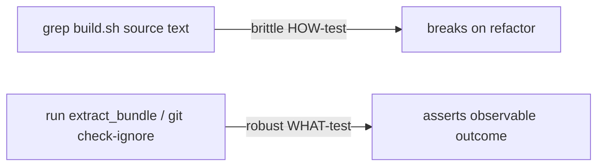

## Summary

Removed the source-text grep-as-assertion tests on `build.sh` and
`wasm_activation/pkg/.gitignore`, replacing them with behavioural WHAT-tests
that exercise observable outcomes instead of the script's internal wording.
Closes #2886.

These HOW-tests read `build.sh` into a string and asserted that literal
substrings or regexes appeared in the source — so any behaviour-preserving
refactor (renaming a variable, reordering `tar` flags, switching hashing
invocations) would break them even though the build still verified tarballs and
rejected tampering exactly as before.

### Changes

- **`test/scripts/BuildScriptContentHash.ts`**
  - Deleted `build.sh declares a content manifest file constant` — redundant
    with the manifest-committed and `--verify-only` missing/tampered tests.
  - Deleted `build.sh has tarball SHA-256 verification logic` — redundant with
    the `verify_tarball_sha256` mismatch test, the `assetSha256` pin-format
    test, and the `guard_unverified_extract` anchor test.
  - Replaced `pkg/.gitignore allows content-manifest.sha256` with
    `content-manifest.sha256 is not git-ignored`, which asks git itself via
    `git check-ignore -q` (rc 1 = not ignored) rather than grepping the
    `.gitignore` text.
  - Replaced
    `build.sh extracts without honouring archived owner/permission
    bits`
    with `build.sh extract_bundle does not honour archived permission
    bits`,
    which drives the real `extract_bundle` helper against a 0777 archive member
    under a restrictive umask and asserts the extracted file is masked (not
    group/other-accessible). A regression to `tar -p` extracts 0777 and fails
    the test.
- **`test/scripts/BuildScript.ts`**
  - Deleted `build.sh exposes a --rev option for explicit historical pins` — the
    `--rev` contract is already proven behaviourally by the `--help`,
    `--rev rejects non-hex`, and `--rev requires a value` tests; the
    release-tag/asset-name greps tested only download-path wording.
- **`build.sh`**
  - Extracted the inline `tar --no-same-owner --no-same-permissions -xzf`
    invocation into an `extract_bundle()` helper so the tar-safety behaviour is
    testable in isolation (sourced like the existing `verify_tarball_sha256`,
    `guard_unverified_extract`, and `assert_safe_tar_entries` helpers).

### Note

The permission/owner _stripping_ property is only fully observable as root, but
the new `extract_bundle` test still catches the meaningful regression (swapping
`--no-same-permissions` for `-p`, which preserves 0777 even for non-root) and
proves extraction lands files correctly. The path-traversal and absolute-path
extraction safety remains covered behaviourally by the existing
`assert_safe_tar_entries` tests.

## Evidence

Backend/shell change — no UI to screenshot. Verified by running the affected
test files and the full quality gate.

```
running 11 tests from ./test/scripts/BuildScriptContentHash.ts
...
build.sh extract_bundle does not honour archived permission bits ... ok
content-manifest.sha256 is not git-ignored ... ok
running 8 tests from ./test/scripts/BuildScript.ts
...
ok | 19 passed | 0 failed
```

Full gate: `./quality.sh` → `ok | 7058 passed (2 steps) | 0 failed | 4 ignored`.



## Test Plan

- `test/scripts/BuildScriptContentHash.ts::content-manifest.sha256 is not git-ignored`
  — `git check-ignore` exits 1 for the manifest path.
- `test/scripts/BuildScriptContentHash.ts::build.sh extract_bundle does not honour archived permission bits`
  — sources `extract_bundle`, extracts a 0777 member under `umask 077`, asserts
  the extracted mode is masked and content matches.
- Existing behavioural tests retained as coverage for the deleted greps
  (`verify_tarball_sha256` mismatch, `--verify-only` tampered/missing manifest,
  `assetSha256` pin format, `--rev` validation, `--help`).
- Full `./quality.sh` run passes (7058 tests).
