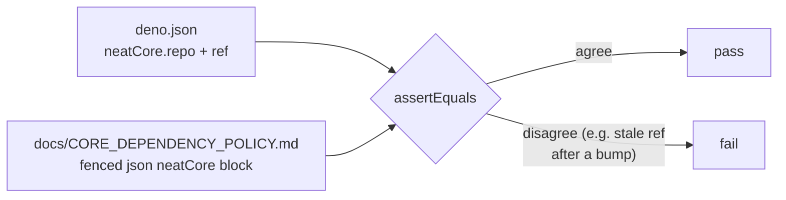

# PR Summary — Issue #2887

## Summary

Removed the documentation-keyword grep assertions across the build/CI policy
tests. These tests read a Markdown documentation file into a string and asserted
it `.includes(...)` a keyword, which verifies nothing about whether the
documentation is correct, complete, or coherent — it is the source-text-grep
anti-pattern applied to prose. A keyword grep passes for the wrong reason
(`lower.includes("ref")` is satisfied by "preferred" or "different", and a doc
that says "do **not** pin the ref" still passes), and rewording with a synonym
fails the test though nothing behavioural changed. This aligns the suite with
the project's own testing policy in `AGENTS.md` ("How tests to avoid": _grepping
source files for patterns, keywords, or headings; inspecting documentation
content_).

Where a genuine machine-checkable contract was available, the grep was
**rewritten** rather than deleted; otherwise the prose-grep test was
**removed**.

Closes #2887.

## Changes

| File                                     | Action                                                                                                                                                                                                                                                                                                                                                                                               |
| ---------------------------------------- | ---------------------------------------------------------------------------------------------------------------------------------------------------------------------------------------------------------------------------------------------------------------------------------------------------------------------------------------------------------------------------------------------------- |
| `test/scripts/CoreDependencyPolicy.ts`   | **Rewrote** the keyword-grep `policy document covers required sections` test into a parsed-value WHAT-test: it extracts the fenced `` ```json `` `neatCore` block from `docs/CORE_DEPENDENCY_POLICY.md` and `assertEquals` its `repo` + `ref` against `deno.json`. **Removed** the `AGENTS.md references…` prose grep. Kept the existing parsed-`deno.json` pin test and the doc-exists `stat` test. |
| `test/scripts/ScorerAlignmentPolicy.ts`  | **Deleted** — all four tests were prose greps (`scorer`, `downstream`, `same`+`rev`, `verify`/`confirm`/`check`). The genuine same-rev contract is cross-repo (NEAT-AI-scorer is not in this workspace) and is enforced by a CI guard, so it cannot be meaningfully asserted by a unit test here.                                                                                                    |
| `test/scripts/ParityGate.ts`             | **Dropped** the doc-topic grep loop (kept the doc-exists `stat`) and **removed** the `AGENTS.md references the parity gate document` grep. The real CLI WHAT-tests (`--help`, `--dry-run`, skip flags, unknown-option handling) are untouched.                                                                                                                                                       |
| `test/scripts/BuildScriptContentHash.ts` | **Removed** the `CORE_DEPENDENCY_POLICY documents the new content-hash step` keyword grep. The `assetSha256` pin already has a parsed-`deno.json` WHAT-test (`deno.json pins neatCore.assetSha256 …`).                                                                                                                                                                                               |

### Why the rewrite is a real WHAT-test, not a how-test



The contract fails only when the doc and `deno.json` genuinely disagree on the
pinned `repo`/`ref` — not when surrounding prose is reworded. `rev` is excluded
because the doc carries a `<40-char SHA>` placeholder rather than the live SHA.

## Evidence

Backend/test-only change — no web interface to screenshot.

**TDD verification of the rewritten contract test** — temporarily changed the
doc's fenced-block `ref` from `Develop` to `main` and confirmed the test fails,
then restored it and confirmed it passes:

```
=== ref changed to main; expect FAIL ===
policy document pins the same neatCore repo and ref as deno.json ... FAILED
error: AssertionError: Values are not equal: policy doc and deno.json must agree on neatCore.ref
FAILED | 2 passed | 1 failed
=== restored; expect PASS ===
ok | 3 passed | 0 failed
```

**Full `test/scripts/` suite** — all green after the change:

```
ok | 109 passed | 0 failed (3s)
```

Quality gate: `./quality.sh --lint-only` and `./quality.sh --check-only` both
pass cleanly (format, lint, bash-syntax, type-check).

## Test Plan

- **Added/rewritten**
  `test/scripts/CoreDependencyPolicy.ts::policy document pins the same neatCore repo and ref as deno.json`
  — parses both sources and asserts they agree; verified it fails on a real
  disagreement and passes on prose rewording.
- **Removed** the prose-grep tests listed in the table above (documented
  business-logic change per the issue's recommendation; these assert
  documentation content, which `AGENTS.md` classifies as a how-test to avoid).
- **Unchanged** real WHAT-tests retained: parsed-`deno.json` pin checks,
  doc-exists `stat` checks, and the `parity-gate.sh` CLI behaviour tests.
