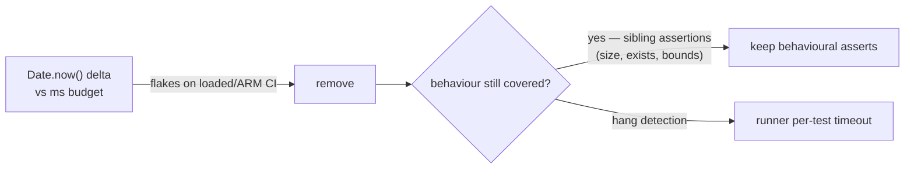

# Remove wall-clock timing assertions from discovery/NEAT unit tests

## Summary

Removed flake-prone wall-clock timing assertions from two unit test files.
These assertions compared a `Date.now()` delta against a fixed millisecond
budget — a "HOW"-flavoured check that depends on the machine the test runs on
(loaded CI runner, shared laptop, ARM-vs-x86) rather than on observable
behaviour. Per the project testing policy in `AGENTS.md` ("Unit tests must never
measure timing or performance"), liveness/hang intent is now left to the test
runner's own per-test timeout, while the genuine behavioural assertions that
were already present are retained. Closes #2888.

Changes:

- `test/ErrorGuidedStructuralEvolution/DiscoveryRobustness.ts` — dropped four
  `Date.now()`-delta budget assertions (`elapsed < 5000`, `< 2000`, `< 10000`,
  `< 30000`) and their unused `startTime`/`elapsed` locals. The surviving
  assertions (`assertExists`, neuron-count bounds, finite-error checks, "may be
  undefined or array" type checks) already capture the real behaviour; a genuine
  infinite loop is caught by the runner's per-test timeout.
- `test/NEAT/NeatAwaitInFlightTasks.ts` — dropped the redundant
  `elapsedMs < 5000` assertion after `awaitInFlightTasks(200)`. The sibling
  `assertEquals(neat.discoveryInProgress.size, 1, ...)` already proves the
  timeout fired and left the long-running task in flight, making the wall-clock
  check redundant.

No production code changed — these are test-only edits.

## Evidence

Backend/test-only change — no web interface to screenshot. Verified by running
the affected suites locally (Rust discovery library available, GPU enabled via
Metal):

```
deno test -A test/NEAT/NeatAwaitInFlightTasks.ts
ok | 6 passed | 0 failed (358ms)

deno test -A test/ErrorGuidedStructuralEvolution/DiscoveryRobustness.ts
ok | 6 passed | 0 failed (550ms)
```

`./quality.sh --lint-only` and `deno check` on both files pass cleanly.



## Test Plan

- Modified `test/ErrorGuidedStructuralEvolution/DiscoveryRobustness.ts`: removed
  timing budget assertions from the "weighted selection", "all-zero error",
  "analyze phases respect timeout", and "batching" tests; behavioural assertions
  retained. All 6 tests pass.
- Modified `test/NEAT/NeatAwaitInFlightTasks.ts`: removed the redundant
  `elapsedMs < 5000` assertion from "respects timeout with long-running tasks";
  the still-in-flight assertion proves the timeout behaviour. All 6 tests pass.
