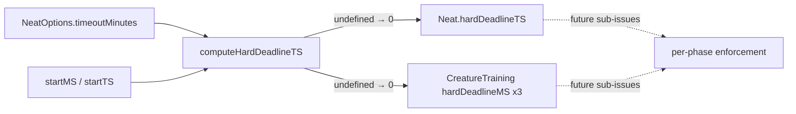

# Add hard-deadline (T+15) helper and plumb `hardDeadlineTS`

## Summary

Introduces a single source of truth for the evolution hard cap — the absolute
wall-clock timestamp past which `evolveDir` must abandon all in-flight work —
and plumbs it through `Neat` and the three evolve variants so later sub-issues
can enforce it in each phase. Pure plumbing: no behavioural change to existing
runs. Closes #2895. Part of #2892.

- **New module `src/NEAT/HardDeadline.ts`** exporting:
  - `HARD_DEADLINE_GRACE_MINUTES = 15` — the maximum permitted overrun past
    `timeoutMinutes`.
  - `computeHardDeadlineTS(startMS, timeoutMinutes)` — returns
    `startMS + timeoutMinutes * 60_000 + graceMS`, where
    `graceMS = min(15, max(1, timeoutMinutes)) * 60_000`. Returns `undefined`
    when `timeoutMinutes` is 0/unset (no timeout → no cap). The helper is pure
    (absolute timestamps in, absolute timestamps out), so tests need no real
    clock (policy from #2888).
- **`src/NEAT/Neat.ts`** — new `hardDeadlineTS` field set alongside `endTimeTS`
  from the same options via the helper (0 when no timeout). Both now anchor to
  one captured `startTS`.
- **`src/creature/CreatureTraining.ts`** — each of the three evolve variants
  computes `hardDeadlineMS` next to its existing `endTimeMS`. The value is
  computed but not yet consumed (enforcement lands in follow-up sub-issues),
  marked with a documented `deno-lint-ignore no-unused-vars`.

## Data flow

## Evidence

Backend/CLI change — no web interface to screenshot. Verified via unit tests and
the full quality gate.

- `./quality.sh` passes cleanly: `ok | 7093 passed (2 steps) | 0 failed`.
- The helper is pure; all assertions are on returned/derived timestamps, never
  on elapsed wall-clock time (policy from #2888).

## Test Plan

- **`test/NEAT/HardDeadline.ts`** (new) — covers:
  - grace constant is 15 minutes;
  - no timeout configured → `undefined` (both 0 and `undefined` inputs);
  - T=2 → grace 2 m; T=45 → grace capped at 15 m (T+15); T=120 → grace clamped
    to 15 m; T=1 → grace 1 m.
- **`test/NEAT/NeatConstruction.ts`** (extended) — asserts
  `hardDeadlineTS - endTimeTS === 5 minutes` for `timeoutMinutes=5`, and
  `hardDeadlineTS === 0` when no timeout is set (consistent with `endTimeTS`).
