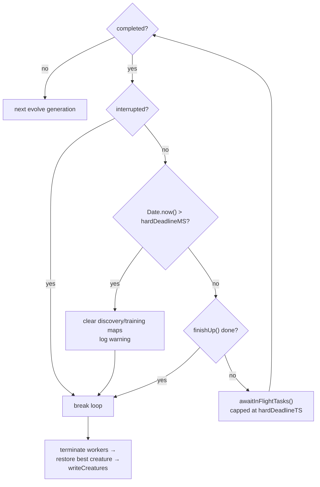

# Enforce the T+15 hard cap in the evolve loops and bound `awaitInFlightTasks`

## Summary

The three evolve variants in `src/creature/CreatureTraining.ts` (`evolveDir`,
`evolveEnv`, `evolveRL`) now break out of the finish-up cycle **unconditionally**
once the absolute T+15 hard deadline (Issue #2895) passes — abandoning any
in-flight discovery/training bookkeeping while still restoring the best creature
and writing the creature store. `Neat.awaitInFlightTasks` is also bounded so its
30 s default wait can never push past the cap.

Previously (see `GRQ-19-sloth.log`) the finish-up cycle could clear stuck
discoveries, then keep running full generations, fine-tuning and waits until the
external 3-hour watchdog killed the process — losing all work. The per-phase
wall-clock guards added in #2432/#2871 only fire *between* finish-up checks; this
issue adds the outer guarantee they cannot provide on their own. The hard cap
turns a watchdog-kill into a clean return of the best creature found so far.

Closes #2896.

## What changed

- **`src/NEAT/Neat.ts`**
  - New `abandonInFlightPastHardDeadline(hardDeadlineMS)` method: when the cap is
    set and already in the past, it logs
    `[Neat] Hard deadline (timeoutMinutes + grace) exceeded — abandoning N in-flight task(s)`,
    clears `discoveryInProgress`/`trainingInProgress`, and returns `true` to
    signal the loop must break. Returns `false` (no-op) before the cap or when
    the cap is `0` (no timeout configured).
  - `awaitInFlightTasks(timeoutMs, hardDeadlineTS = this.hardDeadlineTS)` now caps
    the effective wait at `max(0, hardDeadlineTS - Date.now())`, so the 30 s
    default cannot overshoot the cap. `hardDeadlineTS = 0` disables the cap
    (preserving prior behaviour for runs with no timeout).
- **`src/creature/CreatureTraining.ts`** — in each of the three `completed`
  blocks, `neat.abandonInFlightPastHardDeadline(hardDeadlineMS)` is checked
  before `finishUp()`; a `true` result breaks immediately. The local
  `hardDeadlineMS` (previously plumbed-but-unused under a `no-unused-vars`
  ignore) is now consumed, and the lint-ignore is removed. The post-loop
  sequence (worker termination, best-creature restore, `writeCreatures`) is
  unchanged — the `break` lands there exactly as the normal path does.

## Evidence

Backend/CLI change — no web interface to screenshot. Verified via unit tests and
the full quality gate (`./quality.sh`: **7105 passed, 0 failed, 4 ignored**).

### Hard-cap finish-up flow

## Test Plan

- **`test/NEAT/NeatHardDeadlineEnforcement.ts`** (new) — `abandonInFlightPastHardDeadline`:
  - past deadline → returns `true` and both in-progress maps are emptied (no
    elapsed-time measurement; behavioural per #2888);
  - future deadline → returns `false`, bookkeeping untouched;
  - zero deadline → returns `false` (cap disabled), bookkeeping untouched.
- **`test/NEAT/NeatAwaitInFlightTasks.ts`** (extended):
  - a never-settling task with a past `hardDeadlineTS` returns immediately
    (cap clamps the wait to 0) without abandoning the maps itself;
  - `hardDeadlineTS = 0` disables the cap so a soon-settling task still
    completes within the normal timeout.
- **`test/NEAT/NeatFinishUp.ts`** — existing finish-up tests still pass unchanged.
- Full `./quality.sh` passes.
