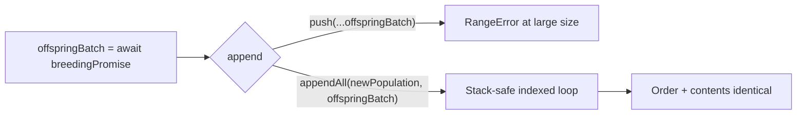

## Summary

Fixed the `evolve()` spread-push stack overflow at
`src/NEAT/NeatEvolution.ts:688`. Spreading an unbounded `offspringBatch` into
`newPopulation.push(...offspringBatch)` exceeds V8's argument/stack limit
(~65k–130k elements) once the configured population size is large enough,
throwing `RangeError: Maximum call stack size exceeded`. This crashed the "Run
Suggest Improvements" example after bumping `@stsoftware/neat-ai` 5.3.15 →
5.3.19 (stSoftwareAU/NEAT-AI-Examples#578).

The fix introduces a stack-safe in-place append helper
(`src/utils/ArrayAppend.ts` → `appendAll<T>(target, items)`) that appends via a
plain indexed loop — no spread, no `push.apply` (same stack limit), no `concat`
(would allocate a new array, but `newPopulation` is `const` and aliased/mutated
later at lines 704 and 735). Population contents and ordering are unchanged:
creative-thinking clones first, then offspring, exactly as before.

Closes #2897.

## Evidence

Backend/library change — no web interface to screenshot. Verified via tests and
the full quality gate.

- `appendAll` uses an indexed loop, so each element is appended without placing
  a per-element argument on the call stack — scales to any batch size.
- Regression test `test/utils/ArrayAppend.ts` includes a **canary** assertion
  (`assertThrows(() => target.push(...bigArray), RangeError)` at 200,000
  primitive elements) proving the test size genuinely exceeds the engine's
  spread limit, plus a **fix** assertion that `appendAll` appends the same batch
  without throwing while preserving order, length, and the pre-existing front
  element.
- `./quality.sh < /dev/null` passes: `7062 passed | 0 failed | 4 ignored`,
  exit 0. `test/NEAT/PhasePipelining.ts`, `test/NEAT/Evolve.ts`, and
  `test/NEAT/NeatEvolve.ts` all pass.

## Test Plan

- Added `test/utils/ArrayAppend.ts`:
  - happy path — appends in order after existing contents
  - empty `items` — no-op
  - empty `target` — receives all items in order
  - large batch (≥200k) — canary `RangeError` for spread-push + `appendAll`
    succeeds preserving order/length/front element (regression for #2897)
- Ran `test/NEAT/PhasePipelining.ts` (the breeding/offspring pipeline) — passes.
- Ran the full `./quality.sh` gate — passes cleanly.

No changes to `semanticVersion` handling, neuron UUIDs, or any wire format.
