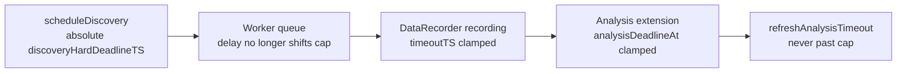

## Summary

Clamp every per-discovery deadline to the caller's absolute hard deadline
(T+15) so no discovery phase can run past it regardless of worker-queue delay.
Closes #2898.

The #2432 allocation clamps the *relative* record+analysis budget at schedule
time, but the worker re-anchors those budgets at `Date.now()` when it starts
processing a request. Queue delays therefore silently shift the absolute
completion time past the caller's deadline, and analysis-timeout extensions
compound the drift (GRQ-18-sloth.log showed repeated extension cycles).

This change passes the absolute deadline across the worker boundary and clamps
every per-discovery deadline against it:

- **`src/config/NeatArguments.ts`** — new optional internal field
  `discoveryHardDeadlineTS?: number` (epoch ms). A plain number, so it crosses
  `Worker.postMessage` in the per-call frozen config. Absent when no
  `timeoutMinutes` is configured → behaviour unchanged.
- **`src/NEAT/NeatScheduling.ts`** (`scheduleDiscovery`) — sets
  `discoveryHardDeadlineTS` from `neat.hardDeadlineTS` in the per-call config
  override (only when a hard deadline is configured). The #2432 relative
  allocation stays as the phase-split mechanism.
- **`src/architecture/ErrorGuidedStructuralEvolution/DataRecorder.ts`**
  - Constructor: `timeoutTS = min(now + recordBudget, discoveryHardDeadlineTS)`
    — fixes the drift where a queued request anchors its relative budget at
    start time, not schedule time.
  - Record→analysis boundary (`extendTimeoutForAnalysisPhase`):
    `analysisDeadlineAt = min(now + analysisBudget, discoveryHardDeadlineTS)`.
  - `refreshAnalysisTimeout`: re-supplies the cap so top-ups never overshoot it.
- **`src/architecture/ErrorGuidedStructuralEvolution/DiscoverStructureBase.ts`**
  (`extendTimeoutForAnalysis`) — accepts and remembers the hard cap and never
  sets `timeoutTS` past it. Once past the cap the computed remaining budget is
  ≤ 0, so the analysis loop's existing per-chunk checks exit — delivering
  "extensions clamped to the T+15 cap, at most one further extension once past
  T". Added a public `getTimeoutTS()` accessor.

The recording-loop checks (`DataRecorderRecording.ts` via `ctx.timeoutTS`) and
analysis per-chunk checks (`DataRecorderAnalysis.ts` via `getTimeoutTS()`)
inherit the clamp once the sources are clamped — no change needed there, proven
by regression tests.

## Evidence

Backend/worker change — no UI to screenshot. Verified by unit tests and the
full quality gate (`./quality.sh`): **7101 passed, 0 failed, 4 ignored**.

## Test Plan

New regression suite
`test/ErrorGuidedStructuralEvolution/DiscoveryHardDeadlineClamp.ts` (injected
timestamps, no real waiting — #2888 policy):

- DataRecorder constructor clamps recording `timeoutTS` to a near-future cap.
- DataRecorder constructor clamps `timeoutTS` to an already-past cap (request
  whose hard deadline elapsed in the queue).
- DataRecorder leaves `timeoutTS` unclamped when no hard deadline is configured.
- `extendTimeoutForAnalysisPhase` clamps `analysisDeadlineAt`, `timeoutTS`, and
  the DiscoverStructure deadline to the cap.
- `refreshAnalysisTimeout` never moves the deadline past the cap.
- `DiscoverStructure.extendTimeoutForAnalysis` clamps to a supplied cap.
- `extendTimeoutForAnalysis` remembers the cap for later top-ups.
- `extendTimeoutForAnalysis` is unchanged when no cap is supplied.

Existing discovery/analysis suites
(`DiscoverAnalysisPerChunkTimeout`, `NeuronDiscoveryIntegration`, `HardDeadline`,
`NeatConstruction`) continue to pass, confirming no behaviour change.
