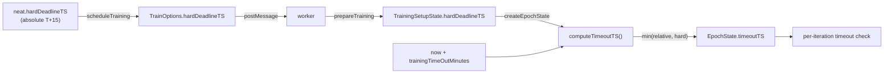

## Summary

Clamp scheduled fine-tuning tasks to the absolute hard deadline so worker-side
training stops at the run's wall-clock deadline even when the task sat in the
worker queue after being scheduled with a relative `trainingTimeOutMinutes`
budget. Closes #2899.

Previously `timeoutTS` was computed from `Date.now()` plus the relative budget
when the worker dequeued the task. A task that waited in the queue therefore got
its full relative budget anchored at dequeue time, drifting past the run's
intended end (`GRQ-19-sloth.log` showed `Fine tuning increased fitness…` lines
continuing right up to the watchdog kill). This change carries the absolute
`hardDeadlineTS` (epoch ms) with each scheduled task and clamps the relative
budget against it.

### Changes

- **`src/config/TrainOptions.ts`** — add optional `hardDeadlineTS?: number`
  (plain number — survives `Worker.postMessage`).
- **`src/NEAT/NeatScheduling.ts`** — `scheduleTraining` sets `hardDeadlineTS`
  from `neat.hardDeadlineTS` (left absent when `0`, so behaviour is unchanged).
- **`src/architecture/training/TrainingSetup.ts`** — plumb `hardDeadlineTS`
  through `TrainingSetupState` and `prepareTraining`.
- **`src/architecture/training/TrainingOutcome.ts`** — extract a pure,
  `now`-injectable
  `computeTimeoutTS(now, trainingTimeOutMinutes,
  hardDeadlineTS)` helper that
  clamps to `min(now + minutes, hardDeadlineTS)`; `createEpochState` calls it
  with `Date.now()`.

When `hardDeadlineTS` is absent (direct `creature.train()` callers), the
computation is identical to before. A hard deadline already in the past is
returned verbatim, so the existing per-iteration timeout check
(`TrainingEpoch.ts`) trips on the next check and returns the best-so-far result.

### Flow

## Evidence

Backend/CLI change — no web interface to screenshot. Verified via unit tests
(injected timestamps, no elapsed-time assertions per #2888) and the full
`./quality.sh` suite (7100 tests pass; a transient unrelated breed flake
`SyntheticLocationE2E` passed on re-run and is unaffected by these changes).

## Test Plan

- `test/architecture/training/TrainingOutcome.ts` (new) — `computeTimeoutTS`:
  - clamps to an earlier hard deadline (15 min budget, 5 min deadline →
    deadline)
  - absent / `undefined` / `0` hard deadline reproduces the pre-#2899 relative
    computation exactly
  - keeps the relative budget when it is the earlier limit
  - no relative budget falls back to the hard deadline
  - no budget and no deadline → `0` (no timeout)
  - hard deadline already in the past is returned verbatim (per-iteration check
    then exits promptly)
- `test/architecture/training/TrainingSetup.ts` — added a case asserting
  `prepareTraining` carries `hardDeadlineTS` through, and that it stays
  `undefined` when absent.
