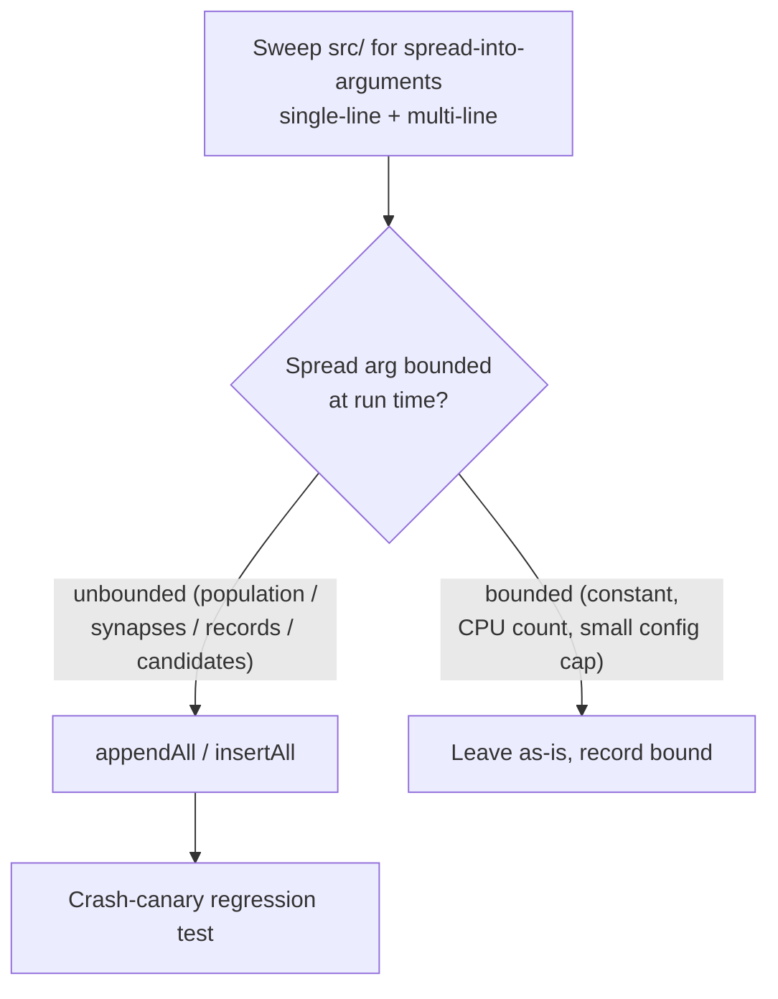

# Audit spread-into-arguments call sites and fix unbounded ones

## Summary

Swept `src/` for every spread-into-call-arguments site, verified the runtime
bound of each by reading the upstream code, and replaced the genuinely
**unbounded** ones with the stack-safe `appendAll` helper from #2897 (plus a new
`insertAll` helper for the one unbounded `splice` insertion). This closes the
`RangeError: Maximum call stack size exceeded` regression class fixed at
`NeatEvolution.ts:688` so no other code path can reproduce it. Bounded sites
(fixed constants, CPU/thread count, small config caps) are left untouched and
documented below. Every change is behaviour-preserving — the order and contents
of each affected array are identical to before.

Closes #2900.

### New helper

`insertAll(target, index, items)` was added to `src/utils/ArrayAppend.ts`
alongside the existing `appendAll`. It performs a stack-safe in-place insertion
(detach tail → indexed-append items → indexed-append tail) that is
behaviour-identical to `target.splice(index, 0, ...items)` but never spreads
`items` into call arguments.

### Corrections to the issue's initial classification

The issue's first-pass verdicts were explicitly a "head start — verify, do not
trust blindly". Verification surfaced four corrections:

- **`FineTunePopulation.ts:218,255` were mislabelled bounded** ("loop bound
  12"). The `for (… attempts < 12 …)` loop bounds the _iteration count_, not the
  _spread size_. Each iteration spreads `extendedTunedPopulation`, sized up to
  `fineTunePopSize` = `max(ceil(populationSize/5), …)`, which scales with the
  configured population size → **unbounded. Fixed.**
- **`FineTunePopulation.ts:162` is actually bounded ≤2**, not unbounded.
  `retry()` returns `fineTuneImprovement(…, 2, …)`, which caps its output at
  `popSize=2`; the "scales with `genus.population`" reasoning conflated the
  _input_ population with the bounded _output_. Converted anyway for consistency
  (it appends into the same population-scaled array as the genuinely-unbounded
  sites) and because the acceptance criteria name it.
- **`DiscoverStructureRecording.ts:114` / `DiscoverDataLoading.ts:118` were
  mislabelled bounded** ("slice(0,64) cap"). The 64-sample cap only applies to
  the timeout _grace_ path. The normal path spreads a batch sized by
  `discoveryBatchSize` (config, default 128, **no upper cap**) / the dataset
  record count → **unbounded. Fixed.**
- **The single-line sweep regex missed multi-line `push(\n  ...builder())`
  spreads** in `DiscoveryCandidates.ts` (lines 234, 245, 270, 310, 332, 341). A
  multi-line re-sweep found six more candidate-list spreads that scale with
  discovery results → **fixed.**

## Full classification of every spread-into-arguments site in `src/`

### Fixed — confirmed unbounded → stack-safe

| Site                                                               | Spread value              | Verified bound                                      | Fix         |
| ------------------------------------------------------------------ | ------------------------- | --------------------------------------------------- | ----------- |
| `blackbox/FineTunePopulation.ts:153`                               | `restoredTunedPopulation` | ≤2 alone, but appended into population-scaled array | `appendAll` |
| `blackbox/FineTunePopulation.ts:162`                               | `retryPopulation`         | ≤2 alone (see correction); same array               | `appendAll` |
| `blackbox/FineTunePopulation.ts:218`                               | `extendedTunedPopulation` | ≤ `fineTunePopSize` ∝ `populationSize/5`            | `appendAll` |
| `blackbox/FineTunePopulation.ts:255`                               | `extendedTunedPopulation` | ≤ `fineTunePopSize` ∝ `populationSize/5`            | `appendAll` |
| `discovery/DiscoveryWireFormat.ts:335`                             | `current` (array node)    | creature wire payload synapse/neuron array          | `appendAll` |
| `discovery/DiscoveryCandidates.ts:234,245,270,291,306,310,332,341` | candidate-builder results | scale with neuron/synapse/discovery counts          | `appendAll` |
| `discovery/CandidateApplicationOps.ts:64,199,334,435`              | `newSynapses` / `toAdd`   | candidate synapse (connection) count                | `appendAll` |
| `discovery/CandidateApplicationOps.ts:165`                         | `remaining` neurons       | candidate hidden-neuron count                       | `insertAll` |
| `architecture/…/DiscoverStructureRecording.ts:114`                 | `effectiveRecordIndices`  | ≤ `discoveryBatchSize` (config, no max)             | `appendAll` |
| `architecture/…/DiscoverDataLoading.ts:118`                        | `fileRecords`             | dataset record count per binary file                | `appendAll` |

### Left as-is — confirmed bounded

| Site                                          | Spread value                    | Verified bound                                                                                                |
| --------------------------------------------- | ------------------------------- | ------------------------------------------------------------------------------------------------------------- |
| `discovery/BrittlenessScorer.ts:169`          | `Math.max(...allOutputChanges)` | ≤ `maxSamples`(50) × `perturbationsPerInput`(default 5)                                                       |
| `discovery/BatchDiscoveryValidator.ts:95,117` | structural/weight-only results  | input candidate list pre-capped upstream by `filterCandidatesForEvaluation` (`maxCandidates ≈ 2×threadCount`) |
| `discovery/CandidateFiltering.ts:240`         | `sampled`                       | ≤ `maxCandidates` = `max(2×threadCount, categoryCount)`                                                       |
| `discovery/DiscoveryReplayRunner.ts:141`      | `pool`                          | worker count = thread / replay concurrency (≈ CPU cores)                                                      |
| `transfer/KnowledgeDistillation.ts:163`       | `studentExports` (splice)       | ≤ `MAX_STUDENT_NEURONS` (64)                                                                                  |
| `transfer/CompactModuleGraft.ts:364`          | `inserted` (splice)             | ≤ module max size (32)                                                                                        |
| `breed/SubgraphTransplant.ts:283`             | `transplantedNeurons` (splice)  | ≤ `MAX_SUBGRAPH_SIZE` (5)                                                                                     |

Array-literal spreads (`[...a, ...b]`, e.g. `NeatEvolution.ts:731–737`) are
iterative in V8 and out of scope — untouched.

## Evidence

This is a backend/library change with no web interface to screenshot. Coverage
is via the test suite (`./quality.sh < /dev/null` passes the full gate). The
regression class is proven by crash-canary tests: each large-batch test first
asserts the _original_ spread throws `RangeError` at the chosen size, then
asserts the stack-safe path succeeds with identical contents and order.



### A note on the `FineTunePopulation` large-scale test

Driving a genuine 65k+ spread through `FindTunePopulation.make()` is impractical
for a unit test — it would need hundreds of thousands of scored,
species-assigned creatures plus the heavy per-creature fine-tuning compute, far
exceeding the 120s unit-test budget. The regression is instead covered by
testing the exact operation the fixed lines now perform (appending a large
`Creature[]` batch into the population array via `appendAll`, with a crash
canary), plus a genuine wide-array behavioural test on the
`assertNoLegacyDiscoveryIdFields` traversal (a fixed unbounded call site).

## Test Plan

- `test/utils/ArrayAppend.ts` — added `insertAll` happy-path, in-place-mutation,
  empty, clamp, and large-batch (#2900) regression tests with a `splice` crash
  canary. Existing `appendAll` tests retained.
- `test/discovery/DiscoveryWireFormatStackSafe.ts` (new) — exercises the fixed
  `assertNoLegacyDiscoveryIdFields` traversal: clean payload,
  leaked-legacy-field detection, a 200k-wide array traversed without
  `RangeError` (with a `push(...)` canary), legacy detection inside a wide
  array, and nested array/object ordering.
- `test/blackbox/FineTunePopulationStackSafe.ts` (new) — appends a 200k
  `Creature[]` batch into a population array via `appendAll` without
  `RangeError` (with a canary), and verifies small-batch order/contents.

Run:

```bash
deno test --allow-all \
  test/utils/ArrayAppend.ts \
  test/discovery/DiscoveryWireFormatStackSafe.ts \
  test/blackbox/FineTunePopulationStackSafe.ts < /dev/null
# 16 passed | 0 failed
```
