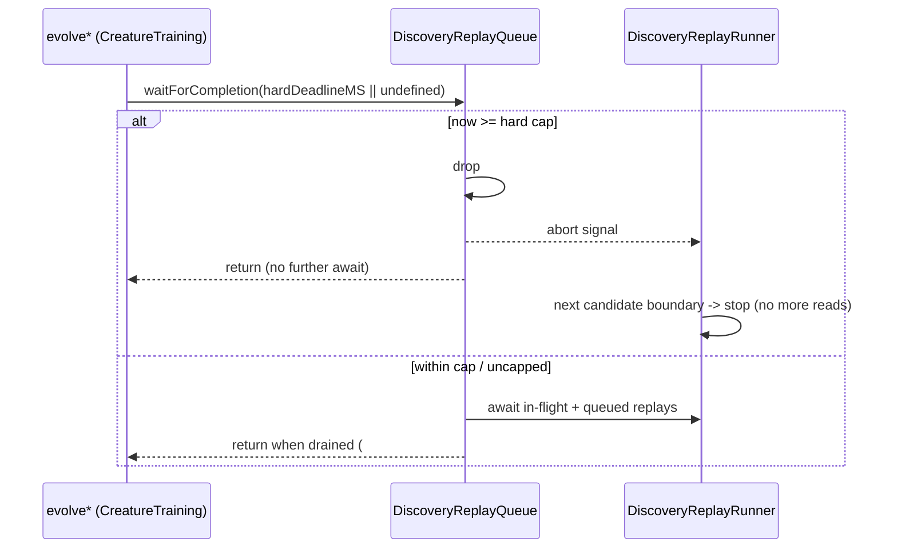

# Bound discovery replay queue waits and replays to the hard deadline

## Summary

Made `DiscoveryReplayQueue` deadline-aware so a configured `--timeout` run can
no longer be held past its hard cap by background replay. `waitForCompletion()`
now stops waiting at the absolute cap, queued replays past the cap are dropped,
and in-flight replays receive an **absolute** deadline (immune to
worker-queue/start delays) plus a cooperative abort signal. Uncapped runs keep
the unbounded wait, preserving the Issue #1509 guarantee.

Closes #2901.

### What changed

- **`src/NEAT/DiscoveryReplayQueue.ts`**
  - New `DiscoveryReplayControl` (`{ deadlineTS?, signal? }`) plumbed through
    the `replayDir` dependency.
  - `waitForCompletion(hardDeadlineTS?)` — once the current time is past the cap
    it drops `#queuedCreature`, aborts the in-flight replay via an
    `AbortController`, and returns without awaiting. A `0`/`undefined` cap means
    unbounded (the #1509 path).
  - `scheduleReplay(..., hardDeadlineTS?)` — skips scheduling when already past
    the cap; otherwise carries the cap into the queued entry.
  - `#startReplay` — passes an absolute deadline of
    `min(now + effectiveTimeout, hardDeadlineTS)` and the abort signal to the
    runner.
- **`src/discovery/DiscoveryReplayRunner.ts` / `DiscoveryReplayRunnerTypes.ts`**
  - `replayDir` accepts an absolute `deadlineTS` and an abort `signal`. The
    relative `timeoutMinutes` is still converted at start, but when an absolute
    `deadlineTS` is supplied the runner clamps to the earlier of the two, so a
    late start cannot extend the cap. `isTimedOut()` now also returns `true`
    when the signal is aborted — the existing per-candidate-boundary checks then
    stop the replay with no further candidate evaluation (no further
    data-directory reads).
- **`src/creature/CreatureTraining.ts`** — the three evolve variants
  (`evolveDir`, `evolveEnv`, `evolveRL`) pass `hardDeadlineMS || undefined` to
  `waitForCompletion`, so only a configured timeout introduces the bounded wait.

Existing `scheduleReplay`/`waitForCompletion` callers without a cap behave
exactly as before.

## Evidence

Backend/CLI change — no UI to screenshot. Verified via new behavioural unit
tests (injected timestamps and a pre-aborted signal — no elapsed-time
measurement, per the #2888 policy) and the full quality gate (`./quality.sh`:
`7112 passed | 0 failed`).

## Test Plan

- `test/NEAT/DiscoveryReplayQueueDeadline.ts` (new):
  - past-cap `waitForCompletion` drops the queued replay and aborts the
    in-flight one;
  - `scheduleReplay` skips scheduling once past the cap;
  - `#startReplay` passes the absolute hard cap to the runner;
  - zero cap waits unbounded (preserves #1509).
- `test/discovery/DiscoveryReplayRunnerDeadline.ts` (new):
  - absolute deadline earlier than `now + timeoutMinutes` wins and stops
    evaluation;
  - a pre-aborted signal stops the runner at the candidate boundary with no
    evaluation;
  - a far-future deadline completes normally.
- Existing `test/NEAT/DiscoveryReplayQueue.ts`,
  `test/NEAT/DiscoveryReplayQueueCompletion.ts`,
  `test/NEAT/DiscoveryReplayIntegration.ts`,
  `test/NEAT/DiscoveryReplayWarmup.ts`, and
  `test/discovery/DiscoveryReplayRunner.ts` all pass unchanged.
