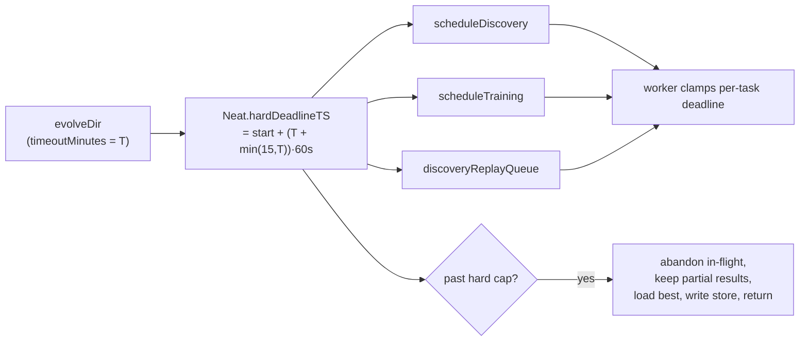

# End-to-end T+15 guard test and timeout-semantics documentation

## Summary

This is the acceptance gate for the parent timeout milestone (#2892): it proves,
end-to-end, that `evolveDir(timeoutMinutes = T)` returns with consistent state
once the absolute **T+15** hard cap passes — even with slow / never-resolving
in-flight discovery and training — and documents the timeout semantics. The
enforcement itself was delivered by the dependency sub-issues (#2895, #2896,
#2898, #2899, #2901); this change adds the integration-level guard and the docs.
**Closes #2902.**

What changed:

- **Integration guard** `test/creature/EvolveDirHardDeadline.ts` — drives a real
  `evolveDir` run with a tiny `timeoutMinutes` and stubbed never-resolving
  in-flight work, with the cap placed in the past via an injected start
  timestamp, and asserts behaviour (not durations): the run returns, the best
  creature is loaded onto the caller's creature, `creatureStore` is written and
  loadable, and the in-flight maps are empty. Covers a training-mode run and a
  discovery-mode run (discovery stubbed — no Rust FFI in CI).
- **Test-only seam** on `evolveDir` (`EvolveDirDeps`) — an optional 4th `deps?`
  parameter (`startTimeMS`, `onNeatReady`), consistent with the existing `deps?`
  seams on `discoveryDir` / `discoveryReplayDir`. Lets the guard drive the cap
  deterministically without real sleeps (policy #2888). Production callers omit
  `deps`; the defaults reproduce the prior behaviour exactly.
- **`docs/TIMEOUTS.md`** (new) — `timeoutMinutes` semantics, the
  `T + min(15, T)` hard cap, what each phase does at the cap (abandon in-flight,
  keep partial results, return best creature), a Mermaid sequence diagram of
  deadline propagation
  (`evolveDir → Neat → scheduleDiscovery / scheduleTraining / replay
  queue → worker clamps`),
  and the unchanged external-watchdog backstop. Linked from `docs/README.md` and
  the AGENTS.md doc index.
- **`CHANGELOG.md`** — Unreleased entry describing the guarantee (a
  `--timeout=45` run completes within the hour, in time for the caller's normal
  save / check-in) and noting the external watchdog (GRQ's 3-hour
  `max-task-hours`) remains the unchanged backstop.

## Evidence

Backend / CLI change — no web interface to screenshot. Verified via the new
integration test, the existing NEAT suite (771 passed), and the full
config-driven `deno test` run (exit 0, no failures), plus
`./quality.sh --lint-only` and `./quality.sh --check-only` (both pass).

### Regression linkage (acceptance criterion)

The guard fails against the pre-#2896 behaviour and passes with the hard-cap
enforcement in place. The hard-cap branch
(`Neat.abandonInFlightPastHardDeadline`) breaks on the **first** completed
cycle, so the run returns at exactly `generation === 1`. With the branch
neutered, the finish-up cycle can only clear the stuck task and then spin
through further evolve() generations before stopping, so the run reaches
`generation` 2+ and the `result.generation === 1` assertion fails. This was
verified empirically by temporarily neutering `abandonInFlightPastHardDeadline`
(both tests then failed on that assertion) and restoring it (both pass). The
assertion is behavioural — a return value, never an elapsed-time measurement
(#2888).

### Deadline propagation

## Test Plan

- **Added** `test/creature/EvolveDirHardDeadline.ts`:
  - `training-mode run returns once the hard cap passes` — never-resolving
    training stub; asserts return at `generation === 1`, finite score/error,
    loaded best creature activates + round-trips, in-flight maps empty, no
    replay wedged, `creatureStore` written and every persisted creature
    loadable.
  - `discovery-mode run (stubbed) returns once the hard cap passes` — same, with
    a never-resolving discovery stub (no Rust FFI).
- **Verified** the guard depends on #2896 by temporarily neutering the hard-cap
  branch (both tests fail on `result.generation === 1`) and restoring it.
- `./quality.sh --lint-only` and `--check-only` pass; full `deno test` passes;
  `test/NEAT/*` (771 tests) pass.
