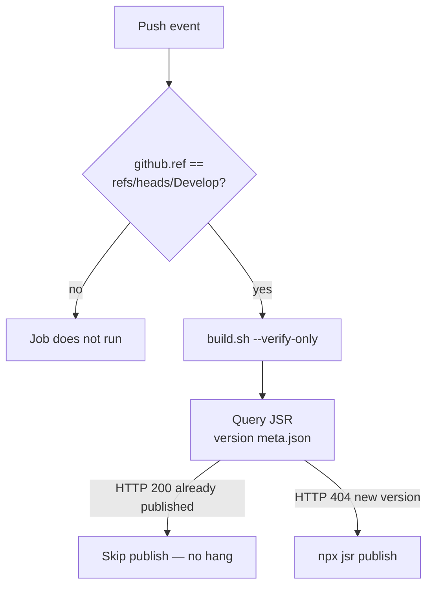

## Summary

The Publish workflow was hanging on routine pushes to Develop. Every push to
Develop triggers `.github/workflows/publish.yml`, but the package `version` in
`deno.json` only changes on a release commit. When the version is unchanged,
`npx jsr publish` re-attempts an already-published version and hangs the CLI
until the 15-minute job timeout cancels it — exactly the **"Publish / publish
(push) — Cancelled after 15m"** seen in the issue screenshot.

Two guards now prevent this:

1. **Explicit Develop branch guard** — the publish job carries
   `if: github.ref == 'refs/heads/Develop'`. The push trigger already restricts
   to Develop, but the explicit guard makes the requirement unambiguous so the
   job never runs on any other ref (the issue's literal ask: _should not be
   attempting to publish unless on the Develop branch_).
2. **Version-already-published gate** — a new step queries the JSR version meta
   endpoint (`https://jsr.io/<name>/<version>_meta.json`): HTTP 200 means the
   version is already published (skip), 404 means it is new (publish). The
   `jsr publish` step is gated on this check, so a routine Develop push that
   does not bump the version never reaches `jsr publish` and can no longer hang.

Closes #2904.

## Evidence

This is a CI/workflow change with no web interface to screenshot. Verification
is via the new structured tests plus `actionlint`.

Confirmed against the live JSR endpoint that the published version returns 200
and an unpublished version returns 404:

```
published 5.3.23  -> HTTP 200
bogus 99.99.99    -> HTTP 404
```

Publish gating flow:



## Test Plan

- Added `test/scripts/PublishBranchGuard.ts` (parses the committed workflow YAML
  and asserts on configuration — "what" tests):
  - `publish.yml only triggers on push to Develop` — the only trigger key is
    `push` and its branches are exactly `[Develop]`.
  - `publish job carries an explicit Develop branch guard` — the job `if:`
    references `github.ref` and requires `refs/heads/Develop`.
  - `publish step is gated on a prior version-published check` — the
    `jsr publish` step has an `if:` that depends on a prior step output, and
    that step queries JSR for the `deno.json` version.
- Existing `test/scripts/PublishWorkflow.ts` (build.sh `--verify-only`, no
  auto-advance of `neatCore.rev`) still passes.
- Full `test/ci/` + `test/scripts/` suites pass (179 tests); `actionlint`,
  `deno fmt`, `deno lint`, and `deno check` all clean.
