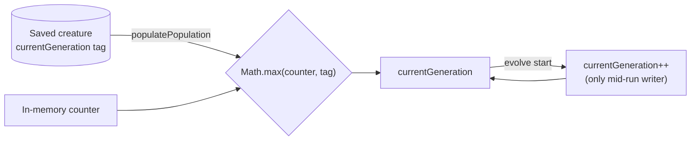

## Summary

Make `Neat.currentGeneration` the single source of truth for a lineage's
**accumulated** generation count and guarantee it is strictly ascending. The
counter is now seeded monotonically from the saved `currentGeneration` tag on
load and can never be lowered or reset by any path. Closes #2908.

Changes:

- **`src/NEAT/Neat.ts` — `populatePopulation`**: seed the counter with
  `Math.max(this.currentGeneration, readCurrentGenerationFromCreature(creature))`
  instead of a direct assignment, so no load path can lower it (monotonic-max,
  consistent with #2831's monotonic tag write).
- **`src/NEAT/Neat.ts` — field doc**: re-documented `currentGeneration` as the
  lineage-accumulated generation count across runs (not per-run), explaining why
  it must persist across ~15-min runs to reach a `warmupGenerations` of 1440.
  The on-disk tag name remains `currentGeneration`.

### Audit of writers to `Neat.currentGeneration`

A full sweep of `src/` (`grep -rn "currentGeneration *=\|currentGeneration++"`)
confirms only three touch the `Neat` instance field; the rest are unrelated
local variables (`WorkerHandler`, `Offspring`, `OnPolicyDistillationBreed`) or a
separate `Mutator.currentGeneration` field:

| Location                       | Writer                     | Verdict                     |
| ------------------------------ | -------------------------- | --------------------------- |
| `Neat.ts:159`                  | field init `= 0`           | construction default — fine |
| `Neat.ts` `populatePopulation` | monotonic-max seed at load | fixed here                  |
| `NeatEvolution.ts:90`          | `neat.currentGeneration++` | the only mid-run writer     |

No path resets or lowers the counter mid-run, so it strictly ascends. The three
`populatePopulation` call sites in `CreatureTraining.ts` (448, 736, 1193) each
create a fresh `Neat` (counter `0`) and feed the saved creature through
`populatePopulation`, so they inherit the monotonic-max fold automatically.



## Evidence

Backend/library change — no UI to screenshot. Verified via TDD: the two new
monotonic-max tests fail against the unfixed code and pass after the fix.

```
populatePopulation: never lowers an already-higher in-memory counter ... FAILED
populatePopulation: missing tag leaves a higher in-memory counter untouched ... FAILED
FAILED | 8 passed | 2 failed
```

After the fix: `ok | 10 passed | 0 failed`. Full `./quality.sh` passes (lint,
format, type-check, all tests): `ok | 7064 passed | 0 failed | 4 ignored`.

## Test Plan

Extended `test/NEAT/NeatPopulatePopulation.ts`:

- `seeds counter from saved currentGeneration tag (resume)` — seed tagged `42` →
  counter is 42, and the next increment yields 43.
- `never lowers an already-higher in-memory counter` — counter pre-set to 100,
  seed tagged `7` → counter stays 100.
- `missing tag leaves a higher in-memory counter untouched` — counter pre-set to
  50, seed with no tag → counter stays 50.

The existing `restores warm-up tags from seed creature` test (seed tagged `7` →
counter 7) continues to pass, confirming clean-start resume is unchanged.
