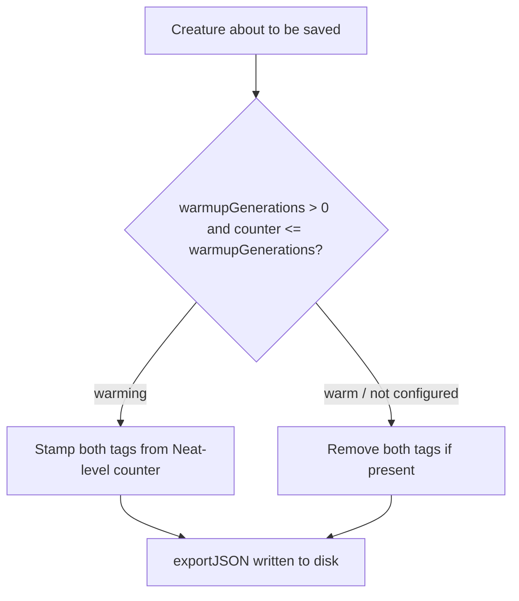

# Stamp warm-up tags only at the export/save boundary; strip both once warm

## Summary

Warm-up tags (`warmupGenerations` / `currentGeneration`) are now written from
Neat-level state **only when a creature is exported for persistence**, and both
tags are **removed once the accumulated counter passes `warmupGenerations`**, so
warm-up logic is zero cost after warm-up completes and no stale seed value lands
on disk.

Previously only the per-generation fittest was re-stamped, so whichever creature
actually landed on disk usually carried the stale seed value and the next run
resumed from it.

New helper
`applySeedWarmupTagsAtSave(target, warmupGenerations, currentGeneration)` in
`src/architecture/CreatureFactory.ts`:

- **Warming**
  (`warmupGenerations > 0 && currentGeneration <= warmupGenerations`): stamps
  both tags via `writeSeedWarmupProgressTags`, preserving its #2831
  monotonic-max guard (a higher generation is never lowered).
- **Warm** (`currentGeneration > warmupGenerations`) or **not configured**:
  `removeTag` both tags if present.

It operates on any taggable target (a live `Creature` or an exported JSON
object), so callers can stamp the export rather than mutating live population
members. `writeSeedWarmupProgressTags` and `readCurrentGenerationFromCreature`
were widened from `Creature` to `TagsInterface` (a backwards-compatible
widening) to support this.

Applied at both library save boundaries:

- **`src/NEAT/NeatEvolution.ts`** — the fittest return path now uses the helper,
  so it strips once warm instead of only stamping while warming. The fittest is
  already a clone, so tagging it directly is safe.
- **`src/creature/CreatureTraining.ts`** — `writeCreatures()` stamps the
  exported JSON of every population member as it is written, so the saved file
  is correct regardless of which creature is saved.

Closes #2909.

## Evidence

Backend/library change only — no web interface to screenshot. Verified via unit
tests (`test/architecture/SeedWarmupPersistence.ts`): all 16 pass.

## Test Plan

Added to `test/architecture/SeedWarmupPersistence.ts`:

- `applySeedWarmupTagsAtSave: while warming stamps both tags from counter` —
  carries the accumulated counter, never a stale seed value.
- `applySeedWarmupTagsAtSave: keeps #2831 monotonic-max guard` — a lower
  Neat-level counter never lowers an existing higher generation.
- `applySeedWarmupTagsAtSave: once warm strips both tags`.
- `applySeedWarmupTagsAtSave: not configured strips stale tags`.
- `applySeedWarmupTagsAtSave: not configured adds no tags`.
- `applySeedWarmupTagsAtSave: stamps the exported JSON object` — verifies the
  helper works on an export object (the `writeCreatures()` path).
- `applySeedWarmupTagsAtSave: strips stale tags from exported JSON once warm`.

Note: `./quality.sh` reported one failure in
`test/score/RustScorerBridgeHardening.ts` ("logs trimmed stderr on non-zero
exit"). This test is unrelated to this change (Rust scorer stderr logging) and
**passes in isolation** — it is flaky under parallel load. All warm-up tag tests
pass.
