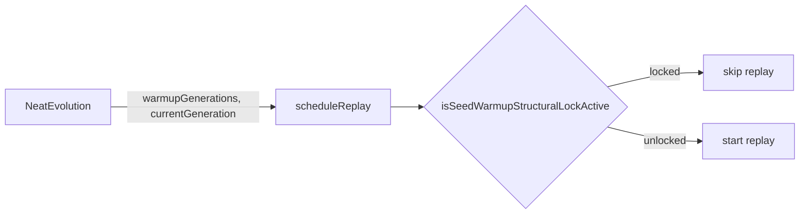

# Read the discovery replay warm-up gate from Neat-level state

## Summary

`DiscoveryReplayQueue.scheduleReplay` previously read the seed warm-up
structural lock from the creature's own warm-up tags via
`isSeedWarmupStructuralLockActiveForCreature(creature)`. Once mid-run creatures
stop carrying warm-up tags (#2911), an untagged creature would read
`warmupGenerations = 0` → lock **inactive** → a cached replay could prune the
seeded topology during the warm-up window.

This change switches the gate to **Neat-level warm-up context** supplied by the
caller. `scheduleReplay` now accepts an optional `warmupContext`
(`{ warmupGenerations, currentGeneration }`) and gates with the existing numbers
variant
`isSeedWarmupStructuralLockActive(warmupGenerations, currentGeneration)`. The
call site in `NeatEvolution.ts` passes `neat.warmupGenerations` /
`neat.currentGeneration`. The now-unused per-creature helper
`isSeedWarmupStructuralLockActiveForCreature` has been removed.

Lock semantics are unchanged: locked while `count <= warmupGenerations`;
conservatively locked when warm-up is configured but the count is unknown
(`<= 0`); unlocked when `count > warmupGenerations` or when warm-up is not
configured.

Closes #2910.

## Evidence

Backend/CLI change — no UI to screenshot. Verified by the unit tests below and
the full quality gate (`./quality.sh < /dev/null`): **7060 passed, 0 failed**.

## Test Plan

- Rewrote `test/NEAT/DiscoveryReplayWarmup.ts` to drive the gate via Neat-level
  context (no per-creature tags):
  - skips replay during the active warm-up window;
  - **untagged creature during warm-up stays locked** (the #2910 regression);
  - conservative lock when the current generation is unknown;
  - replays once the count exceeds `warmupGenerations`;
  - replays when no warm-up is configured / no context is supplied;
  - per-creature tags are ignored in favour of the Neat-level context.
- Updated `test/architecture/SeedWarmupStructuralLock.ts`: removed the four
  `(creature)` cases that exercised the deleted
  `isSeedWarmupStructuralLockActiveForCreature` helper. The numbers-variant
  cases (active/inactive/boundary/conservative/non-finite) remain and cover the
  shared gate logic. This test deletion is a direct consequence of removing the
  helper the issue authorised removing.
