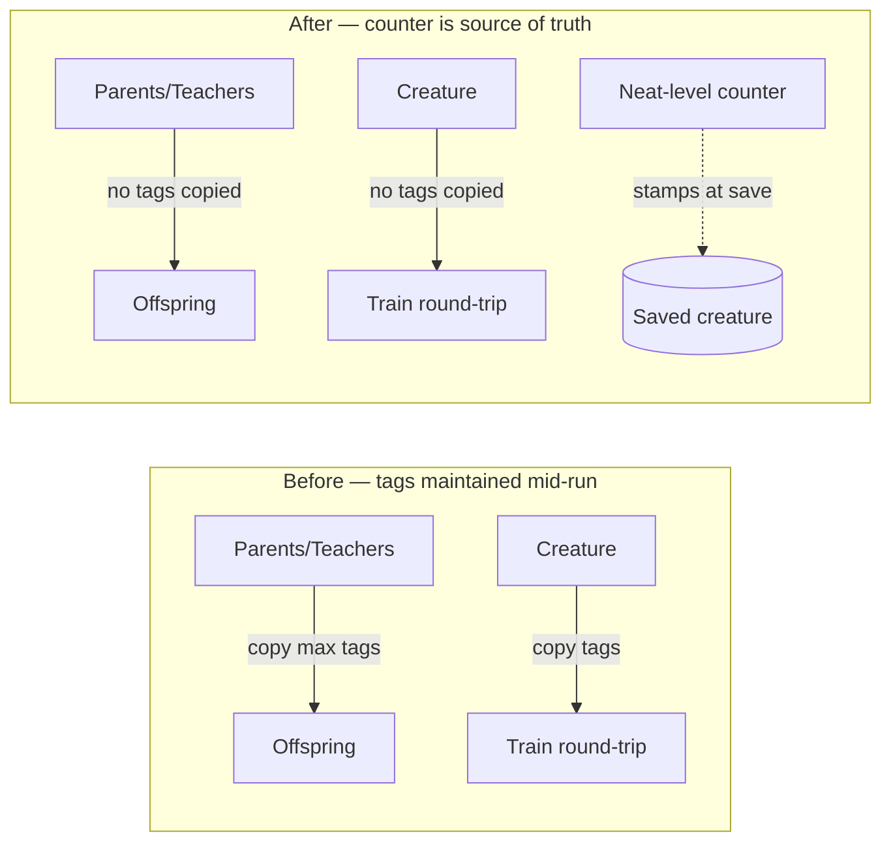

## Summary

Stop maintaining the `warmupGenerations` / `currentGeneration` tags on
creatures **during a run**. The Neat-level warm-up counter is the single
source of truth mid-run; the two tags exist only at the load
(`Neat.populatePopulation`) and save (Issue #2909) boundaries. Three sites
were the de facto count-keeping mechanism and the reason saved creatures
carried stale values — offspring inherited `max(parents)` without
incrementing, so a stale seed value propagated forever. Removing them
makes the counter authoritative. Closes #2911.

Removed:

- `propagateSeedWarmupTags` in `src/architecture/Offspring.ts` and both
  call sites — offspring no longer inherit warm-up tags.
- `propagateSeedWarmupTagsFromTeachers` in
  `src/breed/OnPolicyDistillationBreed.ts` and its call site — the
  distilled student no longer inherits teacher warm-up tags.
- The warm-up tag copy in `WorkerHandler.train()` — the training
  round-trip no longer carries warm-up tags.

Warm-up protection is unaffected: it is enforced at the Neat level via
`mutator.setWarmupContext(...)` in `NeatEvolution.ts`, not via per-creature
tags. The full suite (including `test/NEAT/MutatorWarmup.ts`) passes.

## Evidence

Backend-only change — no web interface to screenshot. Verified via the
test suite and the acceptance-criteria grep.

`./quality.sh < /dev/null` passes: **7069 passed, 0 failed** (exit 0).

Acceptance-criteria grep — no code path outside the load/save boundary
(`src/architecture/CreatureFactory.ts`) reads or writes the two tags:

```
$ grep -rn "WARMUP_GENERATIONS_TAG\|CURRENT_GENERATION_TAG" src/ \
    | grep -v "src/architecture/CreatureFactory.ts"
(no matches)
```



## Test Plan

- `test/architecture/SeedWarmupPersistence.ts` — replaced the three
  "warm-up tags survive breeding" assertions with
  `Offspring.breed: offspring does NOT carry warm-up tags from parents`
  and `grafted breeding does NOT carry warm-up tags`; save-boundary and
  read/write round-trip tests retained unchanged.
- `test/breed/OnPolicyDistillationBreed.ts` — rewrote
  `warm-up tags survive onto offspring` to assert the distilled student
  carries **no** warm-up tags.
- `test/multithreading/WorkerHandler.ts` — rewrote
  `WorkerHandler.train: keeps warm-up tags…` to assert the train payload
  does **not** carry the two warm-up tags, while existing training-context
  tags (`untrained-error`) remain.
- `test/NEAT/MutatorWarmup.ts` — unchanged, still passes (structural
  mutations remain blocked during warm-up).
