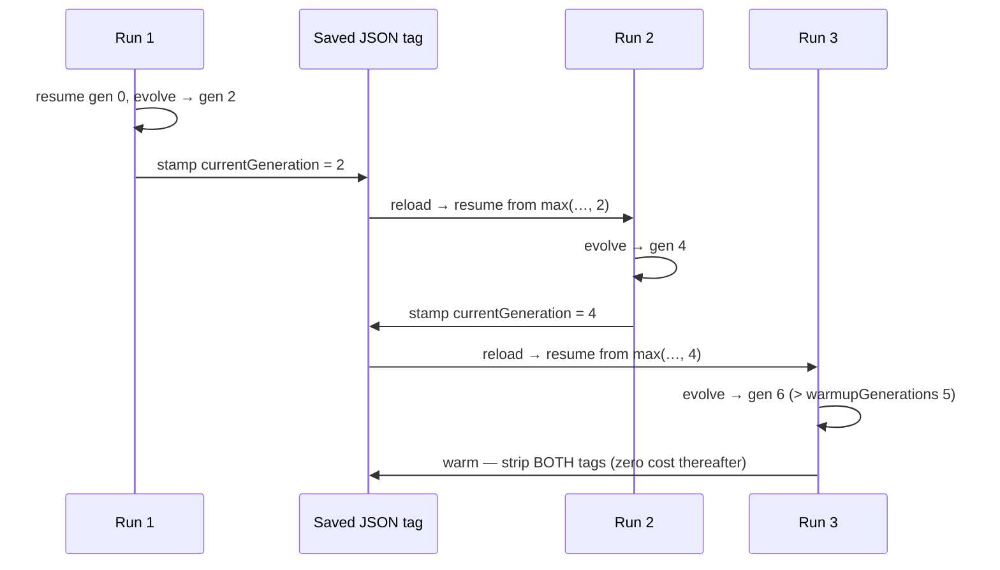

# Multi-run seed warm-up regression test + docs

## Summary

Added an end-to-end regression test proving the seed warm-up generation count
**accumulates across the production save → reload → resume cycle**, that the
structural lock stays active throughout the warm-up window, and that both
warm-up tags disappear from exports once warm-up completes. Also documented the
accumulated-count semantics and post-warm-up tag removal in
`docs/DISCOVERY_GUIDE.md`. Closes #2912.

The test reproduces the production bug shape (`GRQ-24-100.json` stuck at
`currentGeneration: 1` after a week of 15-minute runs against
`warmupGenerations: 1440`): each short run is far shorter than the warm-up
window, so the gate can only lift by the saved tag accumulating across runs. It
drives the **real** production paths touched by the #2908..#2911 fix chain:

- `Neat.populatePopulation` — resume seeds the lineage counter monotonically
  from the saved `currentGeneration` tag (#2908).
- `applySeedWarmupTagsAtSave` — the export boundary used by `writeCreatures`:
  stamps the accumulated counter while warming (monotonic-max, #2831/#2909) and
  strips both tags once warm (#2909).
- `Mutator` / `DiscoveryReplayQueue` — structure-reducing/squash mutations are
  filtered and discovery replay is skipped while the lock is active (#2828).

It would fail against the pre-#2908 behaviour: without monotonic resume from the
saved tag, every run restarts at 0 and saves the same per-run count, so the
strict cross-run increase assertion (`savedGen` 2 → 4 → …, exceeding one run's
`GENS_PER_RUN`) fails — exactly the "stuck at the seed value" production bug.

## Evidence

Backend/CLI change — no web interface. Verified via the new unit test and the
full quality gate.

```
deno test test/NEAT/SeedWarmupAccumulation.ts
ok | 2 passed | 0 failed (34ms)

./quality.sh
ok | 7123 passed (2 steps) | 0 failed | 4 ignored (8m49s)
```

The simulated multi-run accumulation (from the real paths) — counter resumes
monotonically, the gate lifts once it passes the window, then both tags are
stripped:



## Test Plan

- Added `test/NEAT/SeedWarmupAccumulation.ts`:
  - `count accumulates across save/reload/resume, gate lifts, tags drop` — one
    scenario asserting (a) the saved `currentGeneration` strictly increases run
    over run and exceeds a single run's generations, (b) the structural lock is
    enforced on resume during the window (mutator filters structural/squash
    mutations; replay is skipped), and (c) once warm, the saved creature carries
    neither `warmupGenerations` nor `currentGeneration` and replay resumes.
  - `a run shorter than the window can never lift the gate alone` — a larger
    window proves no single short run lifts the gate; only accumulation across
    saved/reloaded runs does, with the saved counter advancing each run.
- Both tests complete in ~34 ms, well within the 120 s unit-test budget; tiny
  network, tiny population, discovery deps stubbed, no real training workers.
- Updated `docs/DISCOVERY_GUIDE.md` with the accumulated-count semantics, the
  monotonic resume/save boundary, post-warm-up tag removal (zero cost), and the
  no-migration note for files stuck at `currentGeneration: 1`.
