# Expose selection-pressure parameters as configuration (Issue #2929)

## Summary

Selection pressure is one of the most direct levers on convergence speed, yet
several of its knobs were hardcoded:

- `src/methods/Selection.ts` — `POWER.power = 4`, `TOURNAMENT.size = 5`,
  `TOURNAMENT.probability = 0.5`.
- `src/breed/AdaptiveTournamentSize.ts` — the fully hardcoded formula
  `max(3, min(floor(sqrt(pop)), floor(pop * 0.1)))`.

This change exposes all of them through the standard `NeatOptions`/`NeatConfig`
surface via a new `selectionPressure` config object, with validation and
defaults that reproduce the current behaviour exactly. Users can now tune the
exploration/exploitation trade-off for their problem.

**Closes #2929.**

### New `selectionPressure` knobs

| Knob                             | Default | Meaning                                                    |
| -------------------------------- | ------- | ---------------------------------------------------------- |
| `power`                          | `4`     | POWER selection exponent                                   |
| `tournamentSize`                 | `5`     | Fixed tournament size when adaptive sizing is off          |
| `tournamentProbability`          | `0.5`   | Probability of picking the best tournament participant     |
| `adaptiveTournament`             | `true`  | Scale tournament size with population size                 |
| `adaptiveTournamentMinSize`      | `3`     | Floor for the adaptive tournament size                     |
| `adaptiveTournamentSqrtExponent` | `0.5`   | Population scaling exponent `floor(pop ^ exponent)` (sqrt) |
| `adaptiveTournamentCapFraction`  | `0.1`   | Cap as a fraction of population `floor(pop * fraction)`    |

Out-of-range values (e.g. `power <= 0`, `tournamentProbability > 1`,
`adaptiveTournamentCapFraction > 1`) are rejected by `parseNumber` with a clear
`ConfigurationError` at config-creation time.

### Bit-for-bit default behaviour

- Defaults are sourced from the existing `Selection` singletons
  (`Selection.POWER.power`, `Selection.TOURNAMENT.size/probability`).
- `calculateAdaptiveTournamentSize` keeps `Math.sqrt` for the default exponent
  (`0.5`) so results are identical to the prior implementation; the configurable
  `Math.pow` path is only used for non-default exponents.

```mermaid
flowchart LR
    O[NeatOptions.selectionPressure] --> P[parseSelectionPressure]
    P --> C[NeatConfig.selectionPressure]
    C --> SP[selectParent]
    SP -->|POWER| Pw[selectPower&#40;power&#41;]
    SP -->|TOURNAMENT| AT{adaptiveTournament?}
    AT -->|yes| Adp[calculateAdaptiveTournamentSize&#40;pop, bounds&#41;]
    AT -->|no| Fix[tournamentSize]
    Adp --> T[selectTournament&#40;size, probability&#41;]
    Fix --> T
```

## Evidence

Backend/library change — no UI to screenshot. Verified by the full quality gate
(`./quality.sh`): **7136 passed | 0 failed | 4 ignored**, including all
pre-existing selection/tournament tests, which pass unchanged (proving defaults
reproduce current behaviour).

The new behavioural tests confirm the acceptance criterion that stronger
pressure increases the chance of selecting the top-ranked creature:

- `test/breed/SelectionPressure.ts::SelectionPressure - higher POWER exponent
  selects the top creature more often`
- `test/breed/SelectionPressure.ts::SelectionPressure - larger tournament size
  selects the top creature more often`

## Test Plan

Added:

- `test/config/SelectionPressureConfig.ts` — defaults reproduce prior values,
  custom/partial overrides, CLI string coercion, and out-of-range rejection for
  every knob.
- `test/breed/SelectionPressure.ts` — custom adaptive bounds change the computed
  size while defaults match the prior formula; POWER exponent and tournament
  size measurably raise the probability of selecting the top creature; default
  config still drives adaptive tournament selection.

No existing tests were modified or removed.

## Files changed

- `src/config/SelectionPressureConfig.ts` (new) — config interface, `Required`
  type, and defaults.
- `src/config/parsers/SelectionParsers.ts` (new) — `parseSelectionPressure`.
- `src/config/NeatConfigParsers.ts` — re-export the new parser.
- `src/config/NeatConfig.ts` — wire `selectionPressure` into `createNeatConfig`.
- `src/config/NeatArguments.ts`, `src/config/NeatOptions.ts` — add the field to
  the config and options surfaces.
- `src/breed/AdaptiveTournamentSize.ts` — accept optional tunable bounds.
- `src/breed/ParentSelection.ts` — read knobs from config instead of the
  hardcoded `Selection` singletons.
- `mod.ts` — export the new config types and default constant.
- `docs/PERFORMANCE_TUNING.md` — document the new knobs.
