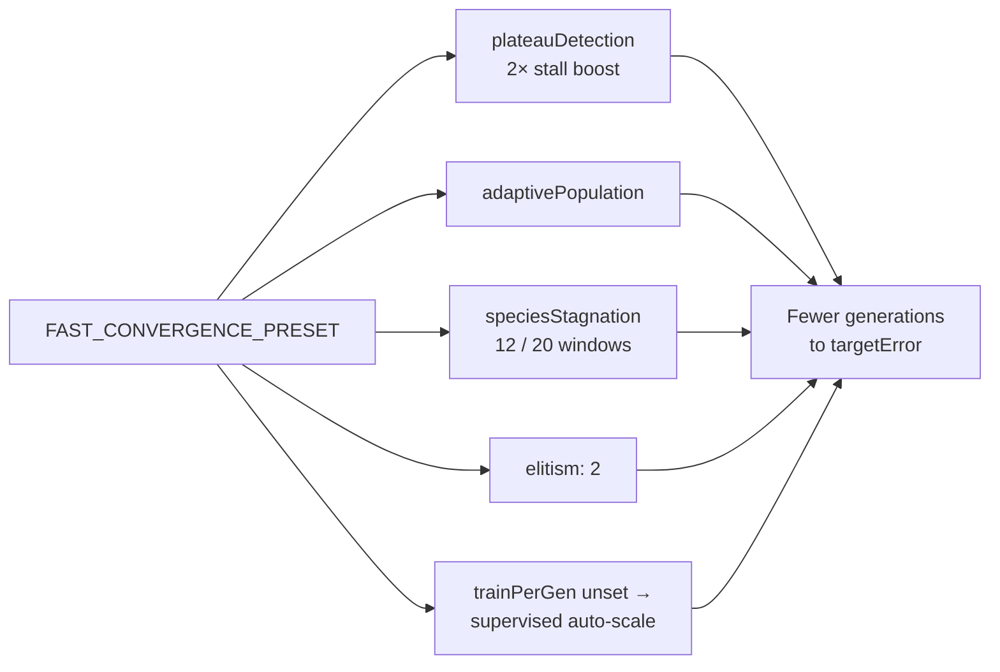

# Add a "Fast Convergence" preset bundling high-impact pace levers

## Summary

Adds `FAST_CONVERGENCE_PRESET` to `src/presets/Presets.ts` — a curated
`NeatOptions` preset that bundles the high-impact "pace" levers which ship
fully implemented but **off by default**, so reaching `targetError` takes
fewer generations. It is a one-line opt-in to "evolve faster". Closes #2930.

The preset enables:

- **Plateau detection** with a 2× stall mutation boost
  (`windowSize: 10`, `responseMutationMultiplier: 2.0`) — the lever that
  breaks the search out of local optima on harder tasks.
- **Adaptive population sizing** (`adaptivePopulation.enabled: true`) —
  grows the population when diversity collapses, shrinks it when healthy.
- **Tighter species stagnation** (`haltWindow: 12`, `extinctionWindow: 20`)
  — reclaims breeding budget from dead-end species sooner than the
  defaults (15/25).
- **`elitism: 2`** — retains the top two performers.
- **`trainPerGen` deliberately left unset** so the supervised auto-scaling
  (`round(populationSize × 0.2)`, Issue #2791) applies — 10 for the
  preset's population of 50. Pinning a small literal would *starve*
  gradient descent below the default and slow convergence; the lever is
  the auto-scaling, not a hard-coded number.

The preset is exported from `mod.ts`, is fully composable (spreadable),
and passes `createNeatConfig` validation. Trade-offs (higher
per-generation cost, premature-convergence risk) and a "when NOT to use
it" note are documented in the preset's doc comment and in
`docs/config/PRESETS.md`.

### Why the obvious approach loses, and the fix

An early draft pinned `trainPerGen: 2`. For a supervised (MSE) task at
population 50 the library **default** `trainPerGen` already auto-scales to
10, so pinning 2 made the preset *slower* than the defaults. The fix is to
leave `trainPerGen` unset and let the auto-scaling apply — the preset then
benefits from the lever instead of fighting it.

## Evidence

This is a backend/library change with no web interface to screenshot.

### Benchmark — fewer generations to `targetError`

`bench/FastConvergencePreset.ts` runs real evolution
(`creature.evolveDataSet`) on a sample task, comparing the library
defaults against the preset over several seeds (single worker thread,
same `targetError` and generation cap), capturing the generation at which
each run first crosses the target via the `onTrainingEvent` lifecycle
callback.

On **3-bit parity** — a classic harder, plateau-prone task — the preset
reaches the target in ~10% fewer generations on average and solves seeds
the defaults stall on within the same budget:

```
Fast Convergence preset benchmark (3-bit parity, 5 seeds, target 0.05, cap 200)
seed  11 → defaults 202 gen (err 0.2303)  |  fast 186 gen (err 0.0466)
seed  23 → defaults 202 gen (err 0.1689)  |  fast 202 gen (err 0.1044)
seed  37 → defaults 202 gen (err 0.1250)  |  fast 149 gen (err 0.0444)
seed  59 → defaults  92 gen (err 0.0402)  |  fast 127 gen (err 0.0488)
seed  71 → defaults 103 gen (err 0.0419)  |  fast  59 gen (err 0.0139)
Mean generations — defaults: 160.2
Mean generations — fast    : 144.6
FAST_CONVERGENCE_PRESET converged 15.6 generations sooner on average (10% fewer).
```

Note the seeds where the defaults hit the 200-generation cap without
reaching the target (errors 0.23, 0.17, 0.13) while the preset converges
(errors ≤ 0.05) — the preset's plateau-escape and stagnation-reclamation
levers are what get it across the line.

On trivially easy 2-input XOR the defaults already converge in a handful
of generations and the extra exploration just adds variance — this is
documented as a "when NOT to use it" caveat rather than hidden.



## Test Plan

Added to `test/config/Presets.ts` (all pass under `./quality.sh`,
7131 tests, 0 failed):

- `Fast Convergence preset - produces valid configuration`
- `Fast Convergence preset - plateau detection is enabled`
- `Fast Convergence preset - adaptive population is enabled`
- `Fast Convergence preset - species stagnation is enabled`
- `Fast Convergence preset - stall response boosts mutation`
- `Fast Convergence preset - leaves trainPerGen to supervised auto-scaling`
- `Fast Convergence preset - preserves elitism`
- `Fast Convergence preset - user overrides take precedence`
- `FAST_CONVERGENCE_PRESET` added to the shared "satisfy NeatOptions type
  and produce valid configs" loop.

Each test calls `createNeatConfig({ ...FAST_CONVERGENCE_PRESET })` and
asserts on the resulting config (behaviour, not source text).

## Files changed

- `src/presets/Presets.ts` — new `FAST_CONVERGENCE_PRESET` with doc comment.
- `mod.ts` — export the new preset.
- `test/config/Presets.ts` — coverage for the new preset.
- `bench/FastConvergencePreset.ts` — convergence benchmark (new).
- `docs/config/PRESETS.md` — table row + section documenting the preset.
