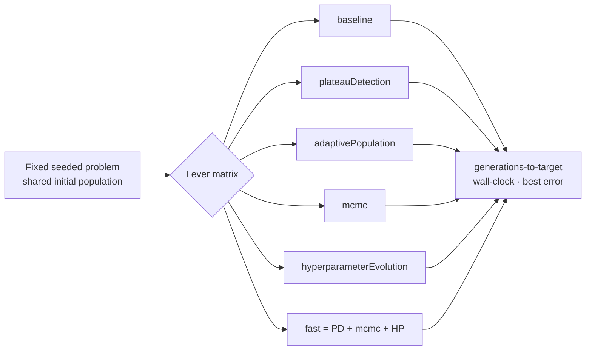

## Summary

Adds a single experiment that compares NEAT-AI's OFF-by-default "pace levers"
head-to-head, so "which should we turn on?" can be answered with data instead of
intuition. Per-lever benches already existed, but each measured one mechanism in
isolation — there was no harness running the _same_ fixed problem under multiple
lever configurations. Closes #2931.

New `bench/EvolutionPaceLeverComparison.ts` is a deterministic, seeded A/B
harness. It builds one fixed supervised problem (a small dense network learning
a fixed logistic mapping, identical seeded initial population and dataset) and
evolves it under a matrix of configurations, reporting
**generations-to-target**, **wall-clock ms**, and **best error** for each:

- `baseline` (defaults)
- `plateauDetection`
- `adaptivePopulation`
- `mcmc`
- `hyperparameterEvolution`
- `fast (combined)` = plateauDetection + mcmc + hyperparameterEvolution

Where a lever has a real production entrypoint, the harness calls it directly so
the comparison measures library behaviour rather than a stand-in:

- `mcmc` → `metropolisHastingsAccept` (`@neat/MetropolisHastings.ts`)
- `adaptivePopulation` → `computeAdaptivePopulationSize`
  (`@neat/AdaptivePopulationSizer.ts`)
- `hyperparameterEvolution` → `createDefaultHyperparameters` /
  `mutateHyperparameters` (`@neat/HyperparameterEvolution.ts`)

`plateauDetection` is modelled directly (window-based stall detection +
random-immigrant injection). **No production/runtime code is changed** — pure
measurement + docs, as the issue requires. `generationsToTarget` and `bestError`
are fully reproducible across runs (only wall-clock varies).

`docs/PERFORMANCE_RESEARCH.md` gains a new section with the numbers, a Mermaid
overview, and a concrete default-on recommendation.

## Evidence

This is a measurement/CLI change with no web interface — evidence is the
benchmark output and the deterministic tests.

`deno run --allow-read --allow-env --allow-ffi bench/EvolutionPaceLeverComparison.ts`
— population 24, 60 generations, 48-sample dataset, `targetError = 0.05`, seed
2931:

| config                  | generations-to-target | wall-clock ms | best error |
| ----------------------- | --------------------- | ------------- | ---------- |
| baseline                | 18                    | 562.2         | 0.049757   |
| plateauDetection        | 14                    | 413.6         | 0.049974   |
| adaptivePopulation      | 20                    | 610.2         | 0.047773   |
| mcmc                    | 14                    | 417.3         | 0.044555   |
| hyperparameterEvolution | 9                     | 268.1         | 0.045144   |
| fast (combined)         | 11                    | 329.0         | 0.045903   |

Convergence vs baseline (fewer generations is better):

- `hyperparameterEvolution` — **50% faster** (9 vs 18 generations), lowest
  wall-clock. Strongest single lever.
- `mcmc` — **22% faster** and the best final error (0.0446).
- `plateauDetection` — **22% faster**; cheap when no plateau is detected.
- `fast (combined)` — **39% faster**; faster than baseline and every lever
  except `hyperparameterEvolution` alone (stacked stochasticity does not simply
  sum).
- `adaptivePopulation` — **11% slower** here: growing the population spreads the
  fixed per-generation training budget, delaying convergence. It is a
  diversity/escape lever, not a convergence-speed one.

**Recommendation (in `docs/PERFORMANCE_RESEARCH.md`):** turn on
`hyperparameterEvolution` for convergence-bound runs and `mcmc` where final
quality matters; keep `plateauDetection` as a cheap stall-escape; leave
`adaptivePopulation` OFF by default for convergence-bound runs. These inform
#2928 / future default changes but do not themselves flip any default.

The ordering is stable as the target tightens (e.g. at `targetError = 0.04`:
baseline 24 generations, `hyperparameterEvolution` 10, `adaptivePopulation` 24).

## Test Plan

`test/bench/EvolutionPaceLeverComparison.ts` (8 deterministic tests, ~30 ms):

- `runLeverComparison` is deterministic across repeated runs (identical
  generations-to-target and best error).
- Returns one result per configuration; metrics are finite and non-negative;
  generations-to-target stays within range.
- `runConfig` leaves the global RNG generator unchanged (no global side
  effects).
- `formatComparisonTable` renders one row per result and an em dash when the
  target is not reached.
- The lever matrix exposes the six issue-#2931 configurations; the production
  target is harder than the fast-test target.

Quality gate: `./quality.sh --lint-only` and `./quality.sh --check-only` both
pass (project-wide lint + type-check); the new tests pass via
`deno test --allow-read --allow-env --allow-ffi test/bench/EvolutionPaceLeverComparison.ts`.

## Deno regression avoided

- Harness, tests, and docs are pure Deno — run via `deno run` / `deno test`, no
  Node tooling, dependencies, or config introduced.
