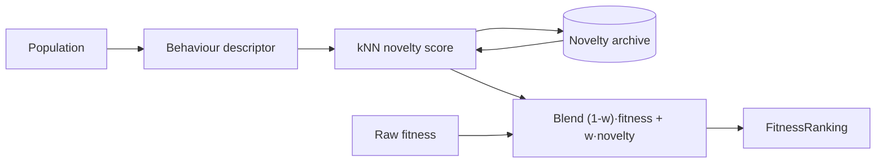

## Summary

Adds an optional **novelty (behavioural-diversity) selection** mechanism to
escape deceptive landscapes, where pure-fitness selection stalls in local optima
and the pace of evolution collapses. The new mechanism is a self-contained
module behind an **OFF-by-default** feature flag, so existing behaviour and
tests are unchanged. Closes #2932.

When enabled, ranking blends raw fitness with a behavioural-novelty score:

- a per-creature **behaviour descriptor** (problem-supplied via a `behaviour`
  tag — e.g. the output vector on a probe set),
- a bounded, FIFO **novelty archive**,
- a **k-nearest-neighbour novelty score** (mean distance to the `k` nearest
  behaviours across the population + archive),
- a configurable blend `score' = (1 - weight)·fitness + weight·novelty` (both
  terms min-max normalised), fed into `FitnessRanking` via the existing
  score-override hook used by fitness sharing.

### What changed

- **New** `src/config/NoveltyConfig.ts` — `NoveltyConfig` /
  `RequiredNoveltyConfig` / `DEFAULT_NOVELTY_CONFIG` (`enabled: false`).
- **New** `src/NEAT/NoveltySearch.ts` — pure-numeric core (`behaviourDistance`,
  `meanNearestNeighbourDistance`, `normalise`, `blendScores`), the
  `NoveltyArchive` and `NoveltySearch` classes, and the `extractBehaviour` /
  `buildNoveltyBlendedScores` bridge to live breeding.
- **Config wiring** — `parseNovelty` (PopulationParsers + barrel), and the
  `novelty` field threaded through `NeatArguments`, `NeatOptions` (both option
  shapes + both `Omit` lists), and `NeatConfig`.
- **Breeding** — `Breed` accepts an optional persistent `NoveltySearch`; when
  `novelty.enabled` it blends novelty into the mother-selection ranking. The
  engine is owned by `Neat` (`neat.noveltySearch`) so the archive accumulates
  across generations, and is passed in at both `Breed` construction sites
  (`Neat.ts`, `NeatEvolution.ts`).
- **Docs** — `docs/NOVELTY_SEARCH.md` (with a Mermaid flow diagram), a README
  Feature Highlight, docs index entry, and a CHANGELOG entry.

### Safety / no-op guarantees

- `enabled: false` (default) → the novelty branch is skipped entirely; ranking
  is byte-for-byte as before.
- `enabled: true` but fewer than two creatures expose a parseable descriptor →
  `buildNoveltyBlendedScores` returns `undefined` and ranking is left untouched.

## Evidence

Backend/CLI change — no web interface to screenshot. Verified via the test suite
and a deterministic deceptive-landscape benchmark.

`bench/NoveltyDeceptiveEscape.ts` — population starts inside a deceptive basin
(fitness cap `0.8`); the global optimum (`1.0`) sits across a fitness valley.
Pure fitness is trapped; novelty escapes in a handful of generations:

| seed  | fitness-only         | with novelty    |
| ----- | -------------------- | --------------- |
| 12345 | trapped (best 0.800) | solved @ gen 8  |
| 222   | trapped (best 0.800) | solved @ gen 9  |
| 9001  | trapped (best 0.800) | solved @ gen 8  |
| 4242  | trapped (best 0.800) | solved @ gen 11 |
| 77777 | trapped (best 0.800) | solved @ gen 5  |

## Test Plan

- `test/config/NoveltyConfig.ts` — defaults applied, OFF by default, overrides,
  partial overrides, range validation (weight, neighbours), empty-tag fallback.
- `test/NEAT/NoveltySearch.ts` — distance, kNN mean, archive FIFO eviction +
  defensive copies + floor, normalise, blend (weight 0/1/0.5 + clamping),
  `computeNovelty`, `updateArchive` threshold, `extractBehaviour`,
  `buildNoveltyBlendedScores` (no-op + blend + archive).
- `test/NEAT/NoveltySearchDeceptive.ts` — **acceptance**: novelty escapes the
  deceptive trap in strictly fewer generations than fitness-only (deterministic,
  seeded).
- `test/breed/BreedNovelty.ts` — Breed wiring: disabled engine untouched,
  enabled engine archives behaviours, enabled-but-no-tags safe no-op.

Quality gates run: `deno fmt`, `deno lint`, `deno check` (full project),
bash-script check — all clean. Affected suites (config, breed, NEAT novelty)
pass.
