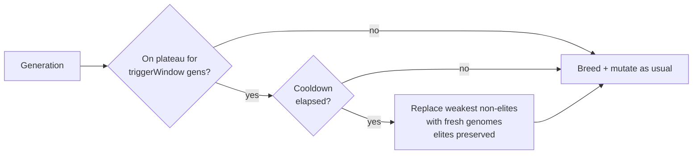

# Inject random immigrants (fresh genomes) on a detected plateau

## Summary

When the population stalls, the only existing stagnation response was to scale
the mutation rate — which perturbs _existing_ genomes but adds no new genetic
material. This PR adds an optional, **OFF-by-default** random-immigrants
controller driven by the **existing** `PlateauDetector` signal: once the
population has been on a plateau for a configurable number of generations, the
weakest _non-elite_ creatures are replaced with freshly seeded genomes, with a
cooldown between injections to avoid thrashing. Elites are always preserved.

Closes #2933.

### What changed

- **`src/config/RandomImmigrantsConfig.ts`** (new) — `RandomImmigrantsConfig`,
  `RequiredRandomImmigrantsConfig`, and `DEFAULT_RANDOM_IMMIGRANTS_CONFIG`
  (`enabled: false`, `injectionFraction: 0.1`, `triggerWindow: 5`,
  `cooldown: 10`).
- **`src/NEAT/RandomImmigrants.ts`** (new) — the `RandomImmigrants` controller
  (decision logic: `shouldInject`, `immigrantCount`, `recordInjection`, `reset`)
  and the `injectRandomImmigrants` helper (mechanical replacement that preserves
  elites and replaces the weakest non-elites, ranking unscored offspring as
  weakest so freshly bred genomes go first).
- **`src/NEAT/NeatEvolution.ts`** — injection wired in right after the new
  population is assembled and before de-duplication, reusing
  `plateauDetector.getGenerationsOnPlateau()`. Fresh immigrants are minimal
  `Creature(input, output)` genomes matching the fittest's I/O and feedback
  setting. A no-op unless `randomImmigrants.enabled`.
- **`src/NEAT/Neat.ts`** — owns a `RandomImmigrants` instance so the cooldown
  state survives across generations.
- Config plumbed through `NeatArguments`, `NeatOptions` (both override blocks
  and both `Omit` lists), `NeatConfig`, `PopulationParsers`
  (`parseRandomImmigrants`), the `NeatConfigParsers` barrel, and a cross-field
  check in `NeatConfigValidation` (enabled ⇒ `injectionFraction > 0`).
- **`README.md`** — new feature entry with a Mermaid flow diagram.

### Flow



## Evidence

Backend/CLI change — no web interface to screenshot. Verified via tests and a
deterministic stagnation-trap benchmark.

**Stagnation-trap escape** (`bench/RandomImmigrantsStagnationEscape.ts`): a wide
flat-plateau landscape whose only gradient is hidden beyond `x = 0.8`. Pure
mutation does an unbiased random walk and never crosses the gap; fresh
immigrants sampled across the domain land beyond the edge, after which ordinary
gradient ascent finishes the climb.

```
seed | immigrants OFF        | immigrants ON
-----+-----------------------+----------------------
  1  | stuck (>= 80)         | solved @ gen 8
  2  | stuck (>= 80)         | solved @ gen 8
  3  | stuck (>= 80)         | solved @ gen 17
  4  | stuck (>= 80)         | solved @ gen 8
  5  | stuck (>= 80)         | solved @ gen 11
```

Immigrants escape the trap on every seed within ≤17 generations; pure mutation
stays stuck for the full 80-generation budget.

## Test Plan

- `test/config/RandomImmigrantsConfig.ts` — defaults applied & OFF by default;
  custom and partial overrides; range validation for `injectionFraction`,
  `triggerWindow`, `cooldown`; enabled-with-zero-fraction rejected.
- `test/NEAT/RandomImmigrants.ts` — controller gating (disabled, trigger window,
  cooldown, reset), `immigrantCount` arithmetic, and `injectRandomImmigrants`
  behaviour (elites preserved, weakest/unscored replaced first, count clamped,
  zero-count no-op).
- `test/NEAT/RandomImmigrantsStagnationEscape.ts` — drives the **real**
  `PlateauDetector` + `RandomImmigrants` on the stagnation trap and asserts
  enabled escapes faster than (and never slower than) pure mutation across 5
  seeds; plus an end-to-end `evolveDataSet` run with injection enabled that
  completes with a well-formed result.

Quality gate: `deno fmt`, `deno lint`, and project-wide `deno check` pass; the
full `test/NEAT/` suite (799 tests) and `test/config/` suite (373 tests) pass.
The feature is OFF by default, so existing behaviour and tests are unchanged.
