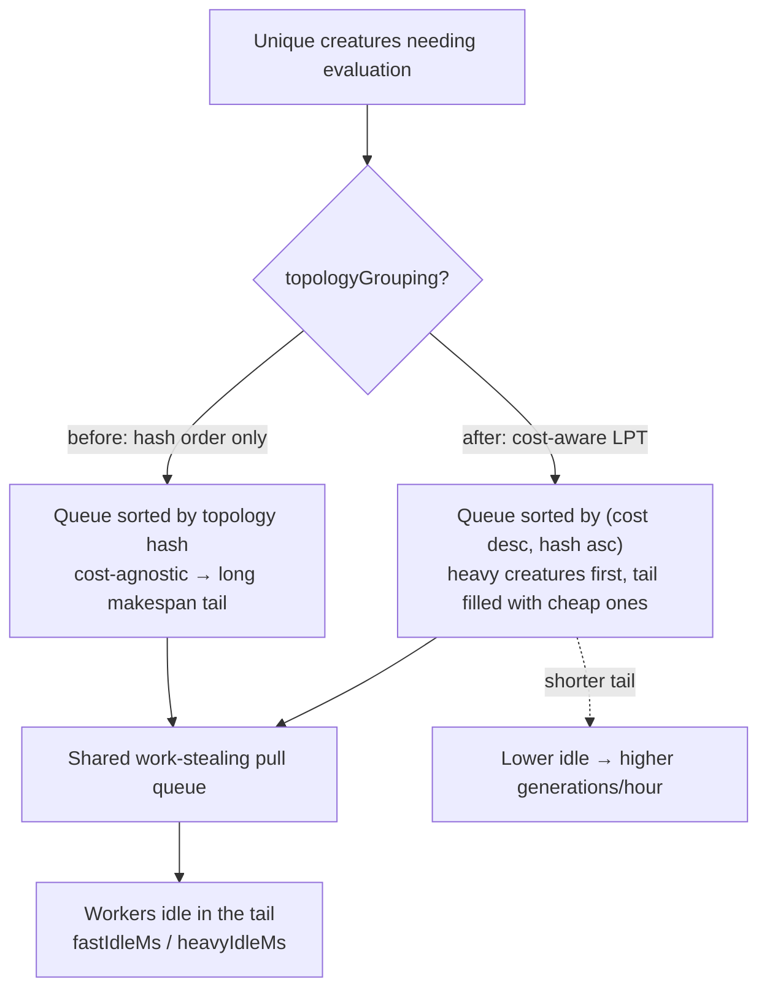

## Summary

Reduce per-generation worker idle time in the fitness phase to raise wall-clock
throughput (generations/hour). Profiling the fitness phase identified the
**dominant idle source as the makespan tail caused by cost-agnostic task
ordering**: workers pull one creature at a time from a shared queue, so load is
balanced _during_ the phase, but when a few expensive creatures are scheduled
late, every other worker falls idle waiting for them. Topology grouping (Issue
#1862) sorts by topology _hash_, which is uncorrelated with cost, so it never
shortens this tail.

The fix orders the evaluation queue **longest-processing-time-first (LPT)** —
expensive creatures start early so the tail fills with cheap ones. Cost is
proxied by `neurons + synapses` (constant per topology), and topology grouping
is preserved as a tiebreak (`cost desc, then hash asc`), so same-topology
creatures stay contiguous for WASM-cache reuse while heavy blocks are
front-loaded. The ordering is a pure function of topology, so **scores and
seeded-run determinism are unchanged** — only the dispatch order changes.

Closes #2934.

### What changed

- **`src/multithreading/EvaluationScheduling.ts`** (new):
  `estimateEvaluationCost`, `orderForEvaluation` (the LPT ordering used by the
  fitness phase), and the pure profiling helpers `simulateGreedyMakespan` /
  `computeScheduleIdle` that model the shared pull-queue scheduling.
- **`src/architecture/Fitness.ts`**: replaced the inline topology-hash sort with
  a call to `orderForEvaluation`.
- **`bench/FitnessDispatchOrdering.ts`** (new): reproducible before/after
  profiling report plus an ordering micro-benchmark.
- **`docs/PERFORMANCE_RESEARCH.md`**: recorded the profiling finding and
  numbers.

## Evidence

Backend/scheduling change — no UI. Profiling simulates the exact pull-queue
discipline the fitness phase uses, for a representative 100-creature generation
(mostly small topologies with a heavy tail; total cost 810), comparing the
baseline cost-agnostic order with the cost-aware order
(`deno run --allow-read --allow-env bench/FitnessDispatchOrdering.ts`):

| workers | makespan before | makespan after | idle before | idle after | idle reduction |
| ------- | --------------- | -------------- | ----------- | ---------- | -------------- |
| 2       | 420             | 408            | 30          | 6          | 80.0%          |
| 4       | 222             | 204            | 78          | 6          | 92.3%          |
| 8       | 126             | 102            | 198         | 6          | 97.0%          |
| 16      | 78              | 54             | 438         | 54         | 87.7%          |

Makespan is the fitness-phase wall-clock; the shorter makespan directly raises
generations/hour (e.g. 8 workers: 126 → 102 cost units, ≈19% faster phase) while
idle drops 80–97%.

**No regression on the uniform-topology path:**
`bench/ParallelFitnessEvaluation.ts` (equal-cost creatures, so ordering cannot
shorten the makespan) is unchanged — 100 creatures / 4 workers ≈ 70.3 ms vs 70.7
ms baseline (within noise). Ordering overhead is sub-millisecond
(`deno bench bench/FitnessDispatchOrdering.ts`).

## Test Plan

- **`test/multithreading/EvaluationScheduling.ts`** (new, 8 tests):
  - `estimateEvaluationCost` counts neurons + synapses; larger topology costs
    more.
  - `orderForEvaluation` sorts longest-cost-first (grouping off); deterministic
    tiebreak across input permutations; keeps same-topology contiguous and
    front-loads the heavy block (grouping on).
  - `simulateGreedyMakespan` / `computeScheduleIdle` correctness on known
    inputs.
  - `orderForEvaluation` reduces idle versus insertion order across 2/4/8
    workers.
- **Existing Fitness suites pass unchanged** (40 tests across
  `test/architecture/Fitness*`, `test/NEAT/Fitness*`, `test/multithreading/`),
  including `FitnessTopologyGrouping` (same-topology contiguity invariant) and
  the dedup/telemetry suites.
- **Evolution integration unchanged**: `test/NEAT/Evolve.ts`,
  `EvolvePhaseTiming.ts`, `NeatEvolve.ts` (14 tests) pass, confirming
  evolutionary outcomes are preserved.
