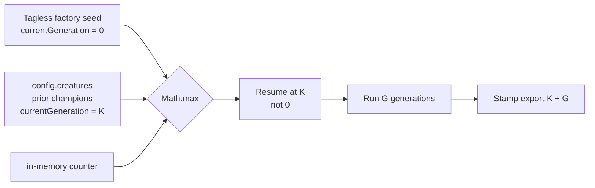

## Summary

Resume the warm-up `currentGeneration` counter from the **maximum across the
entire starting population AND the primary seed**, not just the primary seed
creature. Closes #2945.

**Root cause:** `Neat.populatePopulation` seeded the lineage-accumulated
generation counter from only the single primary seed creature. In production
(the GRQ isolated-team harness) that primary seed is a freshly-built **factory
template** that carries `warmupGenerations` but never `currentGeneration`, so
`readCurrentGenerationFromCreature` returned `0` and a fresh `Neat` stayed at
`0`. The tag-carrying champions from prior runs _were_ loaded — but only as
population members via `config.creatures` — and `populatePopulation` never
inspected them when seeding the counter. Net effect: every run restarted the
counter at `0`, stamped exports with that small per-run value, and the
structural-lock gate (`currentGeneration <= warmupGenerations`) never lifted —
files frozen at `currentGeneration: 1` against `warmupGenerations: 1440`.

**Fix:** fold the maximum `currentGeneration` across `this.population` (the
prior champions, already loaded in the constructor) into the existing monotonic
`Math.max` seed alongside the primary seed. Because it is monotonic-max, tagless
clones contribute `0` and can never lower the counter, so the genuinely-fresh
case still starts at `0`. The lineage self-heals from the current stuck `1`.

## Evidence

Backend-only change — no web interface to screenshot. Verified via TDD unit
tests. Each new test fails against the unfixed code and passes after the fix
(confirmed by stashing `src/NEAT/Neat.ts` and re-running: the two resume tests
`FAILED`, the tagless-fresh test stayed `ok`).

`./quality.sh` passes cleanly (exit 0): fmt, lint, type-check, and all 7205
tests.

## Test Plan

Added to `test/NEAT/NeatPopulatePopulation.ts`:

- `populatePopulation: resumes counter from tagged config.creatures when primary seed is tagless`
  — tagless primary seed + `config.creatures` carrying `currentGeneration: 37`
  resumes the counter at `37` (not `0`).
- `populatePopulation: stamps exports with resumed counter plus generations run`
  — after resuming at `K=37` and running `G=4` generations, the counter reads
  `K + G = 41` (monotonic accumulation preserved).
- `populatePopulation: a fully tagless population still starts at zero` — no
  `currentGeneration` anywhere still starts the counter at `0` (no change for
  the genuinely-fresh case).

Existing monotonic-max tests
(`never lowers an already-higher in-memory
counter`,
`missing tag leaves a higher in-memory counter untouched`) continue to pass,
confirming the never-lower semantics from #2831/#2908 are preserved.
