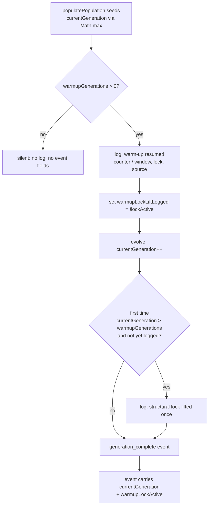

# Surface warm-up resume/accumulation state in logs and training events

## Summary

Part of #2944 — makes the seed warm-up resume/accumulation state **observable**
so a frozen or resetting lineage counter is obvious at a glance, independent of
the seeding fix (#2945). Previously the only evidence of "resumed at generation
900" vs "restarted at 0" was a tag buried in a multi-megabyte creature JSON.

This change is **observability only** — it does not alter counting, seeding, or
stamping behaviour.

Closes #2947.

Three signals were added:

1. **Run-start resume log** (`Neat.populatePopulation`) — after the lineage
   counter is seeded, emits one info line:

   ```
   warm-up: resumed currentGeneration=900 / warmupGenerations=1440 (lock active, source=population)
   ```

   The `source` (`primary-seed` | `population` | `none`) is what makes the
   #2945 bug self-evident: a tagless factory seed resuming from a population
   member (`source=population`) is otherwise indistinguishable from a fresh
   start (`source=none`).

2. **Per-generation event fields** — `generation_complete` events now carry the
   accumulated `currentGeneration` and a derived `warmupLockActive` boolean
   (built by the new `buildWarmupEventFields` helper), so dashboards can chart
   the counter climbing across runs and alert if it is flat or resetting.

3. **Lock-lift transition log** (`evolve`) — logs a single greppable line when
   the structural lock lifts (`currentGeneration` first exceeds
   `warmupGenerations`):

   ```
   warm-up: structural lock lifted at currentGeneration=1441 (warmupGenerations=1440)
   ```

When warm-up is not configured (`warmupGenerations <= 0`) nothing is logged and
the event fields are absent — zero overhead once warm, consistent with the
#2903 design goal. A lineage that resumes already-warm suppresses the lock-lift
line (seeded in `populatePopulation`), so it fires only on a genuine
warm-up → warm transition during the run.

## Evidence

Backend/CLI change — no web interface to screenshot. Verified via the new unit
tests (7 passing) and the full quality gate (`./quality.sh`: 7212 passed, 0
failed). Sample captured output from the existing `NeatPopulatePopulation`
suite confirms the resume line in situ:

```
warm-up: resumed currentGeneration=37 / warmupGenerations=1440 (lock active, source=population)
warm-up: resumed currentGeneration=7 / warmupGenerations=20 (lock active, source=primary-seed)
```

### Observability flow



## Test Plan

New tests in `test/NEAT/WarmupObservability.ts`:

- `resume log reports primary-seed source while locked` — seed carries both
  tags; asserts the single resume line with `source=primary-seed`, the
  accumulated counter, and `lock active`.
- `resume log reports population source when the seed is tagless` — tagless
  factory seed plus a tagged prior champion in the population; asserts
  `source=population` and the population-sourced counter.
- `no warm-up configured logs nothing` — asserts zero resume/lift lines.
- `buildWarmupEventFields surfaces accumulated counter and lock state` — unit
  test of the helper across not-configured / warming / past-window cases.
- `lock-lift transition logs exactly once per run` — drives `evolve()` past the
  warm-up window and asserts the lift line fires exactly once and not again on
  subsequent generations.
- `generation_complete carries accumulated counter and lock state while
  warming` — end-to-end via `evolveDataSet`; asserts the events expose
  `currentGeneration` and `warmupLockActive === true`.
- `generation_complete omits warm-up fields when warm-up is not configured` —
  asserts both fields are `undefined`.

All existing warm-up / training-event tests continue to pass
(`SeedWarmupAccumulation`, `PhaseTimingFields`, `TrainingEvent`,
`SeedWarmupStructuralLock`, `NeatPopulatePopulation`).
