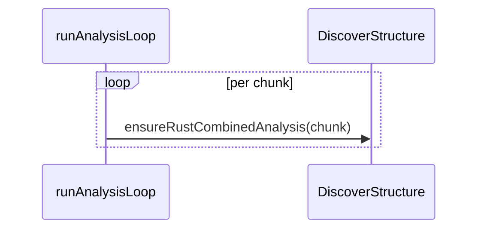

## Summary

Fixed two pre-existing Mermaid quality-gate failures carried over by the
baseline tracker (Issue #2604). Both diagrams used a `sequenceDiagram`
participant ID that collides — case-insensitively — with the Mermaid reserved
keyword `loop`, causing Mermaid to mis-parse later statements as `loop ... end`
blocks:

- `docs/pr-summary-2463.md` — `participant LOOP as propagate_topological_loop`
- `docs/pr-summary-2642.md` — `participant Loop as runAnalysisLoop`

Each colliding participant ID was renamed to `Driver` (a non-reserved word),
keeping the descriptive `as` alias unchanged so the rendered diagrams still read
`propagate_topological_loop` / `runAnalysisLoop`. Every message and `Note over`
reference to the old ID was updated to match. The genuine `loop per chunk` /
`end` block in `pr-summary-2642.md` is a real Mermaid loop and was left intact.

A repo-wide sweep of `docs/**/*.md` confirmed no other participant IDs collide
with Mermaid reserved keywords, so the per-repo tracker can be closed.

Closes #2949.

## Evidence

This is a documentation-only change (Markdown Mermaid blocks) — no web interface
or runtime code is involved, so there is no screenshot. Verification was done
via the lint/format quality step and a grep sweep:

- `./quality.sh --lint-only` passed cleanly (format, lint, bash checks) with no
  reformatting of the edited files.
- `grep -niE '\bLoop\b|\bLOOP\b'` over both files returns no matches — the
  reserved-keyword IDs are gone.
- A reserved-keyword participant sweep over `docs/**/*.md` returns no matches.

Corrected participant declaration (representative):

## Test Plan

No automated test was added: the Mermaid reserved-keyword check is enforced by
the external worker quality gate, not by an in-repo test, and there is no
in-repo Mermaid validator to assert against. The change is purely renaming
diagram participant IDs in two archived PR-summary documents.

- Verified `./quality.sh --lint-only < /dev/null` passes.
- Verified both files no longer reference the reserved IDs `LOOP` / `Loop`.
- Verified the rendered aliases (`propagate_topological_loop`,
  `runAnalysisLoop`) are preserved.
