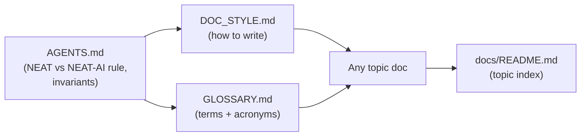

# PR Summary — Issue #2957

## Summary

Establishes the **Phase 0 foundation** for the documentation audit (#2956): one
canonical glossary and one short documentation style guide, both linked from
`docs/README.md`, so every later per-doc audit applies the same rules instead of
reinventing them. Closes #2957.

- **`docs/GLOSSARY.md`** — the canonical glossary. Expands every project acronym
  (NEAT, MCMC, WASM, FFI, GPU, RL, CRISPR, ONNX, …) with a deeper-reading link,
  and explains every themed/house term (Creature, Evolution, Islands, Discovery,
  Intelligent Design, CRISPR, Grafting, …) in plain language mapped to its
  mainstream machine-learning idea. It defers the `NEAT-AI ≠ NEAT` rule to the
  canonical entry in `AGENTS.md` rather than restating it — no contradictory
  copies.
- **`docs/DOC_STYLE.md`** — the short style guide codifying the audit rules:
  define acronyms on first use with a link, explain themed terms and link the
  glossary, call out NEAT-AI-vs-standard-NEAT / industry differences, fact-check
  against both implementation and references, keep docs small, prefer colour +
  Mermaid diagrams, Australian English, and keep internal docs brief.
- **`docs/README.md`** — links both foundation documents from the "Where to
  start" path and the reading-map diagram.

Both new documents are themselves examples of the house style (acronyms defined,
links present, a Mermaid diagram each).

## Evidence

This is a documentation + test change with no web interface to screenshot.
Verification is via the new `test/docs/GlossaryAndStyle.ts` suite and the
existing docs tests, all passing (`deno test test/docs/*.ts` → 66 passed), plus
clean `deno fmt --check`, `markdownlint-cli2`, and `cspell` runs.

How the foundation documents relate:

## Test Plan

Added `test/docs/GlossaryAndStyle.ts` — "what" tests that read the real files
and assert on outcomes:

- `docs/GLOSSARY.md` exists, is substantive, expands every required acronym,
  explains every themed term, links the canonical NEAT-vs-NEAT-AI rule in
  `AGENTS.md`, contains a Mermaid diagram, and has resolvable internal links.
- `docs/DOC_STYLE.md` exists, is substantive, captures the core house-style
  rules, links the glossary and the canonical NEAT rule, and has resolvable
  internal links.
- `docs/README.md` links both foundation documents.

All new and existing docs tests pass (66 passed, 0 failed).

## Acceptance criteria

- [x] A single canonical glossary exists, linked from `docs/README.md`, covering
      the acronyms and themed terms (each acronym expanded + linked; each themed
      term explained).
- [x] A short documentation style guide exists capturing the bullet rules.
- [x] No duplicated/contradictory copies of the NEAT-vs-NEAT-AI rule remain;
      non-canonical docs (glossary, style guide, README, COMPARISON,
      CONTRIBUTING) link to the canonical `AGENTS.md` entry.
- [x] Glossary and style guide are themselves examples of the house style
      (acronyms defined, links present, at least one Mermaid diagram each).
