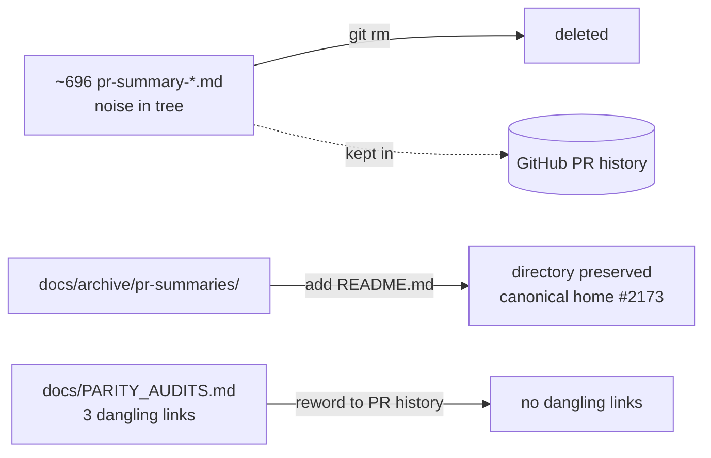

# PR summary — Docs cleanup: delete obsolete PR-summary files (Issue #2958)

## Summary

Removed ~696 obsolete per-PR summary files that were noise in the working tree.
Each summary remains permanently available in GitHub's PR history, so the
working-tree copies were redundant. Part of the #2956 documentation audit.
**Closes #2958.**

- Deleted **199** `docs/pr-summary-*.md` (root) files.
- Deleted **499** `docs/archive/pr-summaries/pr-summary-*.md` files (the issue
  estimated ~497; the tree held 499).
- Preserved the `docs/archive/pr-summaries/` directory — the canonical home for
  future PR summaries (Issue #2173) — by adding a `README.md` that documents the
  policy and replaces the deleted noise with a single intentional marker.
- Fixed three dangling links in `docs/PARITY_AUDITS.md` that pointed at the
  now-deleted `pr-summary-2367/2368/2369.md`; they now reference the merged PR
  history instead.
- Left non-PR-summary archive content untouched (`docs/archive/research/`,
  `docs/archive/investigations/`).

A `git grep -l "pr-summary-"` after the change surfaces only intentional
references — the out-of-scope policy line in `docs/README.md`, the docs tests,
and build-log artifacts — not links to deleted files.

## Evidence

This is a docs/CLI-only change with no web interface, so no screenshot applies.
Verification is via the docs test suite, which reads the real filesystem and
asserts on outcomes:

- `test/docs/PrSummaryArchiveLayout.ts` (new) — asserts the `docs/` root carries
  no `pr-summary-*.md` files and the archive directory is preserved. Failed
  before deletion (199 stray files), passes after.
- `test/docs/DocsIndex.ts` — `docs/README.md internal links resolve` confirms no
  dangling internal links remain.
- `test/docs/JekyllLiquidSafety.ts` — scans every `docs/**/*.md` (now the reduced
  set plus the new README) for unescaped Liquid; still clean.

```
ok | 19 passed | 0 failed (179ms)
```



## Test Plan

- Added `test/docs/PrSummaryArchiveLayout.ts` (2 tests): root has no
  `pr-summary-*.md`; archive directory preserved.
- Ran `test/docs/PrSummaryArchiveLayout.ts`, `test/docs/DocsIndex.ts`,
  `test/docs/JekyllLiquidSafety.ts` — 19 passed, 0 failed.
- Ran `./quality.sh --lint-only` and `./quality.sh --check-only` — clean.
