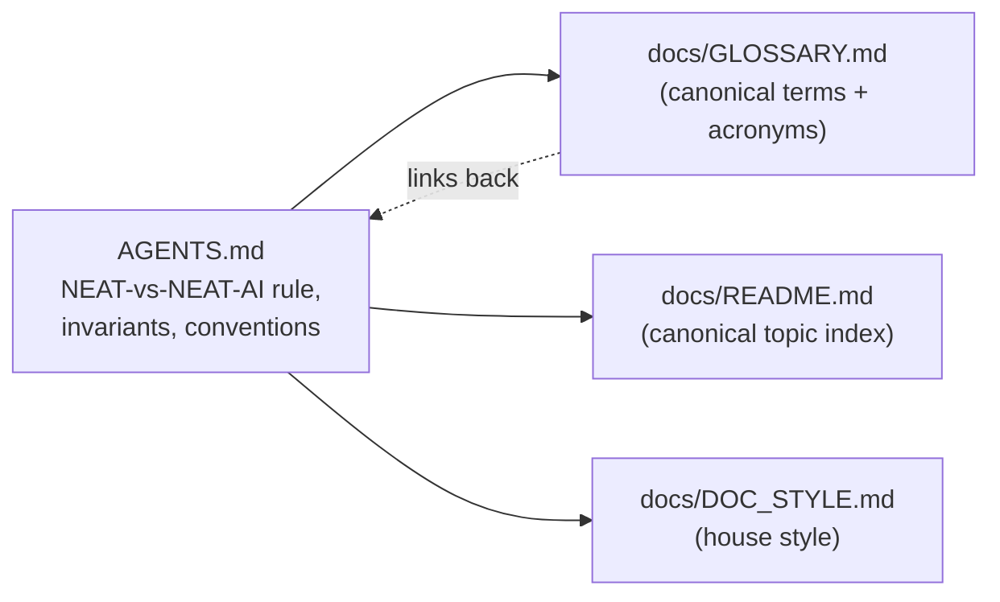

# PR Summary — Docs audit Phase 1: slim AGENTS.md + align internal docs

## Summary

Phase 1 of the documentation audit (#2956): audit the entry-point / AI-facing
docs so they are **consistent with the main docs, as brief as possible, and
refer back rather than repeat**. `AGENTS.md` is the only internal / AI-facing
doc in the repo (there is no `CLAUDE.md` or contributor-bot guide), so the work
focuses there. **Closes #2960.**

`AGENTS.md` dropped from **800 → 687 lines** by replacing content that merely
restated the main docs with links back to the canonical source, while keeping
the canonical content other docs depend on:

- The **NEAT-vs-NEAT-AI rule** (the one canonical statement) stays in
  `AGENTS.md`.
- The two **critical invariants** — neuron UUID stability and semantic version
  immutability — stay verbatim (verified against the code: the quality-gate
  tests, `src/architecture/NeuronId.ts`, and the WASM-only wrappers all still
  exist).

### What was cut (and where it now points)

| Section                                      | Change                                                                                                                                                                                                                                                                            |
| -------------------------------------------- | --------------------------------------------------------------------------------------------------------------------------------------------------------------------------------------------------------------------------------------------------------------------------------- |
| Terminology themed-term/acronym list         | Deferred to the canonical [`docs/GLOSSARY.md`](../../GLOSSARY.md). `AGENTS.md` keeps only the project-name terms (NEAT, NEAT-AI), the three codebase-specific terms not in the glossary (layer assignment, episode rollout, streaming observation), and the NEAT-vs-NEAT-AI rule. |
| Documentation Layout per-doc list            | Removed — it duplicated [`docs/README.md`](../../README.md) (the topic index). Kept governance siblings + foundation-doc (glossary, style guide) pointers.                                                                                                                        |
| Rust Discovery setup steps                   | Deferred to `CONTRIBUTING.md` (setup) and `docs/DISCOVERY_GUIDE.md` (workflow); kept the two contributor conventions.                                                                                                                                                             |
| NEAT-AI-core dependency policy (8 rules)     | Deferred to `docs/CORE_DEPENDENCY_POLICY.md` + `docs/EXTERNAL_NEAT_AI_CORE.md`; kept the two most-tripped-over rules.                                                                                                                                                             |
| Quality Gate step list + flag list           | Deferred to `./quality.sh --help` and `CONTRIBUTING.md`.                                                                                                                                                                                                                          |
| Logging audit grep block, date/time examples | Condensed; canonical rules retained.                                                                                                                                                                                                                                              |

### Consistency fix

`docs/GLOSSARY.md` previously claimed `AGENTS.md` "stays in lock-step with this
table" (bidirectional mirroring). With `AGENTS.md` now deferring to the
glossary, that wording is corrected to state the **one-way** canonical
relationship — the glossary is the single source of truth for themed terms and
acronyms; other docs link back. This removes the terminology drift the audit
forbids.

### Anchors preserved

These anchors are linked from ~25 places across the repo and are kept exactly:

- `#-terminology`
- `#-neat-vs-neat-ai--which-term-to-use`
- `#-logging-policy`
- `#-datetime-handling--temporal-vs-date`

## Evidence

Documentation-only change — no web interface to screenshot. Verification
performed:

- **Lint/format gate**: `./quality.sh --lint-only --skip-discovery` passes
  (format, lint, bash-syntax checks all green).
- **Link resolution**: every local link target in `AGENTS.md` was confirmed to
  exist on disk (21 targets, all resolve).
- **Anchor stability**: the four heavily-linked headings above are unchanged, so
  the ~25 inbound `AGENTS.md#…` links across the repo still resolve.
- **Invariant fact-check**: the files and tests cited by the retained invariants
  (`test/creature/NeuronUuidStability.ts`,
  `test/creature/SemanticVersionStability.ts`, `src/architecture/NeuronId.ts`,
  `src/wasm/`, `src/propagate/`) all exist in the current tree.

### How the foundation docs relate (after this change)

## Test Plan

No code changed, so no unit tests were added or modified. Validation was the
lint/format gate plus the link/anchor/invariant checks listed under Evidence. A
full `./quality.sh` test run was intentionally not used: it would only fold an
unrelated dependency bump into a docs-only PR.

## Acceptance criteria

- [x] `AGENTS.md` materially shorter (800 → 687 lines); duplicated explanations
      replaced by links back to the main docs.
- [x] Canonical terminology + NEAT-vs-NEAT-AI rule remain authoritative and are
      referenced (not copied) elsewhere.
- [x] Invariants/conventions verified against current code.
- [x] Internal-doc inventory confirmed: `AGENTS.md` is the only internal /
      AI-facing doc and is still needed (no `CLAUDE.md` / bot-guidance doc
      exists to remove).
- [x] Cross-links resolve; no terminology drift vs main docs (glossary lock-step
      wording corrected).
