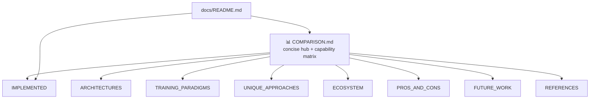

# Docs audit: COMPARISON.md — fact-check & split

## Summary

Fact-checked every comparative claim in the ~1,585-line `COMPARISON.md` against
the current code and external references, then split the monolith into a concise
**hub** plus eight focused, linked sub-documents under `docs/comparison/`. The
top page is now a 118-line hub carrying an at-a-glance capability matrix and a
Mermaid topic map; the depth lives in the sub-docs. Closes #2961.

**Fact-check outcome:** all 20 headline code-referenced claims were verified
present in `src/` (Muon orthogonalisation, synthetic synapses, MCMC +
diversity-aware reheating, predictive coding, DNA-sharing strategies, ONNX
export + `checkOnnxCompatibility()`, `getGpuBackendInfo()`, the adaptive
configs, `feedbackLoop`, transfer-learning
`Checkpoint`/`createSeededPopulation()`, `BatchDiscoveryValidator`, K-fold
cross-validation, etc.). Two stale **external** citations were corrected:

- LSTM "Hochreiter & Schmidhuber (1997)" pointed at arXiv:1503.04069 (Greff et
  al. 2015, _LSTM: A Search Space Odyssey_) → now the actual 1997 paper.
- "Policy Gradient Methods, Schulman et al. (2017)" pointed at arXiv:1704.06440
  → now PPO (arXiv:1707.06347).
- "Large-Scale Evolution of Image Classifiers" pointed at the duplicated
  arXiv:1703.00548 → corrected to arXiv:1703.01041 (Real et al. 2017).

**House style applied (#2956):** every sub-doc carries an explicit
`NEAT-AI ≠ NEAT` callout that defers to the canonical
[NEAT-vs-NEAT-AI rule](../../AGENTS.md#-neat-vs-neat-ai--which-term-to-use), so
a reader never confuses "ours vs theirs". Comparison tables and colour Mermaid
diagrams are used throughout; obsolete/duplicated references were deleted.

### Structure

### Files

- `COMPARISON.md` — now a 118-line hub (was ~1,585 lines): overview,
  `NEAT-AI ≠ NEAT` callout, Mermaid sub-document map, sub-doc table, and an
  at-a-glance NEAT vs NEAT-AI vs traditional-NN capability matrix.
- `docs/comparison/` — eight new sub-docs: `IMPLEMENTED.md`, `ARCHITECTURES.md`,
  `TRAINING_PARADIGMS.md`, `UNIQUE_APPROACHES.md`, `ECOSYSTEM.md`,
  `PROS_AND_CONS.md`, `FUTURE_WORK.md`, `REFERENCES.md`.
- `docs/README.md` — comparison section now links the hub **and** every sub-doc.

## Evidence

This is a documentation-only change (no runtime/CLI/UI surface), so the evidence
is the test suite plus the markdown/lint gates rather than a screenshot.

- New TDD test `test/docs/ComparisonSplit.ts` (8 cases) — written first,
  failing, then made to pass:
  - hub is ≤ 320 lines (actual 118);
  - hub links to every `docs/comparison/*.md` sub-doc;
  - hub carries a comparison table **and** a Mermaid diagram;
  - hub contains the `NEAT-AI ≠ NEAT` callout and links the canonical rule;
  - each sub-doc exists, is substantive, and has a heading;
  - **all** relative links in the hub and every sub-doc resolve on disk;
  - `docs/README.md` still indexes `COMPARISON.md` and the `comparison/`
    sub-docs.
- `markdownlint-cli2` — 0 errors across the changed markdown (MD045 alt-text and
  MD049 emphasis-consistency both clean; `deno fmt` normalised emphasis).
- Existing guards still green: `test/config/ComparisonDocumentedFeatures.ts`
  (10), `test/docs/DocsIndex.ts` (10), `GlossaryAndStyle.ts`,
  `ConfigurationGuideSplit.ts`, `JekyllLiquidSafety.ts` — 43 docs tests pass.

## Test Plan

- Added `test/docs/ComparisonSplit.ts` (8 cases) — verifies the split structure
  and link integrity, modelled on `test/docs/ConfigurationGuideSplit.ts`.
- Ran `deno test test/docs/* test/config/ComparisonDocumentedFeatures.ts` — all
  pass.
- Ran `deno fmt` / `deno lint` / `deno check` on the new test and changed docs —
  clean.
- Ran `markdownlint-cli2` over the repo — 0 errors.
