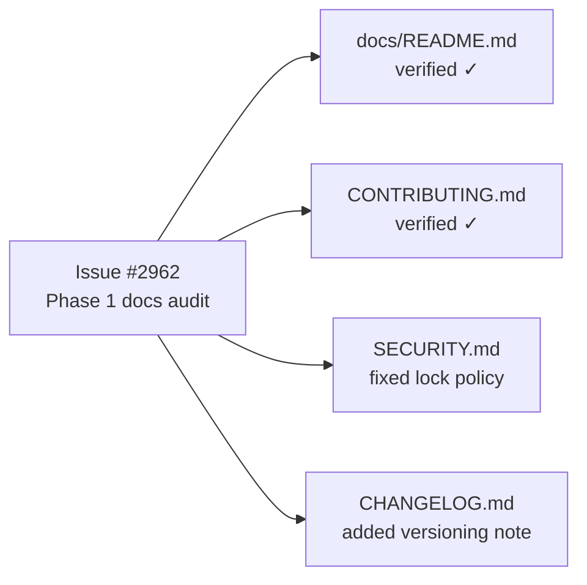

# Docs audit: docs/README hub + CONTRIBUTING, SECURITY, CHANGELOG (Phase 1)

## Summary

Phase 1 of the documentation audit (#2956) — the navigational hub and
project-meta docs. Each of the four in-scope docs was fact-checked against the
current repository; two carried obsolete claims that are now corrected. The
other two were verified accurate and left unchanged. Closes #2962.

### `docs/README.md` — verified, no change

- **Every link resolves.** All in-repo links (topic guides, `comparison/`
  sub-docs, `config/`/`troubleshooting/` directories, archive investigation
  notes, and the `AGENTS.md` anchors `#-terminology`,
  `#-neat-vs-neat-ai--which-term-to-use`) were checked and resolve.
- **Reading path correct** and the **NEAT ≠ NEAT-AI** callout matches the
  canonical rule in `AGENTS.md`.
- **Index complete.** Every `docs/*.md` is either indexed or an intentional
  redirect stub (`NEAT_AI_CORE_PARITY_AUDIT.md`, `RUST_SCORER_PARITY_AUDIT.md`,
  `WASM_ACTIVATION_PARITY_AUDIT.md` — all consolidated into `PARITY_AUDITS.md`
  and correctly left out of the topic index).

### `CONTRIBUTING.md` — verified, no change

- **Setup steps** (Deno 2.x, clone, `./quality.sh`, individual `deno test`)
  confirmed.
- **Quality-gate flag table** matches `quality.sh`'s `show_help` block exactly
  (`--skip-tests`, `--skip-discovery`, `--skip-wasm`, `--with-rust-scorer`,
  `--test-both-scorers`, `--rust-scorer-bin=`, `--rust-scorer-timeout-ms=`,
  `--lint-only`, `--check-only`, `--dry-run`, `--help`).
- **Quality-gate step order** (dep update → fmt → lint → bash check → type check
  → discovery build → `./build.sh --verify-only` → tests) matches the script.
- **Dependency-bump process** (`./build.sh`, `./build.sh --verify-only`,
  `./scripts/parity-gate.sh`, `scripts/check_discovery.ts`) and the project
  structure tree confirmed against the tree.

### `SECURITY.md` — corrected

- **Obsolete `"lock": false` claim removed.** The scheduled OSV scan section
  said the scan "leaves `deno.json`'s `"lock": false` policy intact." That is no
  longer true: `deno.lock` is now committed for transitive-dependency integrity
  pinning (Issue #2865), and `deno.json` has no `"lock"` key. Rewritten to
  describe the committed `deno.lock` as the integrity-pinning mechanism the OSV
  scan re-resolves weekly. All other references (workflow filenames, `gitleaks`,
  reporting channel, supported-versions policy) verified present and current.

### `CHANGELOG.md` — corrected

- **Added a versioning note.** The published `@stsoftware/neat-ai` version is
  `5.5.3` (1058 tags), but the latest curated entry is `[5.2.0]` +
  `[Unreleased]`. This is by design: every merged PR auto-bumps the patch
  version (`update-package-version.yml`) and cuts a release
  (`github-release.yml`). A new note explains that the changelog records
  **notable** changes grouped by minor/major version and that routine auto-patch
  releases are not listed individually — so readers are not misled by the
  version gap. No history was invented; the existing entries were verified
  against the Keep a Changelog format.

## Evidence

Documentation-only change — no UI or runtime behaviour affected. Verification
was performed by checking the docs against the live repository:

- Link resolution sweep over `docs/README.md` — 0 broken in-repo links.
- `CONTRIBUTING.md` flag table and step order diffed against `quality.sh`.
- `SECURITY.md` workflow/file references confirmed to exist
  (`dependency-review.yml`, `osv-scan.yml`, `semgrep.yml`, `deno-outdated.yml`,
  `.gitleaks.toml`); `deno.lock` confirmed tracked (Issue #2865) and `deno.json`
  confirmed to have no `"lock"` key.
- `CHANGELOG.md` claims cross-checked against `gh release list` / `git tag` and
  the auto-release workflows.

Quality gates run on the edited files:

- `markdownlint-cli2 SECURITY.md CHANGELOG.md` → 0 errors.
- `cspell --config docs/cspell.json SECURITY.md CHANGELOG.md` → 0 issues.
- `deno fmt --check SECURITY.md CHANGELOG.md` → clean.

## Test Plan

No code changed, so no unit tests were added. Validation is the fact-check sweep
plus the markdown lint, spellcheck, and format gates listed above, which are the
same gates CI runs for documentation (`markdown-lint.yml`, `spellcheck.yaml`).
