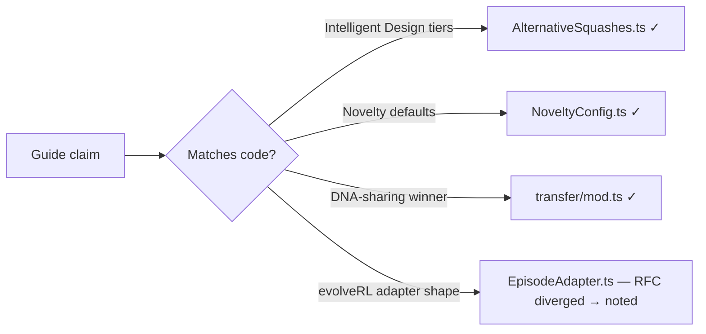

# PR Summary — Docs audit Phase 2: core-concept & themed guides (#2963)

## Summary

Phase 2 of the documentation audit milestone (#2956): audit the eight
deep/themed guides — the docs richest in themed vocabulary (Intelligent Design,
CRISPR, DNA, Evolution) and NEAT-AI-specific algorithm choices — against the
house style in [`DOC_STYLE.md`](../../DOC_STYLE.md). Each guide now links its
themed terms to the canonical [`GLOSSARY.md`](../../GLOSSARY.md), expands
acronyms on first use, and makes NEAT-AI-vs-standard-NEAT differences explicit
by deferring to the one canonical
[NEAT-vs-NEAT-AI rule](../../../AGENTS.md#-neat-vs-neat-ai--which-term-to-use).

Every algorithm claim was fact-checked against the implementation. The one
genuine accuracy gap found — the `evolveRL` RFC describing a contract that
diverged from the shipped `EpisodeAdapter` — is now flagged with a pointer to
the accurate, runnable contract.

**Closes #2963.**

### What changed per guide

| Guide                             | Change                                                                                                                                                                                                                                                           |
| --------------------------------- | ---------------------------------------------------------------------------------------------------------------------------------------------------------------------------------------------------------------------------------------------------------------- |
| `NOVELTY_SEARCH.md`               | Foundation-doc links; acronym table (kNN, FIFO, i.i.d.); explicit "standard technique vs NEAT-AI integration" section; Related footer. Defaults verified against `src/config/NoveltyConfig.ts`.                                                                  |
| `event-driven-evolution.md`       | `> [!IMPORTANT]` note flagging it as a **design RFC**, pointing to the shipped `EpisodeAdapter` contract (`observationLength` getter, `decodeAction`, `reset → {observation, state}`, `step(state, action)`) — fact-checked vs `src/creature/EpisodeAdapter.ts`. |
| `INTELLIGENT_DESIGN.md`           | Glossary links for Intelligent Design / squash; NEAT-AI-vs-standard NOTE. Tier lists verified against `src/intelligentDesign/AlternativeSquashes.ts`.                                                                                                            |
| `CRISPR_GUIDE.md`                 | Glossary links (CRISPR, Grafting, Discovery, Intelligent Design); NEAT-AI-vs-standard NOTE.                                                                                                                                                                      |
| `BACKPROP_ELASTICITY.md`          | NEAT-AI-vs-standard-backprop NOTE; glossary link for squash.                                                                                                                                                                                                     |
| `ACTIVATION_FUNCTIONS.md`         | Made the standard-NEAT difference explicit; glossary link for squash; defer to the NEAT-vs rule.                                                                                                                                                                 |
| `REINFORCEMENT_LEARNING.md`       | Glossary link; RL expansion; pointer to the NEAT-vs rule (comparison table already covered NEAT-AI-vs-industry).                                                                                                                                                 |
| `dna-sharing-bake-off-results.md` | Expand MSE on first use; glossary links (Islands, DNA, horizontal gene transfer); NEAT-AI-vs-standard NOTE. `recommendedDnaSharingStrategy` verified against `src/transfer/mod.ts`.                                                                              |
| `GLOSSARY.md`                     | New **Novelty search** themed-term entry so the guide can link to it.                                                                                                                                                                                            |

### Fact-checks performed (doc claim ↔ code)

## Evidence

Documentation-only change; no web UI to screenshot. Verified via the repo's docs
test suite and markdown tooling:

- `deno test test/docs/DocsIndex.ts test/docs/JekyllLiquidSafety.ts test/docs/GlossaryAndStyle.ts`
  → **28 passed / 0 failed** (internal links resolve; no unescaped Liquid;
  glossary + style invariants hold).
- `markdownlint-cli2` over all nine touched files → **0 errors**.
- `./quality.sh --skip-tests --skip-discovery --skip-wasm` → **EXIT 0**
  (`deno fmt`, `deno lint`, bash check, `deno check` all pass).

## Test Plan

- Ran `test/docs/DocsIndex.ts`, `test/docs/JekyllLiquidSafety.ts`,
  `test/docs/GlossaryAndStyle.ts` (the docs-invariant suite that guards
  internal-link resolution, Jekyll/Liquid safety, and glossary/style rules).
- Ran `test/scripts/MarkdownLintWorkflow.ts` (8 passed).
- Confirmed every new file reference and heading anchor resolves
  (`GLOSSARY.md#-themed--house-terms`,
  `AGENTS.md#-neat-vs-neat-ai--which-term-to-use`, the `evolveRL` anchors,
  `src/config/NoveltyConfig.ts`, `src/creature/EpisodeAdapter.ts`).

No source code changed, so no new unit tests were required; the docs-invariant
tests above are the regression guard for these files.
