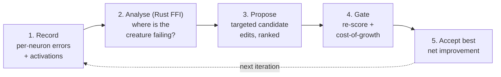

# PR Summary — Docs audit: Discovery subsystem guides (#2964)

## Summary

Phase 2 documentation audit (part of #2956) of the three Discovery guides —
`DISCOVERY_ARCHITECTURE.md`, `DISCOVERY_GUIDE.md`, and `DISCOVERY_DIR.md`. The
guides were fact-checked against the current Rust Discovery module and its
TypeScript surface, de-duplicated into a clear division of labour, and given an
explicit explanation of the **Discovery** themed term and how it differs from
standard NEAT. **Closes #2964.**

### What changed

- **Explain "Discovery" + NEAT-AI vs standard NEAT.** `DISCOVERY_GUIDE.md` now
  glosses Discovery as a NEAT-AI themed term (linked to the glossary) and adds a
  **🆚 Discovery vs standard NEAT** section: standard NEAT grows topology with
  blind `add-node` / `add-connection` mutations, whereas NEAT-AI Discovery is
  error-guided — it records per-neuron errors, asks the Rust FFI extension where
  the creature is failing, and proposes targeted edits gated by cost-of-growth.
  Defers to the canonical NEAT-vs-NEAT-AI rule in `AGENTS.md`.

- **Fact-check fixes (drift removed).**
  - `DISCOVERY_DIR.md` referenced a non-existent `discoveryWorkDir` option →
    corrected to the real `discoveryBaseDirectory` (default `.discovery`,
    verified in `src/config/NeatConfig.ts` / `NeatArguments.ts`).
  - The embedded `isRustDiscoveryEnabled()` snippet pointed at the wrong file
    (`RustDiscovery.ts`, a barrel) with an outdated body. Replaced with an
    accurate description (caches result, probes GPU for telemetry only) pointing
    at the real implementation in `RustDiscoveryLibrary.ts`.
  - Dropped drift-prone hard-coded file counts ("37 files", "38 files") from
    `DISCOVERY_ARCHITECTURE.md`.

- **De-duplication.** The on-disk cache directory tree appeared in both
  `DISCOVERY_ARCHITECTURE.md` and `DISCOVERY_DIR.md`. It now lives **only** in
  `DISCOVERY_DIR.md` (the on-disk-layout doc); the architecture doc links to it
  and keeps just the cache's role/contents. Division of labour: architecture =
  internals, guide = how-to-use, dir = on-disk layout + API.

- **Cross-links.** All three docs now link to each other and to the glossary
  themed-terms entry; the new error-guided flow diagram supplements the existing
  architecture/flow diagrams.

### Error-guided discovery flow (added to DISCOVERY_GUIDE.md)

## Evidence

Documentation-only change (no runtime code). Verified via:

- `test/docs/DiscoveryGuides.ts` — new "what" tests (read the real files,
  assert on outcomes): all 7 pass.
- `deno test --allow-read "test/docs/*.ts"` — 83 passed, 0 failed.
- `deno fmt`, `deno lint`, `deno check` — clean on all changed files.
- `markdownlint-cli2` — 0 errors across the docs.
- No stray Liquid (`` / `{{ }}`) outside code fences.

## Test Plan

Added `test/docs/DiscoveryGuides.ts` covering:

- All three docs exist, are substantive, and carry a Mermaid diagram.
- Each doc cross-links to its two siblings and to `GLOSSARY.md`.
- `DISCOVERY_GUIDE.md` makes the standard-NEAT contrast explicit and links the
  canonical NEAT-vs-NEAT-AI rule.
- On-disk layout lives in `DISCOVERY_DIR.md`; the architecture doc defers to it.
- `DISCOVERY_DIR.md` names `discoveryBaseDirectory` and no longer references the
  stale `discoveryWorkDir`.
- All relative links in the three docs resolve on disk.
- `docs/README.md` still indexes all three docs.

## Acceptance criteria

- [x] Architecture/layout/usage verified against current code.
- [x] Clear, non-overlapping division of the three docs with cross-links;
      duplication removed.
- [x] "Discovery" explained; NEAT-AI-vs-standard-NEAT distinction explicit.
- [x] At least one Mermaid architecture/flow diagram; obsolete content removed.
- [x] Cross-links resolve; linked from `docs/README.md`.
