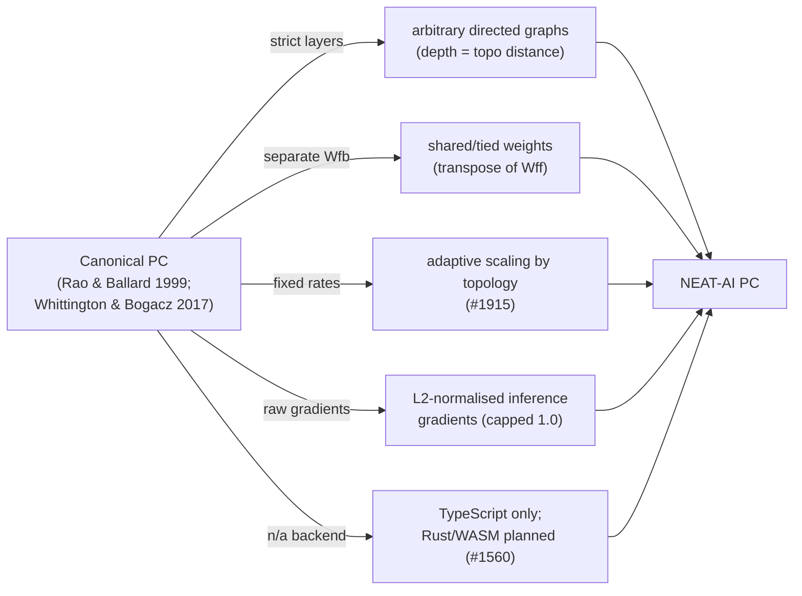

# PR Summary — Docs audit: Predictive Coding guides (#2965)

## Summary

Phase 2 documentation audit (part of #2956) of the two Predictive Coding (PC)
guides — `docs/PREDICTIVE_CODING.md` and `docs/PREDICTIVE_CODING_BENCHMARKS.md`.
The concept/architecture guide was fact-checked against the shipped TypeScript
implementation and the cited literature, the divergences from canonical PC were
made explicit, and the benchmark numbers were re-verified for reproducibility.
**Closes #2965.**

### What changed

- **Config block corrected (biggest drift).** Section 3.2 documented a config
  interface that never shipped — `maxInferenceIterations`,
  `convergenceThreshold`, and `integrationMode`. The actual
  [`src/config/PredictiveCodingConfig.ts`](../../../src/config/PredictiveCodingConfig.ts)
  exposes `enabled`, `inferenceSteps` (50), `inferenceRate` (0.05),
  `learningRate` (0.001), `energyThreshold` (1e-6). The block now mirrors the
  real source, with a note explaining the consolidation. A stale `[!TIP]` that
  named the old fields was fixed too.

- **Implementation status made explicit.** A top-of-doc `[!IMPORTANT]` callout
  records (verified June 2026) that PC ships **TypeScript-only** under
  `src/predictiveCoding/`, is opt-in, includes adaptive scaling (#1915) and
  trace tags (#1913), and **fully replaces** elastic backprop when enabled. The
  **Rust/WASM inference engine** (Section 2.7 / Phase 3, issue #1560) and the
  `complement` integration mode (Phase 5) are flagged as **planned, not yet
  implemented** — the file names in those sections do not exist on disk.

- **NEAT-AI vs canonical PC.** New `🆚 NEAT-AI vs canonical predictive coding`
  section in §1 with a table of deliberate divergences: arbitrary directed
  graphs vs strict layers, shared/tied (transpose) weights, topology-based
  adaptive scaling, L2-normalised inference gradients, opt-in pipeline role, and
  TypeScript-only backend.

- **File paths fixed.** Phase 2's `src/propagate/PredictiveCoding.ts` /
  `CreatureTraining.ts` corrected to the real modules
  (`src/predictiveCoding/PredictiveCoding{Inference,Learning,Trainer}.ts`,
  `PredictionErrorComputation.ts`,
  `src/architecture/training/TrainingPredictiveCoding.ts`). Roadmap phases now
  carry ✅ shipped / 🟡 partial / 🔜 planned markers.

- **Benchmarks re-verified.** Both `convergence.ts` and `speed.ts` were re-run
  (Apple M4 Pro, **Deno 2.8.3**, June 2026). Numbers reproduce within run/
  hardware noise; results appended as dated re-verification tables, keeping the
  February 2026 rows per the doc's own "append, don't overwrite" methodology.

- **Pre-existing gate failure fixed.** `pr-summary-2964.md` had an unescaped
  Liquid sequence that was failing `test/docs/JekyllLiquidSafety.ts`; wrapped it
  in `…` so the shared docs gate passes.

### NEAT-AI vs canonical PC (divergence summary)

### On splitting the large guide

The issue invited a split "if warranted". The guide is already one half of a
two-doc cluster (concept/architecture in `PREDICTIVE_CODING.md`, results in
`PREDICTIVE_CODING_BENCHMARKS.md`), has a single coherent TOC, and is the
canonical PC design-plus-status reference. A further physical split would
fragment the cross-references for little readability gain, so it was **not**
performed; the doc was instead reorganised in place with status markers and an
explicit implemented-vs-planned framing. Diagrams/charts are present
(predictive-coding loop, inference/learning flowcharts, dependency graph,
benchmark-pipeline flow).

## Evidence

Documentation-only change (no runtime code). Verified via:

- `deno test test/docs/DocsIndex.ts test/docs/GlossaryAndStyle.ts
  test/docs/JekyllLiquidSafety.ts`
  — 28 passed, 0 failed (after the Liquid fix).
- `deno fmt` — clean on all changed files.
- `markdownlint-cli2` — 0 errors across the docs.
- Custom anchor check — all 21 intra-doc `#…` links resolve; all new relative
  `src/…` links point at files that exist on disk.
- Benchmark reproducibility (Apple M4 Pro, Deno 2.8.3): convergence — XOR
  backprop 4.0 ms / PC 3.7 ms, regression backprop 5.8 ms / PC 8.6 ms; speed —
  large-network (93 neurons) inference 38.1 ms, Hebbian update 54.3 µs.

## Test Plan

No new code paths, so no new unit tests. Validation relied on the existing docs
test-suite plus reproducibility runs:

- `test/docs/JekyllLiquidSafety.ts` — passes after escaping the stray Liquid in
  `pr-summary-2964.md` (previously failing on the base branch).
- `test/docs/DocsIndex.ts`, `test/docs/GlossaryAndStyle.ts` — confirm the PC
  guides remain indexed and style-compliant.
- Ground-truth fact-check cross-checked every documented config field, trace
  tag, file path, and "planned vs shipped" claim against `src/predictiveCoding/`
  and `src/config/PredictiveCodingConfig.ts`.

## Acceptance criteria

- [x] PC description verified vs implementation + cited literature; stale config
      block and file paths corrected.
- [x] Benchmark numbers re-verified reproducible (Deno 2.8.3) and appended with
      dates; historical rows retained per methodology.
- [x] NEAT-AI-vs-standard divergences explicit; "PC" and acronyms defined on
      first use (acronym list retained).
- [x] Diagrams/charts present; split judged not warranted (rationale above).
- [x] Cross-links resolve; both guides linked from `docs/README.md`.
