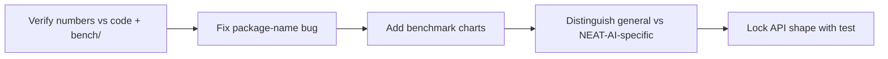

# Docs audit: Performance & hardware-acceleration guides (#2966)

## Summary

Phase 2 documentation audit of the performance & hardware-acceleration cluster:
`PERFORMANCE_RESEARCH.md`, `PERFORMANCE_TUNING.md`, `GPU_ACCELERATION.md`, and
`WASM_RESIDENT_TOPOLOGY.md`. The four guides were already well-structured
(Mermaid diagrams, acronyms defined on first use, resolving cross-links), so
this audit focused on **accuracy verification** against the current code and
benchmarks, plus the **benchmark charts** the issue explicitly calls for. Closes
#2966.

Changes made:

- **Accuracy fix** — corrected the wrong package import in
  `PERFORMANCE_TUNING.md`: `@anthropic/neat-ai` → `@stsoftware/neat-ai` (the
  real package name in `deno.json`), in both `getCacheStats` code examples.
- **Benchmark charts** — added three `xychart-beta` charts (an established
  diagram type in this repo) visualising existing benchmark tables:
  - pace-lever generations-to-target comparison (Issue #2931 data);
  - speedup of the four landed TypeScript optimisations;
  - distance-cache hit vs miss cost (Issue #1293 data).
- **NEAT-AI-specific vs general practice** — added callouts to both large guides
  distinguishing general engineering techniques (LRU caching, work-stealing
  pools, island model, the benchmark-first decision framework) from
  NEAT-AI-specific conclusions and knobs (`wasmCache`, `distanceCache`,
  `selectionPressure`, the serialisation wall), which hold because of NEAT-AI's
  UUID-keyed graph topologies and TS↔WASM boundary.

### Verified against current code (no change needed)

- Every benchmark script cited in `PERFORMANCE_RESEARCH.md` exists under
  `bench/` (17 scripts checked).
- Config knobs referenced in `PERFORMANCE_TUNING.md` exist:
  `heavyTaskWorkerCount`, `allowPoolBorrowing`, `selectionPressure.*`,
  `wasmCache.*`, `distanceCache.maxSize`, `workerThreadCap.*`, `memory.*`.
- GPU paths in `GPU_ACCELERATION.md` match `RustDiscoveryLibrary.ts`:
  `getGpuBackendInfo()` and the `GpuBackendInfo` shape
  (`available`/`backendName`/`adapterName`/`reason`).
- WASM-only operations in `WASM_RESIDENT_TOPOLOGY.md` match `validate_topology`,
  `scan_available_connections`, `compute_reverse_topological_order` and the
  §"WASM-only operations" list.
- Pace-lever production entrypoints exist: `metropolisHastingsAccept`
  (`MetropolisHastings.ts`), `computeAdaptivePopulationSize`
  (`AdaptivePopulationSizer.ts`), hyperparameter helpers
  (`HyperparameterEvolution.ts`).

### Splitting considered, not warranted

The two ~1,000-line guides are coherent and already navigable (per-file Table of
Contents, "In this cluster" cross-links, themed sections). Splitting them would
churn many inbound links for no readability gain, so they were kept whole — the
issue scopes splitting to "where warranted".

## Evidence

CLI/docs change — no web UI. The new Mermaid charts were rendered with
`@mermaid-js/mermaid-cli` to confirm they parse and display correctly:

## Test Plan

- Extended `test/docs/PerformanceGuide.ts` with
  `getCacheStats is importable from the package root and returns the documented
  shape`
  — a behavioural test that imports `getCacheStats` from `mod.ts` and asserts
  every documented field (`name`, `hits`, `misses`, `evictions`, `currentSize`,
  `maxSize`) is present with the documented type. This locks the corrected
  import example.
- `deno test test/docs/` — 27 passed, 0 failed (includes the existing
  `PerformanceGuide`, `GlossaryAndStyle`, `DocsIndex` suites).
- `./quality.sh --lint-only` — formatting, linting, and bash checks pass.
- `markdownlint-cli2` — 0 errors across the changed docs.
