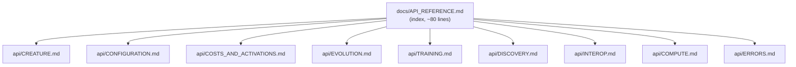

# PR Summary — Docs audit: API_REFERENCE.md fact-check & split (#2967)

## Summary

Fact-checked the public API reference against the **actual exported surface**
(`mod.ts`) and finished the split that `README.md` already advertised: the
1565-line `docs/API_REFERENCE.md` monolith is now a concise (~80-line) index
with a Mermaid surface map that links to the per-topic detail docs under
[`docs/api/`](../../api/). Closes #2967.

The detail docs already existed but were semi-orphaned and had drifted from the
current API. This PR fact-checks them, adds the missing public surfaces, fixes
the inaccuracies found, and wires everything into `docs/README.md`.

### Surfaces added (were undocumented in the sub-docs)

| Surface                                                                                                                                            | Issue | Landed in                      |
| -------------------------------------------------------------------------------------------------------------------------------------------------- | ----- | ------------------------------ |
| `CreatureFactory` (`creatureForProblem`, `creatureForDataset`, `scanTrainingData`, helpers, constants, `ProblemSpec`/`DatasetScan`/`NumericRange`) | #2794 | `api/CREATURE.md`              |
| `Creature.evolveRL()` + `EpisodeAdapter` / `StepResult` / `EvolveRLOptions` / episode types                                                        | —     | `api/EVOLUTION.md`             |
| `FAST_CONVERGENCE_PRESET`                                                                                                                          | #1619 | `api/EVOLUTION.md`             |
| `SelectionPressureConfig` (+ `Required*`, `DEFAULT_*`)                                                                                             | #2929 | `api/CONFIGURATION.md`         |
| `costNameToTaskDescriptor` + `TaskDescriptor`/`CostRange`/`CostTopology`/…                                                                         | —     | `api/COSTS_AND_ACTIVATIONS.md` |

### Corrections (verified against source)

- Activation count **38 → 39**; added the missing **SOFTMAX** squash row
  (`mutationProbability 0`, range `(0,1)`, output-layer use).
- `CRISPR.editAliases` accepts `Record<number, number> | Record<string, string>`
  (was documented as string-only).
- Repointed the `evolveRL` anchor links in `REINFORCEMENT_LEARNING.md` and
  `event-driven-evolution.md` from the removed `API_REFERENCE.md#…` anchor to
  `api/EVOLUTION.md#-creatureevolverl`.
- `docs/README.md` Reference section now lists every `docs/api/` sub-doc.

## Evidence

This is a documentation + test change (no web UI). Verification is via the test
suite and tooling:

- `deno test test/docs/*.ts` → **95 passed | 0 failed** (includes the two new
  tests plus the existing docs-structure suite).
- `deno lint` → clean (1719 files); `deno fmt` applied to all changed files.
- `cspell` (`docs/cspell.json`) → 0 issues across the changed docs.

### Structure after the split

## Test Plan

- **`test/docs/ApiReferenceSplit.ts`** (new) — asserts `API_REFERENCE.md` is a
  short index (≤300 lines), links to every `api/*.md` detail doc, each detail
  doc is substantive, all relative links resolve on disk, and `docs/README.md`
  references the split. (Mirrors the existing `ConfigurationGuideSplit.ts`.)
- **`test/docs/ApiReferenceExports.ts`** (new) — fact-check guard: imports the
  newly documented symbols straight from `mod.ts` and runs the doc examples
  (`creatureForProblem`, `scanTrainingData`, `DEFAULT_SELECTION_PRESSURE_CONFIG`
  values, `costNameToTaskDescriptor`, every preset). Fails if the docs drift
  from the real API.
- Existing `test/docs/*` suite and `test/PublicExports_RL_test.ts` continue to
  pass unchanged.

## Deno regression avoided

All verification uses Deno-native tooling (`deno test`, `deno lint`,
`deno fmt`); no Node tooling or `package.json` dependency was introduced.
