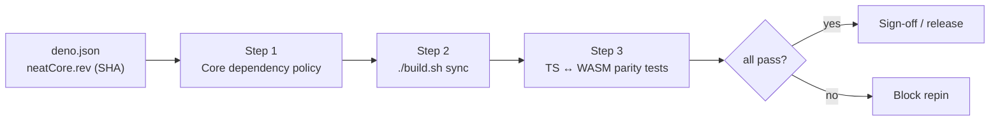

# PR Summary — Docs audit: Rust/WASM, core-parity & dependency-policy docs

## Summary

Phase 2 of the documentation audit (#2956) for the Rust/WASM, core-parity and
dependency-policy cluster. Each in-scope doc was fact-checked against the
current Continuous Integration (CI) workflows, the parity gate script,
`build.sh`, `bump-deps.sh` and the dependency policy. Stale claims were
corrected, obsolete references deleted, acronyms expanded on first use, and a
Mermaid flow added for the parity gate. **Closes #2968.**

The cluster was already consolidated in a prior pass (#2570/#2962): the three
~13-line `*_PARITY_AUDIT.md` files are redirect stubs pointing at the single
`PARITY_AUDITS.md`. They are **retained** because
`test/scripts/ParityAuditsConsolidation.ts` requires them to remain as redirects
so historical PR-summary links still resolve — the parity story is told once in
`PARITY_AUDITS.md`.

### Key fact-check fixes

| Doc                                               | Change                                                       | Why                                                                                                                                                                                               |
| ------------------------------------------------- | ------------------------------------------------------------ | ------------------------------------------------------------------------------------------------------------------------------------------------------------------------------------------------- |
| `PARITY_GATE.md`                                  | Rewrote Step 1 invariants                                    | The "references the required topics" keyword-grep assertion was removed in #2887; `CoreDependencyPolicy.ts` now checks the policy doc's `neatCore` block agrees with `deno.json` on `repo`/`ref`. |
| `PARITY_GATE.md`                                  | Added a Mermaid gate flow; expanded WASM/TS                  | Acceptance criterion: a Mermaid flow for the parity gate; acronyms on first use.                                                                                                                  |
| `EXTERNAL_NEAT_AI_CORE.md`                        | Removed reference to `test/scripts/ScorerAlignmentPolicy.ts` | That test was deleted in #2887/#2890; scorer alignment is now a manual coordinated bump.                                                                                                          |
| `CORE_DEPENDENCY_POLICY.md`                       | Expanded ADR / CI / MITM / JSR                               | House style — define acronyms on first use.                                                                                                                                                       |
| `CI_EXTERNAL_NEAT_AI_CORE.md`, `PARITY_AUDITS.md` | Expanded WASM on first use                                   | House style.                                                                                                                                                                                      |
| `VERSION_VISIBILITY.md`                           | Expanded JSR / GRQ / PR; added cluster cross-link footer     | House style + consistent cross-linking with sibling cluster docs.                                                                                                                                 |

### Verified accurate (no change needed)

- `PARITY_GATE.md` command blocks match `scripts/parity-gate.sh` (Step 1
  command, Step 2 `./build.sh`, Step 3 test list, all flags).
- `build.sh` mode table in `CORE_DEPENDENCY_POLICY.md` matches the script's
  actual flags (`--verify-only`, `--rev`, `--clean`, `--allow-unverified`).
- `CI_EXTERNAL_NEAT_AI_CORE.md` matches `quality.yml`/`publish.yml`
  (`./build.sh --verify-only`).
- `deno.json` pins `neatCore.repo`/`ref`/`rev`/`assetSha256` as documented.
- `TS_RUST_MIGRATION.md` already expands every acronym and explains the
  Rust/WASM-vs-TS split — left as-is.

## Evidence

Documentation-only change; no UI or runtime behaviour. Verified via the
doc-coupled test suite, `deno fmt`, and `cspell`.

```
ok | 39 passed | 0 failed
```

Tests run: `ParityAuditsConsolidation.ts`, `ParityGate.ts`,
`CoreDependencyPolicy.ts`, `BuildScript.ts`, `ContributorCoreDocs.ts`,
`DocsIndex.ts` (all green). `deno fmt --check` and `cspell` clean on all six
edited files.

### Parity-gate flow added to `PARITY_GATE.md`



## Test Plan

No new tests were added — this is a documentation audit and the existing
doc-coupled tests already pin the contract each doc must satisfy:

- `test/scripts/ParityAuditsConsolidation.ts` — consolidation + redirect stubs.
- `test/scripts/ParityGate.ts` — gate doc exists; script CLI surface.
- `test/scripts/CoreDependencyPolicy.ts` — policy doc agrees with `deno.json`.
- `test/scripts/BuildScript.ts` — policy doc describes the artifact flow.
- `test/docs/DocsIndex.ts` — `docs/README.md` indexes and links every doc.

All pass after the edits.
