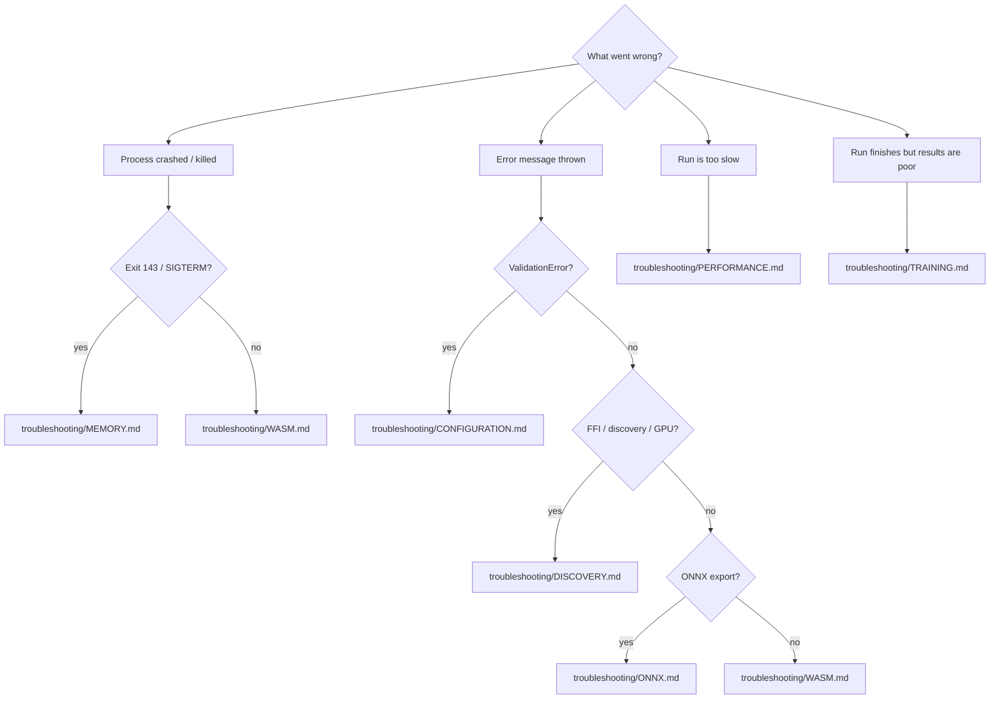

# Docs audit: operational guides (Configuration, Troubleshooting, Timeouts)

## Summary

Phase 2 of the documentation audit (#2956). Fact-checked the three operational
guides — `docs/CONFIGURATION_GUIDE.md`, `docs/TROUBLESHOOTING.md`,
`docs/TIMEOUTS.md` — against the current code and corrected obsolete content.
Closes #2969.

Findings and changes:

- **`CONFIGURATION_GUIDE.md`** — verified accurate, no changes needed. It is a
  topic index over `docs/config/`; all linked detail docs exist, the four
  presets (`QUICK_START_PRESET`, `LARGE_NETWORK_PRESET`,
  `MEMORY_CONSTRAINED_PRESET`, `DISCOVERY_FOCUSED_PRESET`) match `src/config/`,
  and `createNeatConfig()` / `NeatOptionsInput` are accurate.
- **`TIMEOUTS.md`** — verified accurate, no changes needed.
  `HARD_DEADLINE_GRACE_MINUTES = 15`, `computeHardDeadlineTS`, the
  `T + min(15, T)` guarantee, and the `evolveDir` / `evolveDataSet` /
  `evolveEnv` / `evolveRL` sibling set all match `src/NEAT/HardDeadline.ts` and
  `src/creature/CreatureTraining.ts`.
- **`TROUBLESHOOTING.md`** — corrected obsolete content and expanded coverage:
  - **Obsolete GPU message removed.** The code no longer emits
    `Discovery disabled: Rust library loaded but GPU probe failed`, and the GPU
    probe no longer gates discovery — it is informational only and discovery
    always falls back to CPU (`RustDiscoveryLibrary.ts`). Updated both the index
    entry and `troubleshooting/DISCOVERY.md` to the current message
    `ℹ️  No GPU detected — discovery will use CPU fallback`.
  - **Producer-gate log labels corrected** to match the actual log lines
    (`[Offspring/breed] dropping offspring from step=…`,
    `[Mutator] reverting
    mutation from step=…`).
  - **Environment-variable reference expanded** with the current Rust scorer
    knobs (`NEAT_AI_RUST_SCORER_ENABLED`, `_BINARY_PATH`, `_BATCH`,
    `_TIMEOUT_MS`, `_TMP_DIR`, `_ENV`) and `NEAT_AI_TRACE_PREDICTION`, with
    defaults verified against `src/score/RustScorerBridge.ts` and friends.
  - **Added a first-response decision tree** (Mermaid) routing readers from
    symptom to the right topic doc, per the issue's request.

## Evidence

Docs-only change — no web interface to screenshot. Verified by:

- `deno fmt` — clean.
- `cspell` (docs/cspell.json) — 0 issues.
- `markdownlint-cli2` — 0 errors across all 103 markdown files.
- Each quoted error string, env var default, and constant was grepped against
  `src/` to confirm it exists verbatim (or removed where it no longer does).

New first-response decision tree added to `TROUBLESHOOTING.md`:

## Test Plan

No code changed, so no unit tests were added. Documentation accuracy was
validated by grepping `src/` for every quoted string/default and by the
`deno fmt`, `cspell`, and `markdownlint-cli2` gates above.
