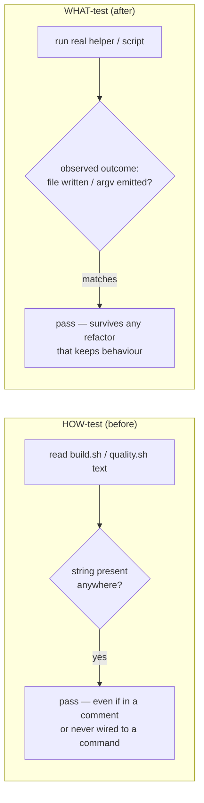

# Replace source-text grep assertions against build.sh / quality.sh with WHAT-tests

## Summary

Two tests asserted behaviour by grepping the **source text** of shell scripts
rather than running them — HOW-tests that pass merely because a string appears
somewhere in the file (even in a comment) and break on any rename or reflow that
leaves behaviour unchanged. They are now WHAT-tests that drive the real script
logic and assert on the observable outcome, matching the pattern already
established by `test/scripts/BuildScriptContentHash.ts` under issue #2886.

- `test/scripts/BuildFingerprint.ts` — the two greps over `build.sh`
  (`includes("build-fingerprint")` / `!includes("pkg/.build-fingerprint")`) are
  replaced by a test that sources `build.sh`'s real `refresh_fingerprint`
  helper, runs it against a temp `DEST_DIR`, and observes that it writes a
  **non-hidden** `build-fingerprint` file containing the expected SHA-256 of
  `<repo>@<rev>` — and that no hidden `.build-fingerprint` companion is created.
- `test/scripts/QualityScript.ts` — the grep over `quality.sh`
  (`includes("VIBE_BUMP_QUARANTINE_HOURS")`, `includes("--minimum-dependency-age")`
  plus a regex over the body) is replaced by a test that places a fake `deno` on
  PATH (via a temp `HOME/.deno/bin`, the directory `quality.sh` prepends),
  runs the deps step through `--lint-only`, and asserts on the **command line
  actually emitted** to `deno outdated` — including the hours → minutes
  conversion (`VIBE_BUMP_QUARANTINE_HOURS=3` → `--minimum-dependency-age=180`).

The genuinely behavioural cases already in these files (the `--dry-run`
flag-parsing tests, the non-integer `VIBE_BUMP_QUARANTINE_HOURS` rejection test,
the committed `build-fingerprint` file/format checks, and the `git`-driven
`.gitignore` checks) are kept unchanged.

Out of scope: `test/scripts/BuildScript.ts:202-214` greps a Markdown document
(`docs/CORE_DEPENDENCY_POLICY.md`), not a script — documentation content has no
behavioural form, and it falls outside this issue's title ("against
build.sh/quality.sh"), so it is left as-is.

Closes #2997.

## Why this matters

## Evidence

Backend/CLI test-only change — no web interface to screenshot. Verified by
running the affected test files and the quality gate:

- `deno test test/scripts/BuildFingerprint.ts test/scripts/QualityScript.ts` —
  18 passed, 0 failed.
- `./quality.sh --check-only` — type-check passes tree-wide (1696 files).
- `./quality.sh --lint-only` — fmt, lint, and bash-script checks pass.

## Test Plan

- Rewrote `test/scripts/BuildFingerprint.ts::build.sh refresh_fingerprint writes
  a non-hidden build-fingerprint` — sources and runs the real
  `refresh_fingerprint`; a regression to a hidden `.build-fingerprint` (or a
  wrong fingerprint value/location) fails the assertions.
- Rewrote `test/scripts/QualityScript.ts::quality.sh dep update invokes
  \`deno outdated\` with --minimum-dependency-age` — shims `deno`, runs the deps
  step, and asserts the emitted argv carries `--update --latest
  --minimum-dependency-age=180`; dropping the flag or mis-converting hours fails.
- All other existing test cases in both files are retained unchanged.
