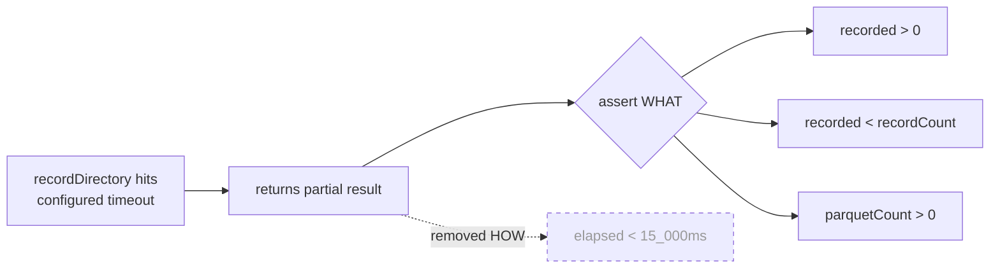

# Remove flaky wall-clock timing assertions from DiscoveryTimeout tests

## Summary

`test/ErrorGuidedStructuralEvolution/DiscoveryTimeout.ts` gated four test cases
on a host-machine wall-clock budget (`elapsed < 15_000`, measured via
`Date.now()`). A wall-clock comparison inside a unit test asserts on the _speed
of the host machine_, not the _behaviour of the code_ — it is flaky by
construction: on a loaded CI runner, a shared laptop, or a slow/ARM box the same
correct code can exceed 15 s and fail, while genuinely broken code that runs
fast still passes.

The behaviour these cases actually care about — that a configured timeout aborts
the run and produces a _partial_ recording — is already asserted observably in
the same blocks (`recorded > 0`, `recorded < recordCount`, `parquetCount > 0`,
`assertExists(result)`). The timing assertion added no correctness signal, so it
was removed (issue option (a), the preferred fix).

Removed assertions and their now-unused `start`/`elapsed`/`Date.now()` plumbing
from all four tests:

- `Batch size 128 saves more batches than 512 on timeout` (the
  `elapsed128 < 15_000 && elapsed512 < 15_000` guard at the former line 322,
  plus its "regression guard for timeout tests are slow on GPU machines" comment
  the issue cited as the file acknowledging the hazard).
- `DiscoverDirectory returns partial results on timeout` (former line 400).
- `Timeout during file reading returns partial data` (former line 475).
- `Discovery completes successfully with reasonable timeout` (former line 550).

The issue named the latter three explicitly; the fourth (former line 322) is the
identical anti-pattern in the same file — the issue quotes its own comment at
line 319 — so it was removed too for a consistent, complete fix.

Closes #2998.

## Evidence

Backend/test-only change — no web interface to screenshot. Verified by running
the modified test file; all four behavioural tests still pass without the timing
gate:

```
Batch size 128 saves more batches than 512 on timeout ... ok (254ms)
DiscoverDirectory returns partial results on timeout ... ok (126ms)
Timeout during file reading returns partial data ... ok (1s)
Discovery completes successfully with reasonable timeout ... ok (25ms)
ok | 4 passed | 0 failed (1s)
```

The observed runtimes (25 ms–1 s) confirm the 15 s assertion never gated real
behaviour on a fast machine, while still being able to fail spuriously on a slow
one — exactly the flakiness removed.



## Test Plan

- No new tests added: the issue is removal of a counter-productive,
  non-behavioural assertion. The existing partial-recording assertions in each
  test continue to prove the timeout fired.
- Ran `deno test test/ErrorGuidedStructuralEvolution/DiscoveryTimeout.ts` — 4
  passed, 0 failed.
- Ran `deno fmt --check`, `deno lint`, `deno check` on the file — all clean (the
  removed `start`/`elapsed` locals would otherwise trip the no-unused-vars
  lint).
- Ran `./quality.sh` — full project gate.
