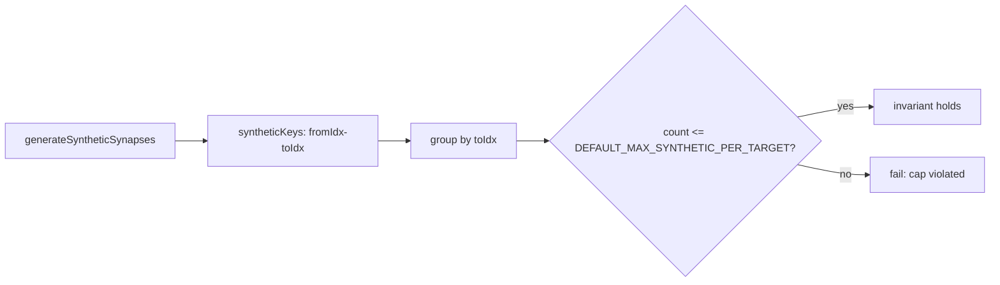

## Summary

Rewrote the benchmark-shaped unit test `test/propagate/SyntheticSynapsesProductionScale.ts:307-350`
("synthetic synapses: memory estimate at production scale") into a proper
**"what" test** that asserts the invariant the per-target cap actually
guarantees. Closes #2999.

The old test fabricated a memory figure from a magic constant
(`const estimatedBytesPerSynapse = 88`), multiplied it by `result.addedCount`,
`console.log`-ged a throughput-style report, then asserted against two
spec-less round numbers (`assertLess(estimatedAdditionalMB, 50)` and
`assertLess(expansionRatio, 5)`). None of these numbers were measured or
specified — they tracked what the current estimate heuristic happened to
produce, so any change to the heuristic or the cap forced the magic values to
be re-tuned even when no observable behaviour regressed. The `console.log` was
benchmark output that added no correctness signal.

### What changed

The rewritten test (renamed to "synthetic synapses: no target exceeds the
per-target cap at production scale") asserts the genuine invariant:

- Group the returned `syntheticKeys` by their target neuron index (`toIdx`).
  A target neuron is the `to` endpoint for exactly one adjacent layer pair, so
  this count is the complete per-target synthetic count.
- Assert every per-target count is `<= DEFAULT_MAX_SYNTHETIC_PER_TARGET`. This
  is the behaviour the cap exists to enforce and bounds total memory growth far
  more meaningfully than a hand-guessed bytes-per-synapse estimate.
- Guard against a vacuous pass: assert the cap actually engages at production
  scale (`skippedCount > 0`) and that some targets receive synthetic synapses.
- Confirm the creature remains structurally valid after generation.

All fabricated `estimatedBytesPerSynapse` / `50 MB` / `5x` arithmetic and the
benchmark-style `console.log` were dropped. No timing or performance metric is
measured in the test, consistent with the project's unit-test-vs-benchmark
policy.



## Evidence

Backend/CLI test change — no web interface to screenshot.

Targeted run of the modified file (7 tests, all pass):

```
running 7 tests from ./test/propagate/SyntheticSynapsesProductionScale.ts
synthetic synapses: per-target cap limits count at production scale ... ok
synthetic synapses: uncapped vs capped count comparison ... ok
synthetic synapses: creature outputs restored after generate and remove all ... ok
synthetic synapses: full training lifecycle at production scale ... ok
synthetic synapses: generation is deterministic at production scale ... ok
synthetic synapses: custom maxPerTarget limits connections ... ok
synthetic synapses: no target exceeds the per-target cap at production scale ... ok
ok | 7 passed | 0 failed (3s)
```

Full `./quality.sh` passes: `ok | 7252 passed (2 steps) | 0 failed | 4 ignored`.

## Test Plan

- Modified `test/propagate/SyntheticSynapsesProductionScale.ts` — replaced the
  memory-estimate test (Test 7) with a per-target cap invariant assertion that
  no target neuron exceeds `DEFAULT_MAX_SYNTHETIC_PER_TARGET`.
- The new test is a "what" test: it survives any internal change to memory
  layout or the sampling heuristic, failing only if the cap is genuinely
  violated.
- Verified the existing six tests in the file are unchanged and still pass.
- Ran the full quality gate (`./quality.sh`) — lint, format, type-check, and
  the entire test suite pass cleanly.
