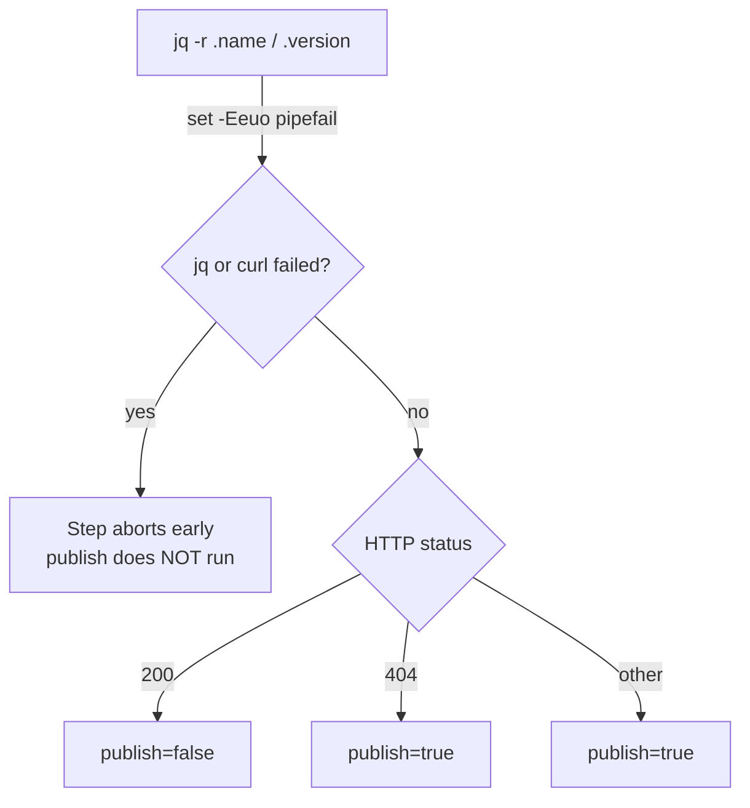

# Add strict-mode preamble to workflow version blocks

## Summary

The _Determine whether the version needs publishing_ step in
`.github/workflows/publish.yml` (and the small version-read block in
`.github/workflows/github-release.yml`) ran multi-line bash without the
`set -Eeuo pipefail` preamble that every other substantial run block in the
repository's workflows already uses. Without strict mode, a `jq` or `curl`
failure would not abort the step — an unset or empty `name`/`version` could
silently produce a malformed JSR meta URL, the HTTP status check would fall
through to the permissive `else` branch, and the publish workflow would proceed
to `npx jsr publish` on the basis of an unverified result.

This change adds `set -Eeuo pipefail` as the first line of both blocks so a tool
failure becomes a clean, early abort instead of a silent degradation — important
in a publish workflow where acting on a wrong answer has release-level
consequences.

Closes #3003.

## Evidence

CLI/workflow-only change — no web interface to screenshot. Verified by a new CI
test plus the existing workflow-validation suite (`actionlint`, action pinning,
concurrency, timeouts) all passing.

`./quality.sh --lint-only` (format + lint + bash syntax) and
`./quality.sh --check-only` (type-check) both pass cleanly. The full `test/ci/`
suite passes (72 tests).

## Test Plan

- Added `test/ci/WorkflowVersionCheckStrictMode.ts`, which parses each
  workflow's YAML and asserts the version-handling run block (`publish.yml` step
  `needs_publish`, `github-release.yml` step `version`) opens with
  `set -Eeuo pipefail`. The test fails against the pre-fix workflows (first
  command line was `name=$(jq ...)` / `VERSION=$(jq ...)`) and passes after the
  change.
- Ran the full `test/ci/` suite — 72 passed, 0 failed.
