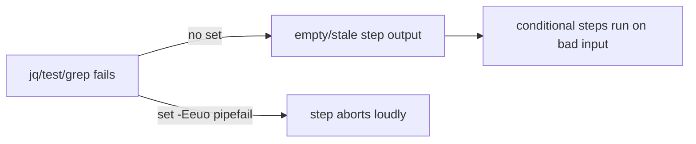

## Summary

Added the `set -Eeuo pipefail` strict-mode preamble to the one remaining
multi-line `run:` block flagged by the `github-actions-audit` finding that still
lacked it — the `Detect Deno worker module` step in
`.github/workflows/markdown-lint.yml`. Without strict mode a failing command
inside the block does not abort the step, so a stale or empty step output could
silently flow into the conditional Deno steps that gate on it.

The two other blocks cited by the issue — `.github/workflows/publish.yml`
(`Determine whether the version needs
publishing`) and
`.github/workflows/github-release.yml` (`Read version
from deno.json`) — already
open with `set -Eeuo pipefail`, having been brought into line by Issue #3003 (PR
#3014), so no change was needed there. The `coverage.yaml`, `quality.yml` and
`update-package-version.yml` workflows are cited by the issue itself as the
house-style standard and are out of scope.

Closes #3006.

## Evidence

This is a CI workflow YAML hygiene change with no web interface to screenshot.
Verification is by the added behaviour-style test that parses the workflow YAML
and asserts the run block opens with the preamble.

Before — `markdown-lint.yml` `detect-deno` step:

```yaml
id: detect-deno
run: |
  if [ -f worker/deno/mod.ts ]; then
```

After:

```yaml
id: detect-deno
run: |
  set -Eeuo pipefail
  if [ -f worker/deno/mod.ts ]; then
```



## Test Plan

- Added `test/ci/MarkdownLintStrictMode.ts`, modelled on the existing
  `test/ci/WorkflowVersionCheckStrictMode.ts`. It parses
  `.github/workflows/markdown-lint.yml`, locates the `detect-deno` step, and
  asserts its `run:` block's first command line is `set -Eeuo pipefail`. The
  test failed against the unfixed workflow and passes after the fix.
- `./quality.sh` run clean (fmt, lint, type-check, full test suite).
