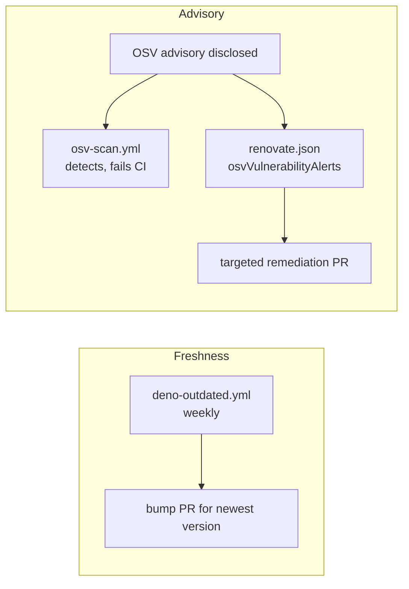

# SCR-AUTO-UPDATE — enable advisory-driven security-update channel

## Summary

The repository had dependency-update automation, but only the _freshness-driven_
half: `.github/workflows/deno-outdated.yml` raises a weekly PR for whatever is
newest, and `.github/workflows/osv-scan.yml` _detects_ advisories (failing CI)
but raises no remediation PR. When a CVE is disclosed against a pinned
dependency, nothing automatically opened a targeted bump — the team waited for
the next weekly freshness run or responded manually to the OSV scan failure.

This change adds a minimal `renovate.json` that enables Renovate's
_advisory-driven_ security-update channel alongside the existing freshness job.
Renovate supports the Deno manager (`jsr:`, `npm:`, `https://deno.land/*`), and
with `osvVulnerabilityAlerts` enabled it raises a dedicated PR for any
dependency carrying a known OSV advisory — turning "an advisory exists" into "a
fix PR is waiting for review" and shrinking the exposure window between
disclosure and remediation. `deno-outdated.yml` is left intact for routine
freshness bumps.

`renovate.json`:

```json
{
  "$schema": "https://docs.renovatebot.com/renovate-schema.json",
  "extends": ["config:recommended"],
  "vulnerabilityAlerts": { "enabled": true },
  "osvVulnerabilityAlerts": true
}
```

`SECURITY.md` is updated to document the new channel under the in-repo
automation list.

Closes #3007.

## Evidence

This is a CI/config change with no web interface to screenshot. Verification is
via the new behavioural tests, which parse the committed `renovate.json` and
assert on the resolved configuration.

```
deno test test/ci/RenovateSecurityUpdates.ts --allow-read
ok | 5 passed | 0 failed
```

Full quality gate: `./quality.sh` → `7265 passed | 0 failed | 4 ignored`.

The two complementary automation channels after this change:



## Test Plan

Added `test/ci/RenovateSecurityUpdates.ts` (5 tests), mirroring the existing
`test/ci/OsvScanWorkflow.ts` "what" style:

- `renovate.json exists and parses as JSON`
- `renovate.json references the Renovate schema`
- `renovate.json extends a base preset`
- `renovate.json enables vulnerability alerts`
  (`vulnerabilityAlerts.enabled === true`)
- `renovate.json enables OSV-backed vulnerability alerts`
  (`osvVulnerabilityAlerts === true`)

Each test failed before `renovate.json` was added (TDD red) and passes after
(green).
