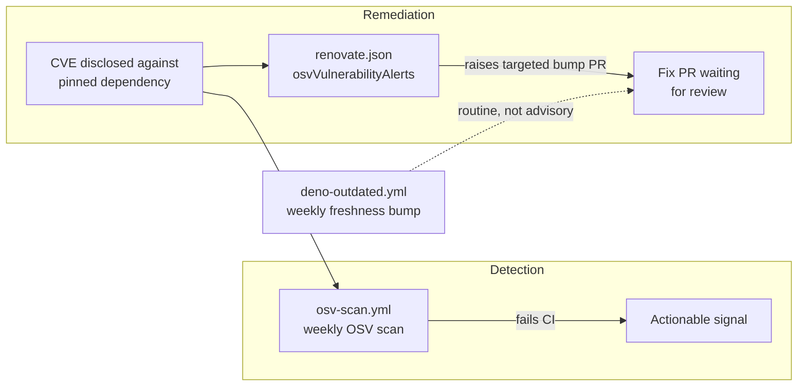

# SCR-AUTO-UPDATE: enable the advisory-driven security-update channel

## Summary

The repository already had _freshness-driven_ dependency automation
(`.github/workflows/deno-outdated.yml` weekly bump, `bump-deps.sh` quarantine
refresh) and advisory _detection_ (`.github/workflows/osv-scan.yml`), but no
advisory-_driven_ update channel. When a CVE was disclosed against a pinned
`jsr:`/`npm:` dependency, nothing raised a targeted remediation PR — the team
waited for the next weekly freshness run (plus the 24h quarantine) or responded
manually to the OSV scan failure.

This change adds a minimal `renovate.json` that enables Renovate's OSV-backed
vulnerability-alert channel. Renovate supports the Deno manager (`jsr:`, `npm:`,
`https://deno.land/*`), so the control is genuinely available here (unlike
Dependabot, which does not parse `deno.json`/`deno.lock`). The existing
freshness job is left untouched — this closes the _remediation-automation_ half
of the same loop that `osv-scan.yml` _detects_.

`SECURITY.md` is updated to document the new channel alongside the existing
automation.

Closes #3007.

## Evidence

This is a config/CI change with no web interface to screenshot. Verification is
via the new "what" tests that parse the committed `renovate.json` and assert on
the resulting configuration (schema reference, `config:recommended` preset,
`vulnerabilityAlerts.enabled`, `osvVulnerabilityAlerts`).



Before: detection only (red CI), remediation manual. After: a dedicated
remediation PR is raised automatically for any dependency carrying a known OSV
advisory.

Test run:

```text
running 5 tests from ./test/ci/RenovateConfig.ts
renovate.json exists and parses as JSON (Issue #3007) ... ok
renovate.json references the Renovate schema (Issue #3007) ... ok
renovate.json extends a recommended preset (Issue #3007) ... ok
renovate.json enables the vulnerability-alert channel (Issue #3007) ... ok
renovate.json enables OSV-backed vulnerability alerts (Issue #3007) ... ok
ok | 5 passed | 0 failed
```

## Test Plan

- Added `test/ci/RenovateConfig.ts` — five "what" tests parsing the committed
  `renovate.json`:
  - exists and parses as JSON
  - references the Renovate schema (`$schema`)
  - extends `config:recommended`
  - `vulnerabilityAlerts.enabled === true`
  - `osvVulnerabilityAlerts === true`
- Confirmed the tests fail against the unfixed tree (no `renovate.json`) and
  pass after adding the file (TDD).
- `./quality.sh --lint-only` passes (fmt, lint, bash syntax).
- `markdownlint-cli2` clean on `SECURITY.md`.

## Deno regression avoided

- Chose Renovate's native Deno manager (config-only `renovate.json`) over GitHub
  Dependabot, which does not parse `deno.json`/`deno.lock`. No Node tooling,
  `package.json`, or lockfile was introduced.
