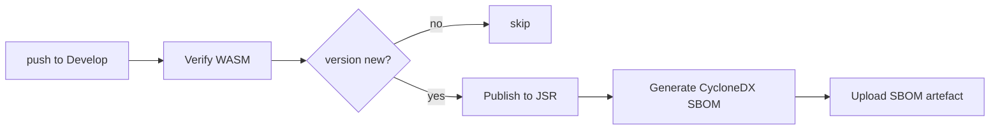

# SCR-SBOM: publish an SBOM artefact from the release pipeline

## Summary

The release pipeline published `@stsoftware/neat-ai` to JSR on every release
commit but produced no Software Bill of Materials (SBOM). Because a release
pipeline exists, the source-only-library exemption does not apply: downstream
consumers and security teams need a machine-readable bill of materials to
enumerate exactly which transitive dependencies a published version shipped —
the artefact that answers "did the version I depend on include the compromised
package?" during a supply-chain incident.

This PR adds two steps to `.github/workflows/publish.yml`, both gated on the
existing `needs_publish` signal so they run only when a new version is actually
published:

1. **Generate CycloneDX SBOM** — `deno run -A npm:@cyclonedx/cdxgen -t deno -o
   sbom.cdx.json .`, generated over the committed `deno.lock` (the same resolved
   tree that ships). Deno has no first-class SBOM emitter, so a CycloneDX
   generator targeting the Deno ecosystem is used.
2. **Upload SBOM** — `actions/upload-artifact` pinned to the 40-char commit SHA
   `043fb46d1a93c77aae656e7c1c64a875d1fc6a0a` (v7.0.1, the same release already
   used by `coverage.yaml`), per the `github-actions-audit` SHA-pinning policy
   (SCR-ACTIONS-PIN). No tag-pinned action is introduced.

Deno regression avoided: SBOM generation uses `deno run npm:@cyclonedx/cdxgen`
rather than introducing any Node/`npx`-based tooling or a `package.json`.

Closes #3008.

## Evidence

This is a CI/workflow-only change with no web interface to screenshot. It was
verified by:

- New "what" tests in `test/ci/SbomPublishWorkflow.ts` parse the committed
  `publish.yml` and assert the SBOM generation + upload configuration — all pass.
- Existing `test/ci/WorkflowActionPinning.ts` confirms the new
  `upload-artifact` reference is a 40-char SHA with a provenance comment — passes.
- `actionlint .github/workflows/publish.yml` reports no issues.
- `deno fmt --check`, `deno lint`, and `deno check` pass on the new test file.

## Test Plan

- Added `test/ci/SbomPublishWorkflow.ts`:
  - `publish.yml generates a CycloneDX SBOM from the lockfile` — asserts a
    `cdxgen` step targeting `-t deno`.
  - `publish.yml writes a recognisable SBOM filename` — asserts a `*.cdx.json`
    output and matching upload `path`.
  - `publish.yml uploads the SBOM as a build artefact` — asserts an
    `actions/upload-artifact` step with a non-empty artefact name.
  - `publish.yml only emits the SBOM when a new version is published` — asserts
    both steps are gated on `steps.needs_publish.outputs.publish == 'true'`.
- Confirmed all 25 tests across the touched CI test files pass.
