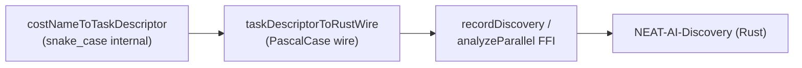

# taskDescriptor FFI wire format: snake_case → PascalCase (Issue #3012)

## Summary

`#2785` attached the internal snake_case `TaskDescriptor` (`#2786`) directly to
the `recordDiscovery` / `analyzeParallel` FFI payloads. NEAT-AI-Discovery (Rust,
`#1314`) deserialises a **PascalCase** `TaskDescriptor`, so it failed with
`unknown variant 'unbounded'` and Rust synapse/neuron analysis degraded to
repeated "Rust synapse/neuron analysis unavailable".

This change adds a dedicated wire mapper,
`taskDescriptorToRustWire(descriptor, numOutputs)`, and applies it at both FFI
boundaries before `JSON.stringify`. The internal `#2786` types are unchanged.

Mappings (TS internal → Rust wire):

- `topology` → `targetTopology` (`independent` → `Independent`, …)
- `range` → `targetRange` (`signed_unit` → `SignedUnit`, …)
- `outputSquashFamily` → `outputSquashFamily` (`bounded_unipolar` →
  `BoundedUnipolar`, …)
- adds `numOutputs` from the creature export
- drops the internal-only `costName` (never sent on the wire)

Closes #3012.

## Evidence

Backend/FFI change — no web UI to screenshot. Verified by the tests below (TDD:
the new wire-shape assertions fail against the unfixed producer that forwarded
the snake_case descriptor, and pass after the mapper lands).

Golden fixtures mirror the canonical payloads from Discovery
`tests/ffi/issue_1314_task_descriptor_plumbing.rs` (MSE, CROSS_ENTROPY, HINGE,
OTHER).

## Test Plan

New `test/ErrorGuidedStructuralEvolution/TaskDescriptorRustWire.ts`:

- `taskDescriptorToRustWire emits only the Discovery contract fields` — every
  built-in + `OTHER` carries only `targetTopology` / `targetRange` /
  `outputSquashFamily` / `numOutputs`, all PascalCase; no `topology` / `range` /
  `costName`.
- `… MSE never serialises the snake_case 'unbounded'` — exact regression guard.
- `… matches Discovery #1314 golden fixtures` — byte-for-byte contract lock.
- `… maps the neutral OTHER descriptor` and `… clamps invalid numOutputs`.

Updated `test/ErrorGuidedStructuralEvolution/DiscoveryTaskDescriptor.ts` —
`recordDiscovery` / `analyzeParallel` / `ensureRustCombinedAnalysis` stubs now
assert on `JSON.parse(JSON.stringify(input)).taskDescriptor` (the serialised
wire shape) instead of the internal object reference, and verify the wire
payload omits `costName` / `topology` / `range`.

Files changed:

- `src/costs/TaskDescriptorRustWire.ts` (new mapper + wire types)
- `src/architecture/ErrorGuidedStructuralEvolution/RustDiscoveryTypes.ts`
  (`taskDescriptor` fields now typed `RustWireTaskDescriptor`)
- `src/architecture/ErrorGuidedStructuralEvolution/DiscoverStructureRecording.ts`
  (`recordDiscovery` maps to the wire shape)
- `src/architecture/ErrorGuidedStructuralEvolution/RustAnalysisCache.ts`
  (`analyzeParallel` maps to the wire shape)
- `docs/api/COSTS_AND_ACTIVATIONS.md` (documents the FFI wire shape)
