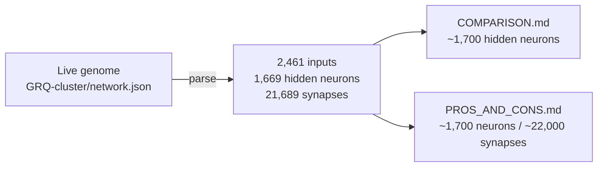

## Summary

Updated the documented size/shape statistics of the production creature, which
were badly understated. Two docs claimed production "maxes out" at **~500 hidden
neurons** (and ~16,000 synapses), but the live creature is far larger. Closes
#3018.

The numbers come from the live production genome
[`stSoftwareAU/GRQ-cluster/network.json`](https://github.com/stSoftwareAU/GRQ-cluster/blob/main/network.json)
(creature "Bob Bailey", version 115, snapshot **2026-06-16**):

| Metric                  | Old docs claim | Actual (live genome) |
| ----------------------- | -------------: | -------------------: |
| Hidden neurons          |           ~500 |       1,669 (~1,700) |
| Synapses                |         16,000 |     21,689 (~22,000) |
| Inputs                  |     (unstated) |                2,461 |
| Listed neurons (total)¹ |              — |                1,673 |

¹ 1,669 hidden + 3 constant + 1 output. Genome is forward-only, semantic version
4.0.0.

### Files changed

- **`COMPARISON.md`** — "Scales to billions of parameters" row updated from
  `~500 hidden neurons in prod` to `~1,700 hidden neurons in prod`.
- **`docs/comparison/PROS_AND_CONS.md`** — the "Limited scalability" con updated
  from "max out around 500 hidden neurons and 16,000 synapses" to "~1,700 hidden
  neurons and ~22,000 synapses across 2,461 inputs, and keeps growing", with a
  link to the source genome and the snapshot date so the figure is traceable.

The figures are kept as `~` approximations (the creature grows over time) and
carry a dated snapshot reference so future drift is obvious.

## Evidence

Documentation-only change — no web interface to screenshot. The statistics were
verified against the live production genome:

```text
$ gh api repos/stSoftwareAU/GRQ-cluster/contents/network.json \
    -H "Accept: application/vnd.github.raw" > grq-network.json
# parsed:
input:    2461
output:   1
neurons:  1673  (constant 3, hidden 1669, output 1)
synapses: 21689
forwardOnly: true   semanticVersion: 4.0.0
# snapshot commit date: 2026-06-16T10:23:26Z
```



`./quality.sh --lint-only` passes cleanly (formatting, lint, bash check). The
relevant remaining gates (type-check, tests) are unaffected — no source code was
touched.

## Test Plan

No unit tests were added. This is a pure documentation correction with no code
change, and per `AGENTS.md` tests that grep documentation for literal strings
are "how" tests and are explicitly discouraged. Validation performed:

- `deno fmt` on both changed Markdown files — clean.
- `./quality.sh --lint-only < /dev/null` — passes (formatting, lint, bash
  syntax).
- Figures cross-checked against the live `GRQ-cluster/network.json` genome.
