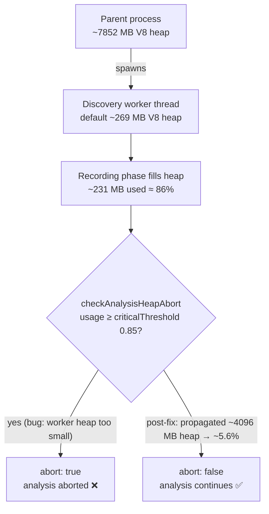

## Summary

TDD **red** step for #3022 (Discovery worker uses the default ~270 MB V8 heap;
`AnalysisHeapGuard` aborts analysis after recording). Adds a regression test that
pins down the **parent vs. worker heap split** at the analysis-extension boundary —
the dimension the existing guard tests never modelled, which is why the regression
escaped. No production code changes. Closes #3023.

On GRQ-23 the parent process is sized for a ~7852 MB V8 heap, but the discovery
**worker thread** runs on the default ~269 MB heap. After the recording phase fills
that small default worker heap to ≈86%, `checkAnalysisHeapAbort` trips CRITICAL and
aborts analysis even though host RSS / native budget have headroom. The guard logic
is correct; the bug is that the worker never receives a heap proportional to the
parent's.

`test/ErrorGuidedStructuralEvolution/DiscoveryWorkerHeapLimit.ts`:

1. Injects a worker-shaped sample (`heapTotal ≈ 269 MB`, `heapUsed ≈ 231 MB`, ≈86%)
   through the existing `_setHeapGuardProviderForTests` seam — no real
   `Deno.memoryUsage()` dependence.
2. Asserts **current** behaviour: `checkAnalysisHeapAbort(...)` returns
   `{ abort: true }` with `pressureLevel === "critical"` against the default
   `criticalThreshold: 0.85`, documenting the bug.
3. Contrasts with the parent's ~7852 MB heap holding the **same** recorded bytes —
   no abort — proving the split, not real pressure, is the cause.
4. Encodes the **post-fix contract** (a propagated ~4096 MB worker heap keeps
   analysis running, `abort: false`) as a case toggled by a single reviewable
   switch, `EXPECT_POST_FIX_HEAP_PROPAGATION`. While `false` (today) it is a
   documented x-fail (skipped); a sibling fix PR flips it to `true` to take the
   step red→green.

### Switch verification

- `EXPECT_POST_FIX_HEAP_PROPAGATION = false` (main): `2 passed | 1 ignored`.
- Flipped to `true` (simulated sibling fix): `3 passed | 0 failed`.

## Evidence

Backend/test-only change — no web interface to screenshot. Verified via
`deno test`; the full `./quality.sh` gate passes (`7276 passed | 0 failed |
5 ignored`).

## Test Plan

Added `test/ErrorGuidedStructuralEvolution/DiscoveryWorkerHeapLimit.ts`:

- `default ~269MB worker heap trips CRITICAL at the extension boundary` — reproduces
  the abort via the `_setHeapGuardProviderForTests` seam (documents the bug; passes
  on `main`).
- `the parent ~7852MB heap holding the same data would NOT abort` — proves the
  parent/worker split is the cause, not real memory pressure.
- `[post-fix] propagated ~4096MB worker heap keeps analysis running` — the post-fix
  contract, a documented x-fail (`ignore`d) until a sibling fix flips
  `EXPECT_POST_FIX_HEAP_PROPAGATION`.
