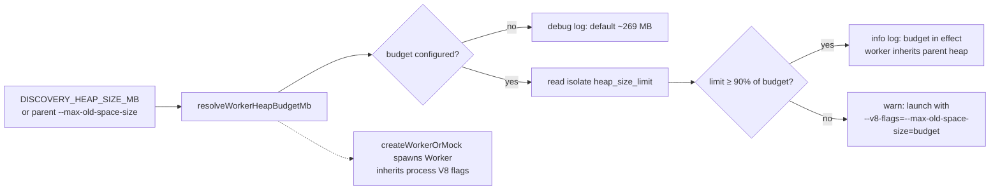

## Summary

Propagate the configured discovery V8 heap budget to spawned discovery workers.
`WorkerHandlerBase.createWorkerOrMock` — the only `new Worker(...)` spawn in
`src/` — now consumes the `DISCOVERY_HEAP_SIZE_MB` input contract (with a
fallback to the parent's `--max-old-space-size`) and verifies/logs the effective
worker heap limit at spawn time, warning loudly when the process was not
launched with a matching V8 flag. Closes #3024.

Sub-issue of #3022, addressing **suspected root cause #1**: discovery workers
spawned without the parent's V8 heap budget. On GRQ-23 the parent runs with
~7852 MB while the worker sat on Deno's ~269 MB default, so the recording phase
filled the small worker heap to ≈86% and `AnalysisHeapGuard` aborted analysis.

### Chosen Deno mechanism (investigated + verified)

Deno's `Worker` constructor has **no** per-worker heap option (unlike Node's
`worker_threads` `resourceLimits.maxOldGenerationSizeMb`). I empirically tested
the candidate mechanisms on Deno 2.8.3 by reading
`v8.getHeapStatistics().heap_size_limit` from both the parent and a spawned
worker:

| Mechanism                                                         | Worker heap sized?                              |
| ----------------------------------------------------------------- | ----------------------------------------------- |
| Process-level `--v8-flags=--max-old-space-size=512`               | ✅ worker inherits (608 MB, same as parent)     |
| `DENO_V8_FLAGS=--max-old-space-size=512` at process start         | ✅ worker inherits                              |
| `Deno.env.set("DENO_V8_FLAGS", …)` at runtime before `new Worker` | ❌ no effect — flags read once at process start |

So the only supported lever is the **process-level V8 flag worker isolates
inherit**. The external discovery runner (`worker/Discovery/run.sh`,
`src/Discovery/Scan.ts` — not in this repo) launches the process with the flag
derived from `DISCOVERY_HEAP_SIZE_MB`. The library's job — and what this PR
delivers — is to **consume that input contract** and make the propagation
observable: it logs the worker's effective heap limit and warns with the exact
required flag when the configured budget is not actually in effect (the GRQ-23
failure mode). Runtime env mutation cannot resize an isolate, so a warning is
the correct, honest signal. The mechanism and its limits are documented at
`src/workers/WorkerHandlerBase.ts:135`.

### Evidence

Backend/CLI change — no web interface to screenshot. Verified via the new
contract test (below) and the full quality gate (`./quality.sh`):
`7303 passed | 0 failed | 4 ignored`.

### Test Plan

New worker-spawn contract test (#3022 TDD item 2),
`test/workers/WorkerHeapBudget.ts` — red→green demonstrated (the imported
symbols did not exist before this PR, so the suite failed to type-check; it is
green after the implementation):

- `resolveWorkerHeapBudgetMb` consumes `DISCOVERY_HEAP_SIZE_MB`, falls back to
  parent `--max-old-space-size`, applies correct precedence, and rejects
  non-positive / non-numeric values.
- `parseMaxOldSpaceMb` / `requiredWorkerV8Flag` unit coverage.
- `verifyWorkerHeapBudget` returns the budget and logs at **info** when the heap
  matches, **warns** with the required flag on the GRQ-23 shortfall shape, and
  stays silent / returns `undefined` when no budget is configured.

Flipped the sibling switch in
`test/ErrorGuidedStructuralEvolution/DiscoveryWorkerHeapLimit.ts`
(`EXPECT_POST_FIX_HEAP_PROPAGATION` `false → true`) as that file documents: this
PR is the sibling fix that propagates a parent-proportional worker heap, so the
previously-x-failed post-fix case
(`propagated ~4096MB worker heap keeps
analysis running`) is now active and
green. No existing tests were removed or disabled.

No regression to the `direct`/mock path: `createWorkerOrMock(direct=true)` still
returns the mock unchanged (the budget verification runs only on the real-spawn
branch); existing worker-handler tests pass.
